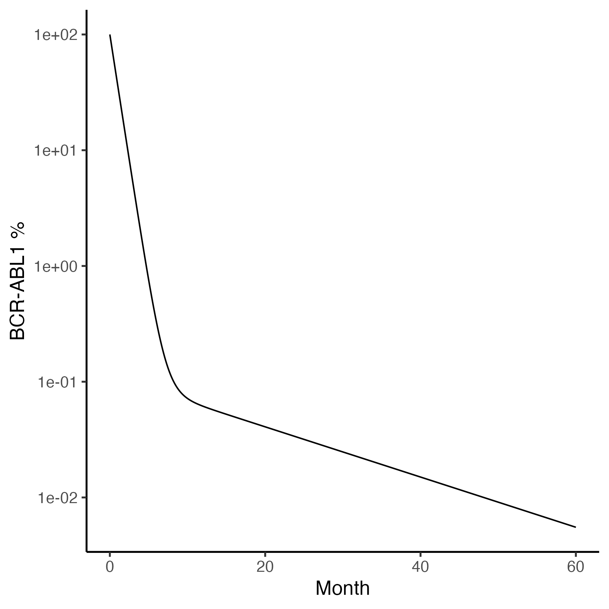
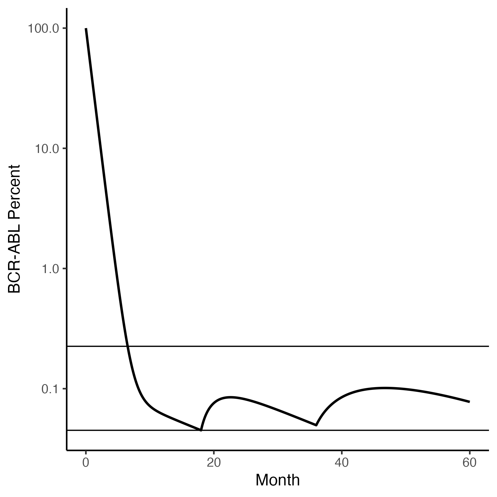
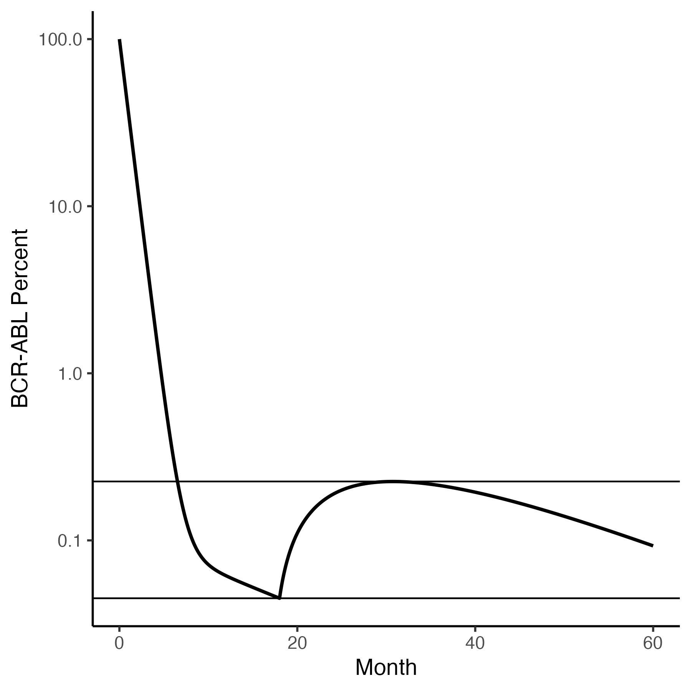
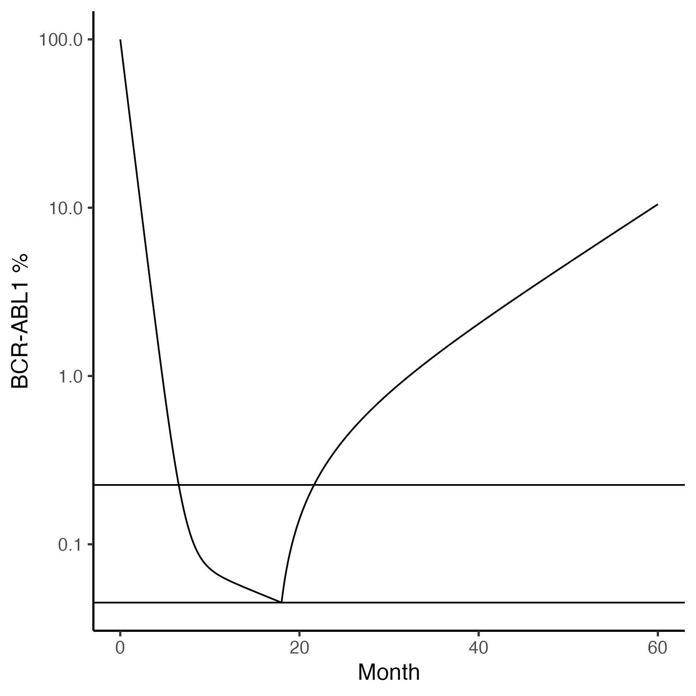

## Reduced tyrosine kinase inhibitor dose is predicted to be as effective as standard dose in chronic myeloid leukemia: a simulation study based on phase III trial data. Fassoni et al, Haematologica (2018). 


The first goal is to reproduce the average patient full-dosing plot in Figure 1C using the population median rounded parameters
q = 1, pXY = 0.05, pYX = 0.001, L0 = 100 and pY = 0.2 found in Section S3
This code makes this plot.

```

rm(list=ls())
library(myelo)
library(tidyverse)
TY=1e6
TX=1e6/50

fassoni<-function(Time, State, Pars) {
    with(as.list(c(Time, State, Pars)),{
    dX = -pxy*X + pyx*Y 
    dY =  pxy*X - pyx*Y  - q*Y
    list(c(dX,dY),c(prct=100*Y/TY))
  })
}
ic=c(X=TX,Y=TY)
library(deSolve)
d=ode(y = ic, times = seq(0,60,.1), func = fassoni, parms = c(pxy=0.05,pyx=0.001,q=1))
d=as_tibble(d)%>%mutate_all(as.numeric)
names(d)<-c("Month","X","Y","Prct")
tc=function(sz) theme_classic(base_size=sz)
gy=ylab("BCR-ABL Percent")
head(d)
d%>%ggplot(aes(x=Month,y=Prct))+geom_line(size=1)+
  gy+tc(14)+scale_y_log10()+theme(legend.position="top")
ggsave("../docs/fasssoniF1C.png",width=6,height=6)

```




## Dose reduction

Our hope is that a typical patient on trial will respond to dose halvings as follows  

```

fassoni_f<-function(Time, State, Pars) {
    with(as.list(c(Time, State, Pars)),{
    dX = -pxy*X + pyx*Y 
    dY =  pxy*X - pyx*Y  - (f*etki-py)*Y
    df = 0
    list(c(dX,dY,df),c(prct=100*Y/TY))
  })
}
ic=c(X=TX,Y=TY,f=1)
(eventdat=data.frame(var="f",
                     time=c(18,36),
                     value=c(0.5,0.25),
                     method="replace"))
d=ode(y = ic, times = seq(0,60,.1), func = fassoni_f, 
       events=list(data=eventdat),
      parms = c(pxy=0.05,pyx=0.001,py=0.2,etki=1.2))
d=as_tibble(d)%>%mutate_all(as.numeric)
names(d)<-c("Month","X","Y","f","Prct")
tc=function(sz) theme_classic(base_size=sz)
gy=ylab("BCR-ABL Percent")
head(d)
head(d)
y0=(d%>%filter(Month==18))[["Prct"]]
y1=5*y0
d%>%ggplot(aes(x=Month,y=Prct))+geom_line(size=1)+geom_hline(yintercept=c(y0,y1))+
# d%>%ggplot(aes(x=Month,y=Prct))+geom_line(size=1)+
  gy+tc(14)+scale_y_log10()+theme(legend.position="top")
ggsave("../docs/fasssoniF3C.png",width=6,height=6)

```


Here the upper horixontal line is 5-fold higher than the cance burden at the time of the first dose reduction.


## Borderline Cases

For some patients a two-fold dose reduction may cause a perturbation that is 
as great as a 4-fold dose reduction for an average patient. 
Such patients may just barely be able to continue to use their reduced dose. 

```
(eventdat=data.frame(var="f",
                     time=c(18),
                     value=c(0.25),
                     method="replace"))
d=ode(y = ic, times = seq(0,60,.1), func = fassoni_f, 
       events=list(data=eventdat),
      parms = c(pxy=0.05,pyx=0.001,py=0.2,etki=1.2))
d=as_tibble(d)%>%mutate_all(as.numeric)
names(d)<-c("Month","X","Y","f","Prct")
tc=function(sz) theme_classic(base_size=sz)
gy=ylab("BCR-ABL Percent")
head(d)
y0=(d%>%filter(Month==18))[["Prct"]]
y1=5*y0
d%>%ggplot(aes(x=Month,y=Prct))+geom_line(size=1)+geom_hline(yintercept=c(y0,y1))+
  gy+tc(14)+scale_y_log10()+theme(legend.position="top")
ggsave("../docs/fasssoniF2D.png",width=6,height=6)

```



Comparing the last two plots, one sees that, in terms of transient perturbations that
could trigger a return to a higher dose, it is better to halve doses in series rather than all at once. 


## Failures

And there will be some patients who must return to their previous dose. This is mimicked 
here by reducing the dose to an average patient 10-fold.

```
(eventdat=data.frame(var="f",
                     time=c(18),
                     value=c(0.10),
                     method="replace"))
d=ode(y = ic, times = seq(0,60,.1), func = fassoni_f, 
       events=list(data=eventdat),
      parms = c(pxy=0.05,pyx=0.001,py=0.2,etki=1.2))
d=as_tibble(d)%>%mutate_all(as.numeric)
names(d)<-c("Month","X","Y","f","Prct")
tc=function(sz) theme_classic(base_size=sz)
gy=ylab("BCR-ABL Percent")
head(d)
y0=(d%>%filter(Month==18))[["Prct"]]
y1=5*y0
d%>%ggplot(aes(x=Month,y=Prct))+geom_line(size=1)+geom_hline(yintercept=c(y0,y1))+
  gy+tc(14)+scale_y_log10()+theme(legend.position="top")
ggsave("../docs/fasssoniF2E.png",width=6,height=6)

```



