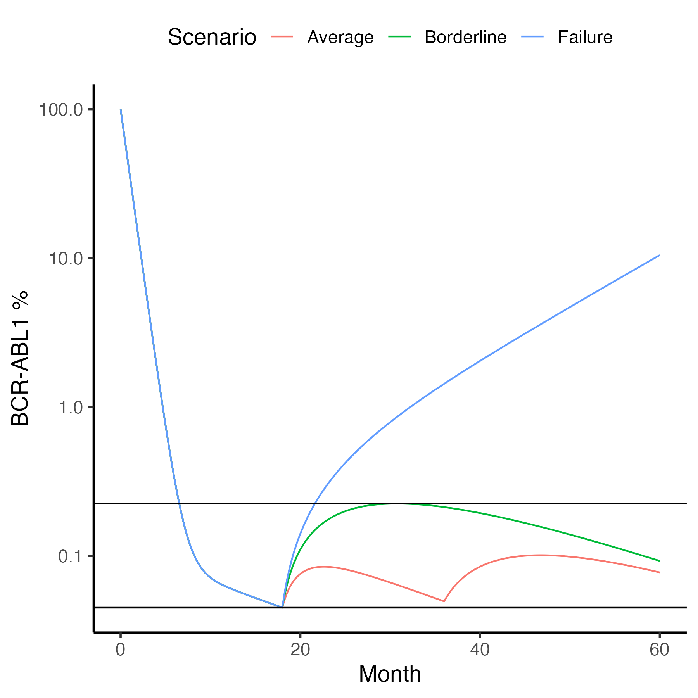

# Reduced tyrosine kinase inhibitor dose is predicted to be as effective as standard dose in chronic myeloid leukemia: a simulation study based on phase III trial data 
### Artur Fassoni, Christoph Baldow, Ingo Roeder and Ingmar Glauche 
### *Haematologica* (2018) 103(11):1825-1834


First we reproduce the plot in Figure 1C using population median parameter values.

```
rm(list=ls())
library(tidyverse)
TY=1e6
TX=1e6/50

fassoni<-function(Time, State, Pars) {
    with(as.list(c(Time, State, Pars)),{
    dX = -pxy*X + pyx*Y 
    dY =  pxy*X - pyx*Y  - q*Y
    list(c(dX,dY),c(prct=100*Y/TY))
  })
}
ic=c(X=TX,Y=TY)
library(deSolve)
d=ode(y = ic, times = seq(0,60,.1), func = fassoni, parms = c(pxy=0.05,pyx=0.001,q=1)) # see Section S3
d=as_tibble(d)%>%mutate_all(as.numeric)
names(d)<-c("Month","X","Y","Prct")
tc=function(sz) theme_classic(base_size=sz)
gy=ylab("BCR-ABL1 %")
head(d)
gl=geom_line()
d%>%ggplot(aes(x=Month,y=Prct))+gl+gy+tc(14)+scale_y_log10()
ggsave("../docs/fasssoniF1C.png",width=6,height=6)
```


## Dose reductions

Next we see what two dose halvings are expected to do to a typical patient.  

```
fassoni_f<-function(Time, State, Pars) {
    with(as.list(c(Time, State, Pars)),{
    dX = -pxy*X + pyx*Y 
    dY =  pxy*X - pyx*Y  - (f*etki-py)*Y
    df = 0
    list(c(dX,dY,df),c(prct=100*Y/TY))
  })
}
ic=c(X=TX,Y=TY,f=1)
(eventdat=data.frame(var="f",
                     time=c(18,36),
                     value=c(0.5,0.25),
                     method="replace"))
d=ode(y = ic, times = seq(0,60,.1), func = fassoni_f, 
       events=list(data=eventdat),
      parms = c(pxy=0.05,pyx=0.001,py=0.2,etki=1.2))
d=as_tibble(d)%>%mutate_all(as.numeric)
names(d)<-c("Month","X","Y","f","Prct")
y0=(d%>%filter(Month==18))[["Prct"]]
y1=5*y0
gh=geom_hline(yintercept=c(y0,y1))
d%>%ggplot(aes(x=Month,y=Prct))+gl+gh+gy+tc(14)+scale_y_log10()
ggsave("../docs/fasssoniF3C.png",width=6,height=6)
dB=cbind(d,Scenario="Average") # save for later

```


The upper horizontal line is 5-fold higher than the cancer burden at the time of the first dose reduction.


## Borderline Cases

For some patients a two-fold dose reduction may cause a perturbation that is 
as great as a 4-fold dose reduction for an average patient. 
Such patients may just barely be able to continue to use their reduced dose. 

```
(eventdat=data.frame(var="f",
                     time=c(18),
                     value=c(0.25),
                     method="replace"))
d=ode(y = ic, times = seq(0,60,.1), func = fassoni_f, 
       events=list(data=eventdat),
      parms = c(pxy=0.05,pyx=0.001,py=0.2,etki=1.2))
d=as_tibble(d)%>%mutate_all(as.numeric)
names(d)<-c("Month","X","Y","f","Prct")
d%>%ggplot(aes(x=Month,y=Prct))+gl+gh+gy+tc(14)+scale_y_log10()
ggsave("../docs/fasssoniF2D.png",width=6,height=6)
dC=cbind(d,Scenario="Borderline") # save for later

```


Comparing the last two plots, to minimize transient perturbations, it is better to halve doses twice 
than to reduce doses 4-fold all at once. 


## Failures

There will be some patients who must return to their previous dose. This is mimicked 
here by reducing a typical patient's dose 10-fold.

```
(eventdat=data.frame(var="f",
                     time=c(18),
                     value=c(0.10),
                     method="replace"))
d=ode(y = ic, times = seq(0,60,.1), func = fassoni_f, 
       events=list(data=eventdat),
      parms = c(pxy=0.05,pyx=0.001,py=0.2,etki=1.2))
d=as_tibble(d)%>%mutate_all(as.numeric)
names(d)<-c("Month","X","Y","f","Prct")
d%>%ggplot(aes(x=Month,y=Prct))+gl+gh+gy+tc(14)+scale_y_log10()
ggsave("../docs/fasssoniF2E.png",width=6,height=6)
dF=cbind(d,Scenario="Failure")
```


## All in One Plot


```
D=bind_rows(dB,dC,dF)
D%>%ggplot(aes(x=Month,y=Prct,col=Scenario))+gl+gh+gy+tc(14)+scale_y_log10()+theme(legend.position="top")
ggsave("../docs/allInOne.png",width=6,height=6)
```




