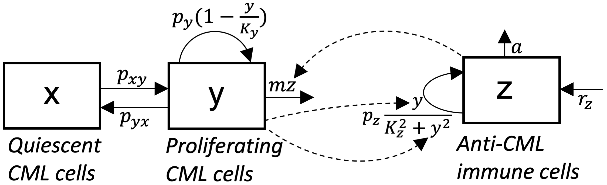
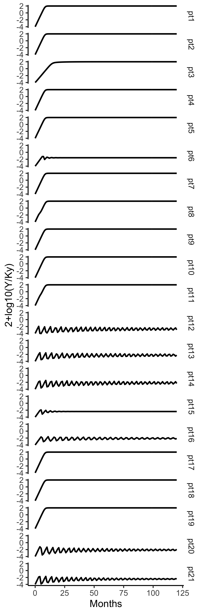
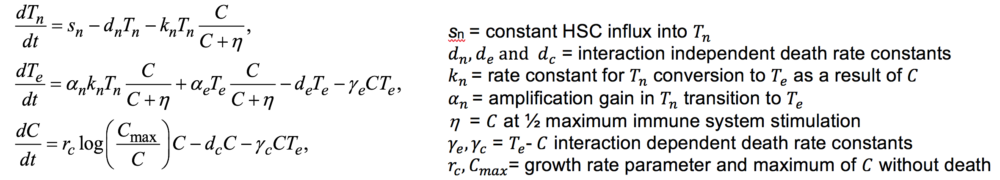
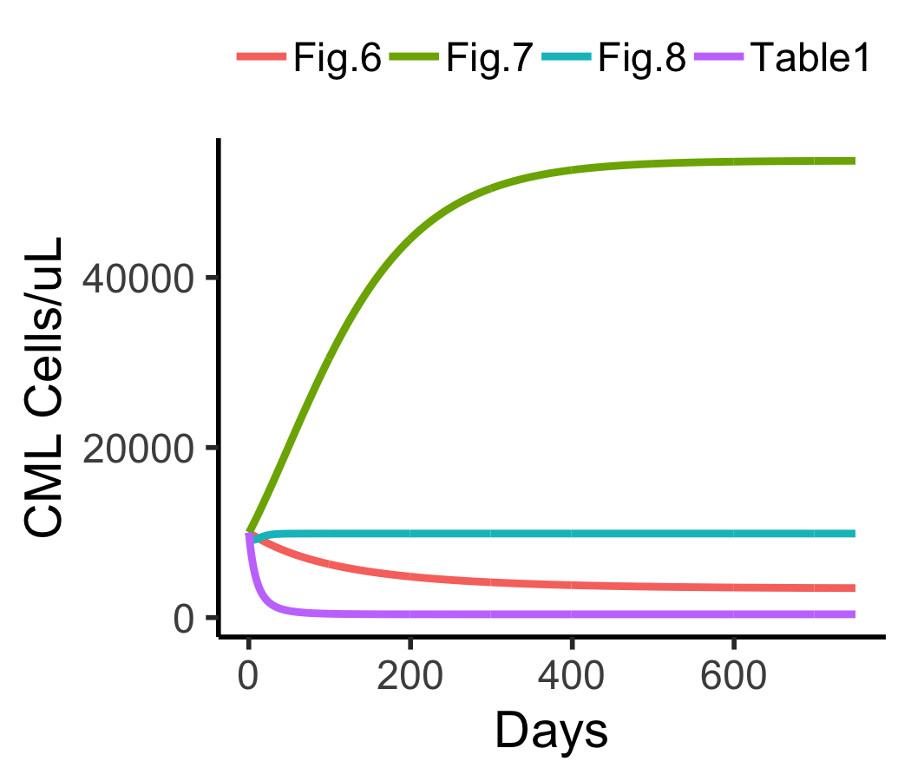
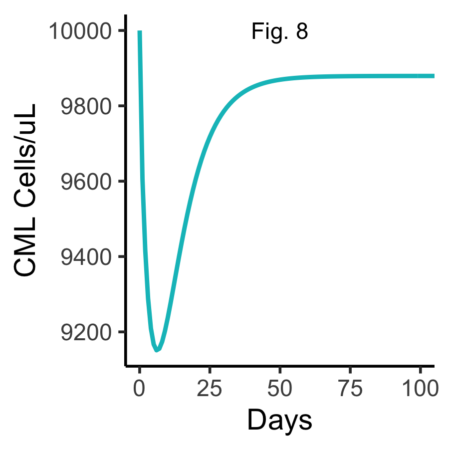
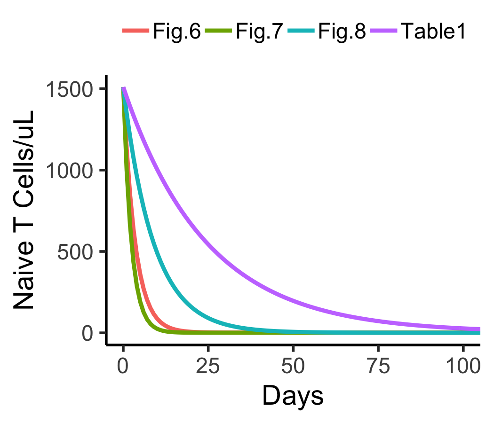
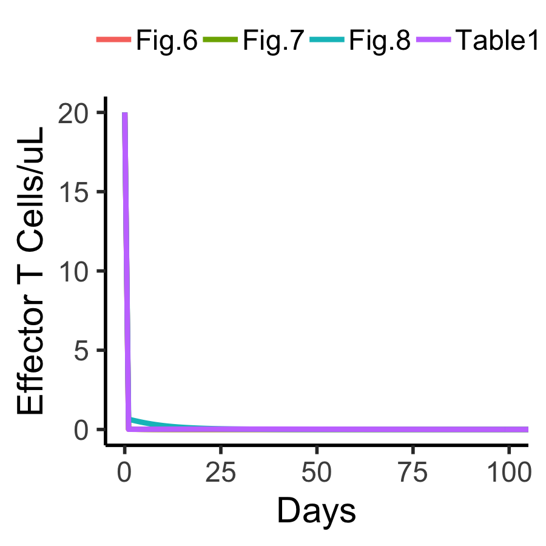

# CML models in myelo
The R package houses models of myeloid hematopoiesis. The focus here is on CML.


# Inferring immunological control mechanisms from TKI dose alterations in CML patients (Hahnel et 2020)

This model captures quiscent (x) and dividing (y) CML cells interacting with anti-CML immune cells (z). 


The differential equations of this model are:


The following code runs the model for 10 years (120 months) from an initial condition of y(0)=1 yielding


```
library(myelo)  
library(deSolve)
library(tidyverse)
glauchePars20
(ic=c(X=0,Y=1,Z=0))
(d=glauchePars20%>%group_by(id)%>%nest())
d$data[[1]]
glauche20<-function(Time, State, Pars) {
  with(as.list(c(Time, State, Pars)),{
    dX = -pxy*X + pyx*Y 
    dY =  pxy*X - pyx*Y + py*Y*(1-Y/Ky)   -  m*Y*Z 
    dZ =  rz    -   a*Z                   + pz*Y*Z/(Kz^2+Y^2)  
    list(c(dX,dY,dZ),c(ratio=2+log10(Y/Ky)))
  })
}

fsim=function(x) {
  ic[3]=x$rz/x$a
  ode(y = ic, times = seq(0,10*12,1), func = glauche20, parms = x)
}
d=d%>%mutate(out=map(data,fsim))
head(d$out[[1]])
for (i in 1:21) plot(d$out[[i]],which=c("ratio"),xlab="Months",ylab="2+log10(Y/Ky)",main=paste("Patient",i))  
as_tibble(d$out[[1]])%>%select(time,ratio)
d=d%>%mutate(D=map(out,function(x) as_tibble(x)%>%select(time,ratio)
                   %>%mutate(time=as.numeric(time),ratio=as.numeric(ratio))))
pdf("~/Results/CML/hahnel.pdf",width=4,height=4)
# png("~/Results/CML/hahnel.png") #only last plot shows up
# ?plot.deSolve
# par(mfrow=c(6,2))
for (i in 1:21) plot(d$out[[i]],which=c("ratio"),xlab="Months",ylab="2+log10(Y/Ky)",main=paste("Patient",i))  
dev.off()
dd=d%>%select(id,D)
dd=dd%>%unnest(cols=D)
dd$id=as_factor(dd$id)
tc=function(sz) theme_classic(base_size=sz)
gx=xlab("Months")
gy=ylab("2+log10(Y/Ky)")
sbb=theme(strip.background=element_blank())
dd%>%ggplot(aes(x=time,y=ratio))+facet_grid(id~.)+geom_line(size=1)+gx+gy+tc(14)+sbb 
ggsave("~/Results/CML/hahnel.png",width=4,height=12)
```


# A mathematical model for chronic myelogenous leukemia (CML) and T cell interaction (Moore and Li 2004)

This model captures CML cells (C) interacting with naive T cells (Tn) and effector T cells (Te). 
The differential equations of this model are:



The following code reproduces Figures 6-8 in [Moore and Li 2004](https://www.ncbi.nlm.nih.gov/pubmed/15038986) 




```
library(tidyverse)
library(deSolve)
library(myelo)  

#Table 1
(p1=c(sn=0.073,dn=0.04,de=0.06,dc=0.2,  kn=.001,eta=100,alfn=0.41,alfe=0.2, Cmax=3e5, rc=.03, ge=.005, gc=.005)) 
#Table 3
(p6=c(sn=0.37, dn=0.23,de=0.30,dc=0.024,kn=.062,eta=720,alfn=0.14,alfe=0.98,Cmax=23e4,rc=.0057,ge=.057,gc=.0034)) 
(p7=c(sn=0.29, dn=0.35,de=0.40,dc=0.012,kn=.066,eta=140,alfn=0.39,alfe=0.65,Cmax=16e4,rc=.011, ge=.079, gc=.058)) 
(p8=c(sn=0.071,dn=0.05,de=0.12,dc=0.68, kn=.063,eta=43, alfn=0.56,alfe=0.53,Cmax=19e4,rc=.23,  ge=.0077,gc=.047)) 
(P=list(Table1=p1,Fig.6=p6,Fig.7=p7,Fig.8=p8))
(ic=c(Tn=1510,Te=20,C=1e4)) # units are cells/uL 
t= seq(0,750,1)             #  and days
######## see http://eriqande.github.io/2015/01/22/solving-differential-equations-in-R.html
L=lapply(P, function(x) { 
  params=x
  ode(y=ic,times=t,func=moore04,parms=params)
})
L
D=do.call(rbind, lapply(names(L), function(x) data.frame(L[[x]],x,stringsAsFactors=F)))
###########
ltb=theme(legend.margin=margin(0,0,0,0),legend.title=element_blank())
ltp=theme(legend.position="top",legend.direction="horizontal")
tc=function(sz) theme_classic(base_size=sz);
gy=ylab("CML Cells/uL")
gx=xlab("Days")
D%>%ggplot(aes(x=time,y=C,color=x))+geom_line(size=1)+gx+gy+tc(14)+ltb+ltp
ggsave("~/Results/CML/fig6to8.png",height=3,width=3.5)

```


The code below further zooms in on 0 to 100 of the plot in Figure 8

```
cc=coord_cartesian(xlim=c(0,100))
library(scales)
D%>%filter(x=="Fig.8")%>%
  ggplot(aes(x=time,y=C))+geom_line(size=1,color=hue_pal()(4)[3])+gx+gy+tc(14)+ltb+ltp+cc+
  annotate("text", x =50, y =10000, label = "Fig. 8")
ggsave("~/Results/CML/fig8.png",height=3,width=3)

```



We can now examine time courses of naive T cells

```
gy=ylab("Naive T Cells/uL")
D%>%ggplot(aes(x=time,y=Tn,color=x))+geom_line(size=1)+gx+gy+tc(14)+ltb+ltp+cc
ggsave("~/Results/CML/naive.png",height=3,width=3.5)

```


and effector T cells
```
gy=ylab("Effector T Cells/uL")
D%>%ggplot(aes(x=time,y=Te,color=x))+geom_line(size=1)+gx+gy+tc(14)+ltb+ltp+cc
ggsave("~/Results/CML/effector.png",height=3,width=3)

```


It seems the initial effecter T cell population is far higher than it should be. The following code zooms in on the first 3 time points
```
D%>%group_by(x)%>%nest()%>%mutate(top=map(data,function(x) x[1:3,]))%>%unnest(top)
#  A tibble: 12 x 6
#    x       time    Tn      Te      C     T
#    <chr>  <dbl> <dbl>   <dbl>  <dbl> <dbl>
#  1 Table1     0 1510  20      10000  1530 
#  2 Table1     1 1449.  0.0130  9062. 1449.
#  3 Table1     2 1391.  0.0137  8252. 1391.
#  4 Fig.6      0 1510  20      10000  1530 
#  5 Fig.6      1 1133.  0.0162  9937. 1133.
#  6 Fig.6      2  850.  0.0122  9877.  850.
#  7 Fig.7      0 1510  20      10000  1530 
#  8 Fig.7      1  997.  0.0316 10148.  997.
#  9 Fig.7      2  659.  0.0205 10319.  659.
# 10 Fig.8      0 1510  20      10000  1530 
# 11 Fig.8      1 1349.  0.645   9606. 1350.
# 12 Fig.8      2 1205.  0.588   9415. 1206.

```

A help page is available for the function called by ode() of the R package deSolve, i.e. moore04(). Its definition is
```
moore04<-function(Time, State, Pars) {
  with(as.list(c(State, Pars)),{
    dTn = sn - dn*Tn - kn*Tn*C/(C+eta) 
    dTe = alfn*kn*Tn*C/(C+eta) + alfe*Te*C/(C+eta) - de*Te - ge*C*Te
    dC  = rc*C*log(Cmax/C) - dc*C - gc*C*Te 
    list( c(dTn,dTe,dC), c(T=Tn+Te) )
  }) 
}
```
