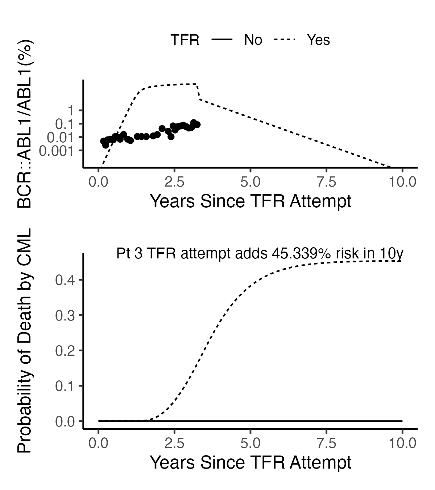

## A Model of Survival Times of CML Cases Diagnosed in 1975-1985 Yields Estimates of Death-by-Disease Risks of Treatment-Free Remission Attempt Failures 

These are the scripts for this paper that I submitted to Leukemia Research on 08/24/2025.  

The first step is to generate a case-listing file for each of the three SEER databases using the software SEER*stat.  These files are merged into one in the Fig2A_mkSEER.R.  This is your starting point. Next run Fig2AB.R, then run the remaining Fig2 to Fig4 files. Figure 5 needs three preliminary steps before running Fig.5.R. The steps are: 1) run Fig5_1mkAges.R, which estimates the midpoint ages of 5-year age intervals of OC and HM mortality data from SEER; 2) Fig5_2mkMrts.R which organized the 5-year age interval SEER mortality data so that it is ready for surface spline fitting; and 3) surface spline fitting to interpolate 5-year age group mortalities to 1-year age group mortalities, i.e. to create the input mortality matrices expected by codes I wrote for SEERaBomb.  The remaining 2 files are setup.R, which simple contains some definitions used by more than one of the other scripts, and B_setpointWatershed.R, which hold codes for inverse mapping setpoints and watershed seen in the data by inspection to Hahnel model immune activation parameters $K_z$ and $p_z$. 


In Figure 4A I provide a bespoke Poisson regression fit to data from Patient 3 in Hahnel et al (Cancer Res. 2020). The TFR attempt risk estimate was 0.11%.  In the code below I show what happens if one uses the fits given by Hahnel et al for the 10 (of 21) patients in their dataset with failed TFR attempts. 

```
## using hahnel model parameters values to estimate TFR failure risks of death by CML
graphics.off();rm(list=ls())
setwd("~/cml/TFRisks") 
library(tidyverse)
library(patchwork)
library(deSolve) 
library(myelo)
(Fids=c(1:4,7,9:10,17:19)) #10 TFR Failure IDs, i.e. relapses  (out of 21 studied)
### get parameters from myelo
(d <- glauchePars20[Fids,]|>select(id:Z0,-grp)|>relocate(CessT, .after = last_col()))
d$id=as.numeric(row.names(d))
d
# get state at time of TFR attempt
hahnel<-function(Time, State, Pars) {
  with(as.list(c(Time, State, Pars)),{
    dX = -pxy*X + pyx*Y 
    dY =  pxy*X - pyx*Y + py*Y*(1-Y/Ky)   -  m*Y*Z - TKI*Y
    dZ =  rz    -   az*Z                   + pz*Y*Z/(Kz^2+Y^2) 
    list(c(dX,dY,dZ))
  })                               
}

fsim=function(x) {
  ic=c(X=x$X0,Y=x$Y0,Z=x$Z0)
  y=ode(y = ic, times = seq(0,x$CessT,1), func = hahnel, parms = x)
  tail(data.frame(y),1)|>select(-time)
}

(dn=d%>%group_by(id)%>%nest())
(dn=dn%>%mutate(out=map(data,fsim)))
(dd=dn%>%unnest())

# get data from myelo to get final times as times to restart TKI
head(d2<-hahnelFigS5)
(d2=d2|>filter(Pt%in%Fids))
(d2n=d2|>nest_by(Pt))
d2n$data[[1]]
dd$finalT=sapply(d2n$data,function(x) max(x$Months))
(dd=dd|>mutate(Ton=finalT-CessT)) # time in months to turn the TKI back on
#       id       pyx        pxy   TKI      pz      Kz    py      Ky    az    rz      m       X0      Y0    Z0 CessT        X       Y     Z finalT   Ton
#    <dbl>     <dbl>      <dbl> <dbl>   <dbl>   <dbl> <dbl>   <dbl> <dbl> <dbl>  <dbl>    <dbl>   <dbl> <dbl> <dbl>    <dbl>   <dbl> <dbl>  <dbl> <dbl>
#  1     1 0.0126    0.0483     13.9  2.21e+3  362     1.66 1000000     2   200 0.0001   194000  742834   100  85.9   3.22e3 1.27e+1  112.   89.0  3.11
#  2     2 0.00033   0.0452      1.95 1.94e+3  508     1.66 1000000     2   200 0.0001      796  109001   101  85.7   1.95e1 3.42e+0  101.   89.7  4.02
#  3     3 0.878     0.184       6.48 1.5 e-7    4.29  1.66 1000000     2   200 0.0001   161000   33678   100  72.9   2.37e0 7.84e-2  100.  112.  39.0 
#  4     4 0.000271  0.00000168  2.31 5.38e+4 9570     1.66 1000000     2   200 0.0001 35100000  217698   114  95.2   3.51e7 8.90e+1  103.   96.7  1.52
#  5     7 0.00106   0.000406    1.86 5.85e-3   26.3   1.66 1000000     2   200 0.0001    31200   11949   100 108     2.99e4 5.71e+1  100.  111.   2.77
#  6     9 0.000378  0.0732      2.56 3.25e+2   85.7   1.66 1000000     2   200 0.0001     3820  739824   100  60.7   4.99e1 4.35e+0  111.   62.7  2.05
#  7    10 0.000635  0.0447      2.77 4.73e+2  115     1.66 1000000     2   200 0.0001     7950  559804   100  70.5   3.59e2 1.48e+1  137.   73.4  2.94
#  8    17 0.00122   0.0452      2.36 2.68e+4 5700     1.66 1000000     2   200 0.0001    26900  996734   101  95.6   3.83e2 2.59e+1  101.   97.7  2.15
#  9    18 0.000457  0.051       3.32 6.57e-7    6.84  1.66 1000000     2   200 0.0001    14600 1630508   100  81.3   2.39e2 7.52e+0  100.   86.4  5.15
# 10    19 0.0000454 0.00000286  1.86 1.47e+1 1740     1.66 1000000     2   200 0.0001 10100000  637927   100  92.6   1.01e7 1.36e+2  100.   95.6  3.00

#no immunity loss here for Patient 3 ... all fits taken as is.
markovHahnel<-function(Time, State, Pars) {
  with(as.list(c(Time, State, Pars)),{
    L=Y/Ky
    dUtki   = 0     
    dX1  = -k1*L*X1
    dX2  = k1*L*X1 - k2*X2
    dX3b = k2*X2-k3*X3b # H is the cumulative hazard of progression, 
    dH   = k3*X3b/(X1+X2+X3b) # conditional on it not having happened yet 
    dX = -pxy*X + pyx*Y 
    dY =  pxy*X - pyx*Y + py*Y*(1-Y/Ky)   -  m*Y*Z - TKI*Utki*Y
    dZ =  rz    -   az*Z                   + pz*Y*Z/(Kz^2+Y^2) 
    list(c(dUtki,dX1,dX2,dX3b,dH,dX,dY,dZ),c(P=1-exp(-H),R=L/(2-L)))
  })                                # P=1-RS where RS=exp(-H)
}
mpars=c(k1=0.35121676,k2=1.11192339,k3=1.61921238)/12 # updated to April 2025 values 

tc=function(sz) theme_classic(base_size=sz)
sbb=theme(strip.background=element_blank()) 
bks=c(0.001,0.01,0.1,1)
sy=scale_y_log10(breaks=bks,labels=bks)
cc1=coord_cartesian(ylim=c(1e-4,100))
gl=geom_line()
gxTFR=xlab("Years Since TFR Attempt")
gyIS=ylab("BCR::ABL1/ABL1(%)")
top=theme(legend.position="top",legend.title = element_text(size=10))
layout <- "
A
B
B
"
gyP=ylab("Probability of Death by CML")

i=1
risks=NULL
dd=ungroup(dd)
for (i in dd$id) {
  (hpars=dd|>filter(id==i)|>select(pyx:m)|>unlist())
  (mhPars=c(mpars,hpars))
  (hICs=dd|>filter(id==i)|>select(X:Z)|>unlist())
  # (hICs=dd[i,]|>select(X:Z)|>unlist())
  (mhIC0=c(Utki=1,X1=1,X2=0,X3b=0,H=0,hICs)) # didn't attempt a TFR
  (mhIC1=c(Utki=0,X1=1,X2=0,X3b=0,H=0,hICs))
  times <- seq(-12*0,12*10,by=1) #run from 0 months to 10 more years after TFR attempt
  y0 <- ode(mhIC0,times = times, func = markovHahnel,	parms = mhPars,method="lsodar")
  (d0=data.frame(y0)) 
  # now do TFR from time of attempt
  (tON=dd|>filter(id==i)|>select(Ton)|>unlist())
  (evTKI=data.frame(var="Utki",time=c(tON),value=c(1),method="replace")) #return to dosing after TFR1 failure
  y1 <- ode(mhIC1,times = times, func = markovHahnel,	parms = mhPars,events=list(data=evTKI),method="lsodar")
  (d1=data.frame(y1)) 

  (tOFF=dd|>filter(id==i)|>select(CessT)|>unlist())
  
  d1|>select(time:H,P:R)|>gather(key="Var",value="Value",-time)|>
    mutate(Var=factor(Var,levels=c("Utki","Upz","X1","X2","X3b","H","P","R")))|>
      ggplot(aes(x=time,y=Value))+facet_grid(Var~.,scales = "free")+geom_line(size=1)+xlab("Months")+tc(14)+sbb
    (D0=d0%>%select(time,R,P)%>%mutate(TFR="No"))
    (D1=d1%>%select(time,R,P)%>%mutate(TFR="Yes"))
    D=bind_rows(D0,D1)
    (p1=D%>%ggplot(aes(x=time/12,y=100*R,linetype=TFR))+gl+sy+gxTFR+gyIS+cc1+
      geom_point(mapping=aes(x=(Months-tOFF)/12, y=Prct),data=d2|>mutate(TFR="Yes")|>filter(Pt==i))+tc(12)+top) 
  
  print(DR0<-D%>%filter(time==120,TFR=="No"))  # risk 10-years without stopping
  print(DR1<-D%>%filter(time==120,TFR=="Yes"))  # risk 10-years after stopping
  print(progRisk <- DR1$P-DR0$P) # 0.0001555865
  # (id=dd[i,]|>select(id)|>unlist())
  (tit=paste0("Pt ",i," TFR attempt adds ",round(100*progRisk,3),"% risk in 10y"))
  
  (p2=D%>%ggplot(aes(x=time/12,y=P,linetype=TFR)) + geom_line()+ ggtitle(tit)+ tc(12)+ 
    theme(legend.position="none", plot.title=element_text(size=10,hjust=0.7,vjust=-4))+gxTFR+gyP )
  p1/p2 + plot_layout(design = layout)
  ggsave(paste0("pngs/pt",i,".png"),height=4.5,width=4)
  risks=c(risks,progRisk)
}

names(risks)<-dd$id
round(100*risks,3)
#      1      2      3      4      7      9     10     17     18     19 
#  0.031  0.031 45.339  0.008  0.092  0.001  0.013  0.007  0.234  0.305 
# Pt 3 outlier is due to a very poor fit. Bespoke Poisson regression took 45% to 0.11%
median(risks*100)
quantile(risks*100)
#           0%          25%          50%          75%         100% 
# 8.481922e-04 9.212717e-03 3.148553e-02 1.985405e-01 4.533915e+01 
```


  
Their patient 3 was clearly unacceptable, as seen directly, and also from the extremely high estimate of the risk at 45%.


