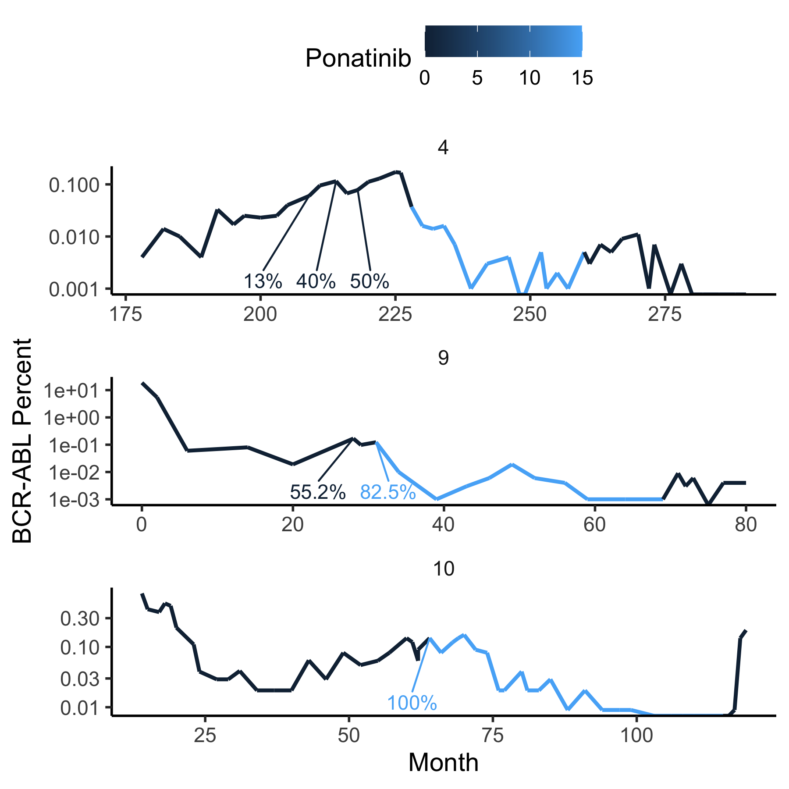

## Prolonged treatment-free remission in chronic myeloid leukemia patients with previous BCR-ABL1 kinase domain mutations. Claudiani et al, Haematologica (2020). 

This code plots data for 3 patients treated with ponatinib (pts 4, 9 and 10 in Fig 1). 

```
rm(list=ls())
library(myelo)
library(tidyverse)
head(d<-claudianiPon)
tc=function(sz) theme_classic(base_size=sz)
gy=ylab("BCR-ABL Percent")
sbb=theme(strip.background=element_blank())
library(ggrepel)
d%>%ggplot(aes(x=Month,y=Prct,col=Ponatinib,label=T315I))+facet_wrap(Pt~.,ncol=1,scale="free")+geom_line(size=1)+
  geom_text_repel(nudge_y=-10,nudge_x=-3) +
  gy+tc(14)+sbb+scale_y_log10()+theme(legend.position="top")
ggsave("../docs/claudianiPonLog.png",width=6,height=6)

```



T315I mutation percentages of BCR-ABL at 3, 2 and 1 time points are indicated below the curves. BCR-ABL percentages during ponatinib use are in light blue:  before this a different TKI was used and after it no TKI was used. 

## Question

Focusing on patient 4, how did the clone rise ~10-fold between months 180 and 210 and only reach a T315I percentage of 13%?  

## Hypothesis

T315I formation did not initiate this relapse. This patient had
a pre-existing small T315I subclone under immunological control lost via 
immune system exhaustion by an infection, similar to the Hong Kong 
flu of 1968 releasing latent A-bomb-induced CML clones in Hiroshima females in 1969-1974, 
see Radiat Environ Biophys. 2021;60(1):41-47. 
Continued exposure to non-ponatinib TKI during this loss of immuno-control 
then provided greater selective pressure for the pre-existing T315I clone 
to grow relative to WT.  Thus, prior to the 
infection the immune system was controlling the cancer. 
The infection allowed all bcr-abl clones to expand,
and with continued TKI application, particularly the T315I subclone. 
Ponatinib then drove all subclones down to a size that 
could again be immuno-controlled, see Hahnel et al. Canc Res 2020 80:2394–406. In 
contrast, the relapse in patient 10 was initiated by 
T315I formation, as in this patient T315I was at 100% at the end of a ~3-fold rise 
between months 40 and 60. Consistent with weaker immuno-control in patient 10, a relapse occurred 
when attempting TFR; in patient 4, BCR-ABL decreasing 
between months 270 and 280 in the absence of any TKI suggests strong immuno-control. 

## Other Questions and Speculations
 
Q. If the pre-ponatinib TKI was able to control non-T315I clones prior to
the patient gaining immuno-control, why couldn't it control them after immuno-control 
loss? 

A. Maybe some other fully-sweeping partial resistance mutation came after immuno-control, 
but before T315I.

Q. Why would T315I form after immuno-control? 

A. Maybe TKI-to-immuno-control transitions happen gradually, and thus with periods 
of major contributions from both sources. Perhaps the T315I clone starts when there is more TKI
control, and before the clone gets too big, the immuno-control 
contribution increases enough to keep it in check. 
