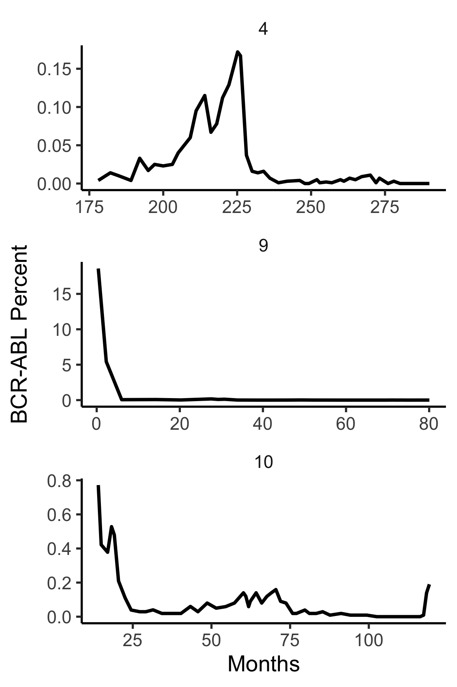

## Prolonged treatment-free remission in chronic myeloid leukemia patients with previous BCR-ABL1 kinase domain mutations. Claudiani et al, Haematologica (2020). 

The following code plots data for patients 4, 9 and 10 in Figure 1 of this paper. 

```
rm(list=ls())
library(myelo)
library(tidyverse)
head(d<-claudianiPon)
tc=function(sz) theme_classic(base_size=sz)
gy=ylab("BCR-ABL Percent")
sbb=theme(strip.background=element_blank())
d%>%ggplot(aes(x=Months,y=Prct))+facet_wrap(Pt~.,ncol=1,scale="free")+geom_line(size=1)+
  gy+tc(14)+sbb+theme(legend.position="top") 
ggsave("~/Results/CML/claudianiPon.png",width=4,height=12)
d%>%ggplot(aes(x=Months,y=Prct))+facet_wrap(Pt~.,ncol=1,scale="free")+geom_line(size=1)+
  gy+tc(14)+sbb+scale_y_log10()+theme(legend.position="top")
ggsave("~/Results/CML/claudianiPonLog.png",width=4,height=12)
```




and using a log scale


Patient 4: ponatinib was started on month 228 and stopped (entering a TFR) on month 259. 

Patient 9: ponatinib was started on month 31 and stopped (entering a TFR) on month 69.

Patient 10: ponatinib was started on month 64 and stopped (attempting a TFR) on month 114.


