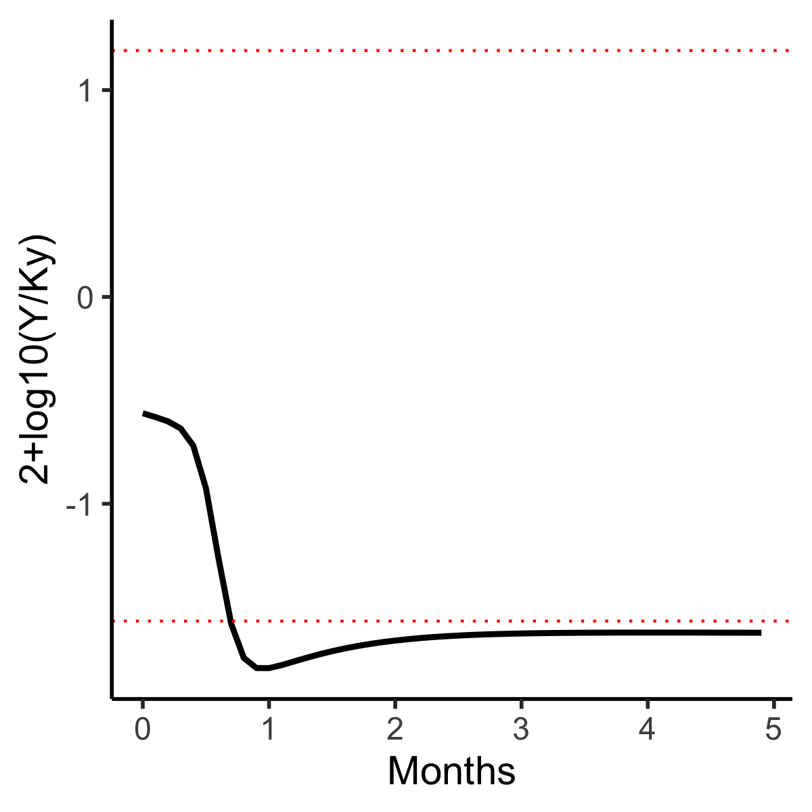
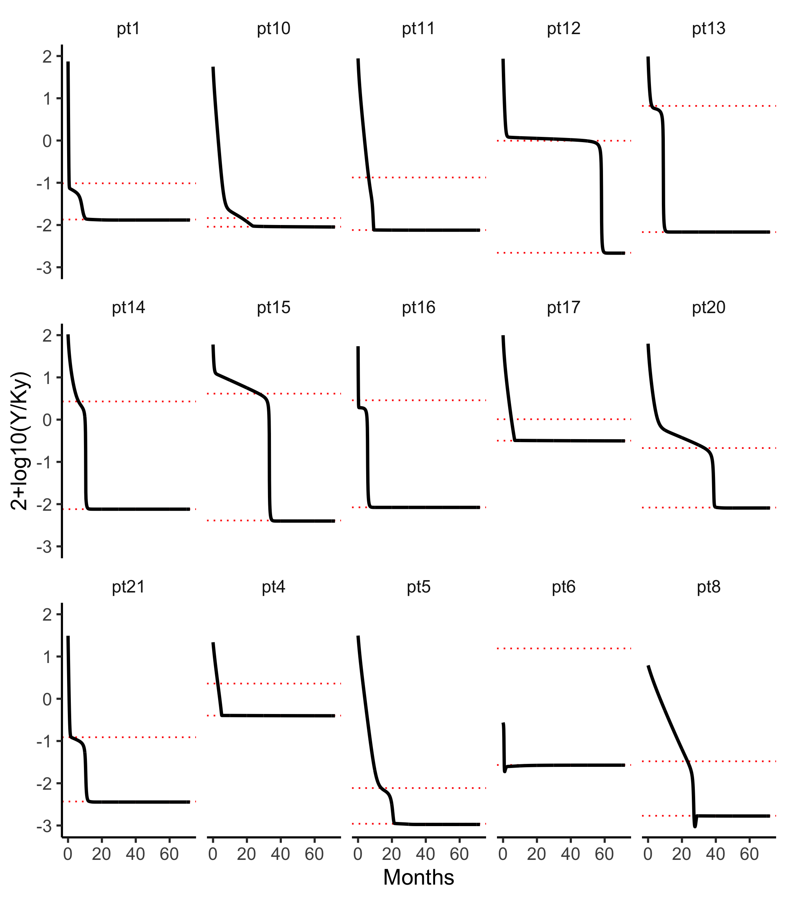
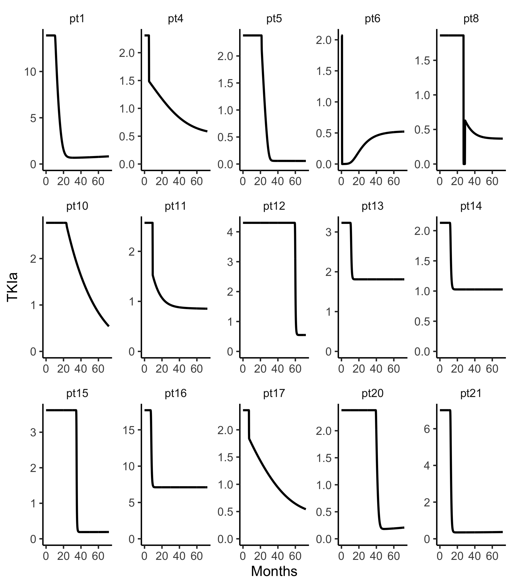

## Model-based inference and classification of immunological control mechanisms from TKI cessation and dose reduction in CML patients. Hahnel et al, Cancer Research (2020).

This model captures quiescent (x) and dividing (y) CML cells interacting with anti-CML immune cells (z). 


The differential equations of this model are:


There are three classes of patients: Class A {2, 3, 7, 9, 18, 19} 
have no hope of being controlled by the immune system; Class B  {6, 12, 13, 14, 15, 16, 20, 21}
are  easily controlled by dropping cancer loads low enough; and Class C {1, 4, 5, 8, 10, 11, 17} 
can be immuno-controlled if steered properly by lowering doses as cancer loads drop across
peak stimulation loads, to increase time there and thus immune stimulation.  

In Figure S5 and the output of the code below, which simulates patient 
loads out to 72 months, Class B patients 12-16 have striking (perhaps unrealistic) load step drops as loads fall into 
the immune activation window.    

```
library(tidyverse)
library(myelo)
library(deSolve)
head(d <- glauchePars20)
fHahnel<-function(Time, State, Pars) {
    with(as.list(c(Time, State, Pars)),{
    dX = -pxy*X + pyx*Y 
    dY =  pxy*X - pyx*Y + py*Y*(1-Y/Ky)   -  m*Y*Z - TKI*Y
    dZ =  rz    -   a*Z                   + pz*Y*Z/(Kz^2+Y^2) 
    list(c(dX,dY,dZ),c(prct=2+log10(Y/Ky)))
  })
}

fsim=function(x) {
  ic=c(X=x$X0,Y=x$Y0,Z=x$Z0)
  ode(y = ic, times = seq(0,72,.1), func = fHahnel, parms = x)
}

(dn=d%>%group_by(id)%>%nest())
dn=dn%>%mutate(out=map(data,fsim))
dn=dn%>%mutate(D=map(out,function(x) as_tibble(x)%>%mutate_all(as.numeric)))
dd=dn%>%select(id,D)
dd=dd%>%unnest(cols=D)
dd$id=as_factor(dd$id)
d$id=as_factor(d$id)
tc=function(sz) theme_classic(base_size=sz)
gx=xlab("Months")
gy=ylab("2+log10(Y/Ky)")
sbb=theme(strip.background=element_blank())
dd%>%ggplot(aes(x=time,y=prct))+
  geom_hline(aes(yintercept=2+log10(Ymax/Ky)),linetype='dotted', col = 'red',data=d) +
  geom_hline(aes(yintercept=2+log10(Ymin/Ky)),linetype='dotted', col = 'red',data=d) +
  facet_wrap(id~.,ncol=5) + geom_line(size=1)+gx+gy+tc(14)+sbb 
ggsave("../docs/figS5simBstep72mo.png",width=7,height=8)

```


Patient 6 is the only one that starts inside the immune activation window (i.e. between the dotted lines).  Class A patients have no window. 


Immune activation window lengths (distances between 
dotted lines above) vs patient ID are plotted below.  Class B pts 20 and 21 are almost in class C, as their 
window lengths are close to those of pts 8 and 11. Class A pts were arbitrarily placed at -1. 

```
d%>%ggplot(aes(x=1:21,y=lGap,col=grp))+geom_point() # separable in diff of logs 
ggsave("../docs/logGapvsID.png",width=4,height=4)
```

In Radiat Environ Biophys. 2021;60(1):41-47, Classes A-C are Hiroshima male (hm)-, Nagasaki (n)-, and Hiroshima female (hf)-like.  


Zooming in on the first 5 months of patient 6, initial flatness reflects the quasi-equilibrium assumption 
used to define initial Z values of other patients not holding in the window, where activation dynamics are strong, 
and the remedy of assuming no activation is also incorrect.
```
dd%>%filter(id=="pt6",time<5)%>%ggplot(aes(x=time,y=prct))+geom_line(size=1)+
geom_hline(aes(yintercept=2+log10(Ymax/Ky)),linetype='dotted',col='red',data=d%>%filter(id=="pt6"))+
geom_hline(aes(yintercept=2+log10(Ymin/Ky)),linetype='dotted',col='red',data=d%>%filter(id=="pt6"))+
gx+gy+tc(14)+sbb 
ggsave("../docs/pt6Zoom.png",width=4,height=4)
```



A model-based  dose adjustment rule is given
in Eq. 12 of the Treatment Optimization Section in Supplemental Methods. 
This rule was used to steer a Class C patient to a subclinical steady state in Fig. S9.
It is model-based in that it depends on patient-specific activation window bottom values (Ymins) as setpoints. 
Moving right to left in the figure below, this rule drops doses toward zero as loads cross Ymin.

```
library(tidyverse)
TKI=10
Ymin=200
Y=seq(180,220,.1)
TKIa=TKI/(1+exp(100*(1-Y/Ymin)))  #adjusted TKI dose
tibble(Y,TKI)%>%ggplot(aes(x=Y,y=TKIa))+geom_line() 
#dose drops smoothly around Ymin at bottom of activation window
ggsave("../docs/doseAdjustment.png",width=4,height=4)
```

This yields roughly proportional control with doses constrained between the max 
(known to suffice as it brought the load down this far) and zero (which would be great as it 
would eliminate toxicities). The system reaches steady state between these extremes 
within 5% (190 to 210) of the setpoint Ymin = 200; this tolerance
is defined by 100 in the dose-adjustment formula (higher values imply tighter control). 

The following code shows how this rule can be applied to Class B and C patients.
```
head(d <- glauchePars20%>%filter(grp!="A_hm")) #drop patients without Ymin

fTa<-function(Time, State, Pars) {
  with(as.list(c(Time, State, Pars)),{
    TKIa=TKI/(1+exp(100*(1-Y/Ymin)))
    dX = -pxy*X + pyx*Y 
    dY =  pxy*X - pyx*Y + py*Y*(1-Y/Ky)   -  m*Y*Z - TKIa*Y
    dZ =  rz    -   a*Z                   + pz*Y*Z/(Kz^2+Y^2) 
    list(c(dX,dY,dZ),c(prct=2+log10(Y/Ky),TKIa=TKIa))
  })
}

fsimTa=function(x) {
  ic=c(X=x$X0,Y=x$Y0,Z=x$Z0)
  ode(y = ic, times = seq(0,72,.1), func = fTa, parms = x)
}

(dn=d%>%group_by(id)%>%nest())
head(dn$data[[1]])
dn=dn%>%mutate(out=map(data,fsimTa))
head(dn$out[[1]])
dn=dn%>%mutate(D=map(out,function(x) as_tibble(x)%>%mutate_all(as.numeric)))
dd=dn%>%select(id,D)
dd=dd%>%unnest(cols=D)
dd$id=as_factor(dd$id)
d$id=as_factor(d$id)
tc=function(sz) theme_classic(base_size=sz)
gx=xlab("Months")
gy=ylab("2+log10(Y/Ky)")
sbb=theme(strip.background=element_blank())
dd%>%ggplot(aes(x=time,y=prct))+ 
  geom_hline(aes(yintercept=2+log10(Ymax/Ky)),linetype='dotted', col = 'red',data=d) +
  geom_hline(aes(yintercept=2+log10(Ymin/Ky)),linetype='dotted', col = 'red',data=d) +
  facet_wrap(id~.,ncol=5) + geom_line(size=1)+gx+gy+tc(14)+sbb 
ggsave("../docs/doseAdjY.png",width=7,height=8)

```



These load dynamics are achieved by drug dosing dynamics that generate the following TKI-mediated CML cell killing rates 
```
dd%>%ggplot(aes(x=time,y=TKIa))+facet_wrap(id~.,scale="free",ncol=5)+
   ylim(c(0,NA))+geom_line(size=1)+gx+tc(14)+sbb 
ggsave("../docs/doseAdjTKI.png",width=7,height=8)

```

This reveals that the Class C patient in Fig. S9 was pt 4. 
It is unclear why baseline values are much higher in pts 1 and 16.   


Using WebPlotDigitizer, BCR-ABL time courses in Figs S2 and S5 were digitized.    
```
head(hahnelFigS2)
(d=hahnelFigS2%>%mutate(Censored=c("No","Yes")[UL+1]))
tc=function(sz) theme_classic(base_size=sz)
gx=xlab("Months")
gy=ylab("BCR-ABL Percent")
sbb=theme(strip.background=element_blank())
d%>%ggplot(aes(x=Months,y=Prct,col=Censored))+facet_wrap(Pt~.,ncol=4)+geom_line(size=1)+
gx+gy+tc(14)+sbb+scale_y_log10()+theme(legend.position="top") 
ggsave("../docs/hahnelFigS2.png",width=6,height=8)

```


The first values of these time courses reproduce Fig S1E.
```
library(myelo)
library(tidyverse)
head(hahnelFigS2)
d=hahnelFigS2%>%group_by(Pt)%>%nest()
(x=d$data[[1]])
myfun=function(x) x[[1,"Prct"]]
myfun(x)
D=d%>%mutate(first=map_dbl(data,myfun))
hist(log10(D$first),n=20)
hist(log10(D$first),breaks=c(-1,0,1,2,3))
D%>%ggplot(aes(x=first))+geom_histogram()+scale_x_log10()
D%>%ggplot(aes(x=first))+geom_histogram(breaks=c(0.1,1,10,100,1000))+scale_x_log10()
D%>%ggplot(aes(x=first,y=..density..))+geom_freqpoly(breaks=c(0.1,1,10,100,1000))+scale_x_log10()+
labs(x="Patient's First BCR-ABL1 Percentage",y="Probability Density")
ggsave("../docs/hahnelFigS1E.png",width=3,height=3)

```


There are fast and slow relapse rates after TKI cessation (Fig S5). 

```
rm(list=ls())
library(myelo)
library(tidyverse)
head(hahnelFigS5)
(dn=hahnelFigS5%>%mutate(Censored=c("No","Yes")[UL+1]))
dn=dn%>%group_by(Pt)%>%nest()
myfun=function(x) x%>%mutate(Months=Months-Months[1])
dn=dn%>%mutate(data=map(data,myfun))
dd=dn%>%unnest(data)
tc=function(sz) theme_classic(base_size=sz)
gy=ylab("BCR-ABL Percent")
gx=xlab("Months after TKI Cessation")
sbb=theme(strip.background=element_blank())
head(d <- glauchePars20)
d$Pt=1:21
dd%>%ggplot(aes(x=Months,y=log10(Prct),col=Censored))+
  geom_hline(aes(yintercept=2+log10(Ymin/Ky)),linetype='dotted',data=d) +
  geom_hline(aes(yintercept=2+log10(Ymax/Ky)),linetype='dotted',data=d) +
  facet_wrap(Pt~.,ncol=5)+
  geom_line(size=1)+geom_point(size=1)+
  gx+gy+tc(14)+sbb+
  theme(legend.position="top") 
ggsave("../docs/hahnelFigS5.png",width=7,height=8)

```


Without modeling, patients 3 and 6 appear similar, but with it, we see 3 does
not have an immune activation window (so treatment should resume) and 
6 is approaching immmune activation,  so treatment should not resume.  


To simulate radiation-induced CML, the following code runs 
the model for 6 years (72 months) from an initial condition of y(0)=1. 

```
library(myelo)  
library(deSolve)
library(tidyverse)
glauchePars20       # model parameters in Table S1
(ic=c(X=0,Y=1,Z=0))
(d=glauchePars20%>%group_by(id)%>%nest())
d$data[[1]]
glauche20<-function(Time, State, Pars) {
  with(as.list(c(Time, State, Pars)),{
    dX = -pxy*X + pyx*Y 
    dY =  pxy*X - pyx*Y + py*Y*(1-Y/Ky)   -  m*Y*Z 
    dZ =  rz    -   a*Z                   + pz*Y*Z/(Kz^2+Y^2) 
    list(c(dX,dY,dZ),c(ratio=2+log10(Y/Ky)))
  })
}

fsim=function(x) {
  ic[3]=x$rz/x$a
  ode(y = ic, times = seq(0,72,1), func = glauche20, parms = x)
}
d=d%>%mutate(out=map(data,fsim))
d=d%>%mutate(D=map(out,function(x) as_tibble(x)%>%mutate_all(as.numeric)))
dd=d%>%select(id,D)
dd=dd%>%unnest(cols=D)
dd$id=as_factor(dd$id)
tc=function(sz) theme_classic(base_size=sz)
gx=xlab("Months")
gy=ylab("2+log10(Y/Ky)")
sbb=theme(strip.background=element_blank())
dd%>%ggplot(aes(x=time,y=ratio))+facet_wrap(id~.,ncol=5)+geom_line(size=1)+gx+gy+tc(14)+sbb 
ggsave("../docs/hahnel.png",width=7,height=8)

```


This shows that Class B patients never would have been diagnosed. As indeed they were,
the model must have changed post-diagnosis. I suspect 
patients become Class B over years of therapy, as  BCR-ABL enters CD4+ memory cells that are benign but 
stimulate the immune system to destroy CML cells arising from HSC, 
see Radiat Environ Biophys. 2021;60(1):41-47. 


