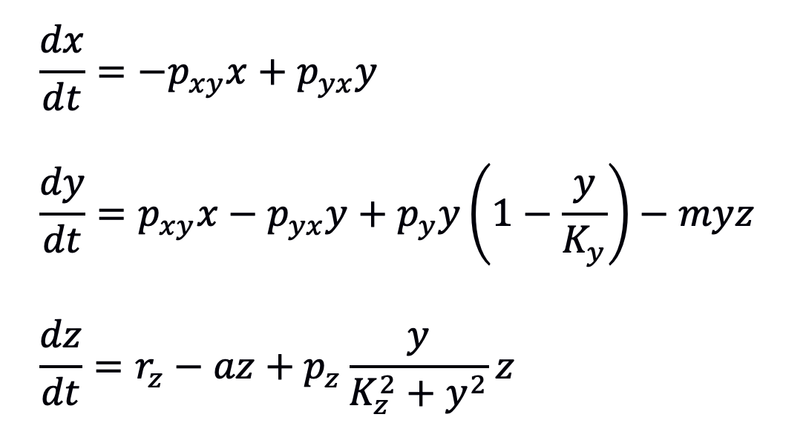
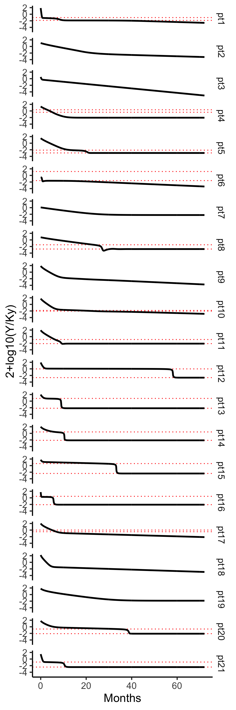
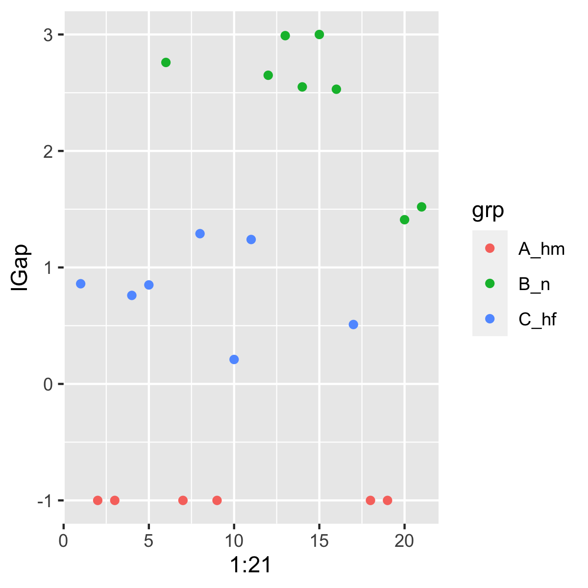
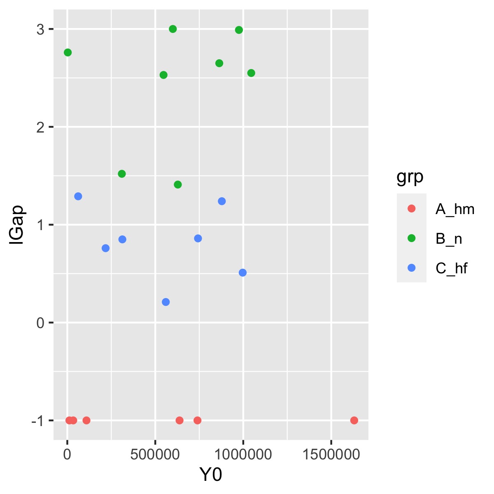
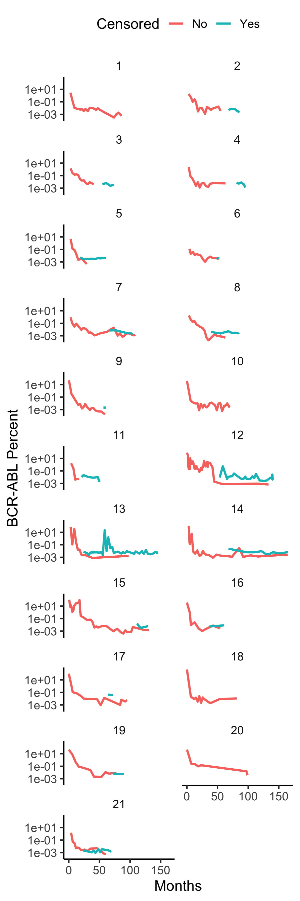
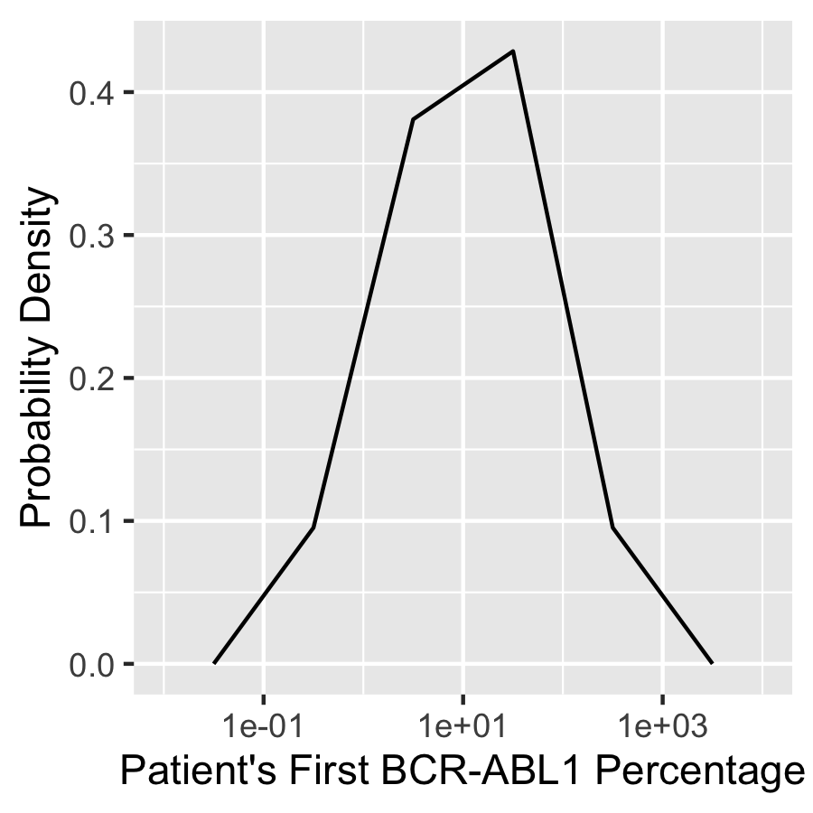
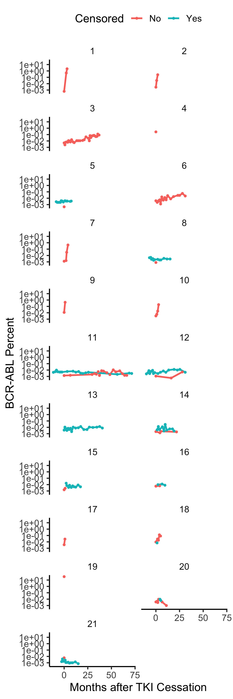
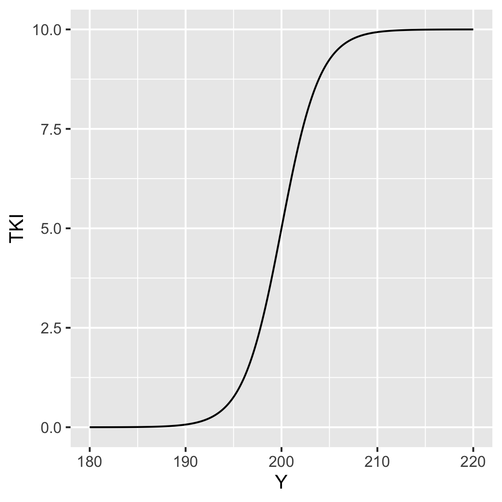

## Model-based inference and classification of immunological control mechanisms from TKI cessation and dose reduction in CML patients. Hahnel et al, Cancer Research (2020).

This model captures quiescent (x) and dividing (y) CML cells interacting with anti-CML immune cells (z). 


The differential equations of this model are:



There are three classes of patients in this paper. Class A patients (2,3,7,9,18,19) 
have no hope of being controlled by the immune system. Class B patients (6, 12,13,14,15,16, 20, 21)
are easily controlled, as one must merely drop the cancer load low enough. And Class C patients
(1,4,5,8,10,11,17) can be immuno-controlled if steered properly.  

In Figure S5 of their paper and the output of the code below, which simulates patient 
loads out to 72 months, Class B patients 12-16 have striking (perhaps unrealistic) load step drops as loads fall into 
the immune activation window.    

```
library(tidyverse)
library(myelo)
library(deSolve)
head(d <- glauchePars20)
fHahnel<-function(Time, State, Pars) {
  with(as.list(c(Time, State, Pars)),{
    dX = -pxy*X + pyx*Y 
    dY =  pxy*X - pyx*Y + py*Y*(1-Y/Ky)   -  m*Y*Z - TKI*Y
    dZ =  rz    -   a*Z                   + pz*Y*Z/(Kz^2+Y^2) 
    list(c(dX,dY,dZ),c(prct=2+log10(Y/Ky)))
  })
}

fsim=function(x) {
  ic=c(X=x$X0,Y=x$Y0,Z=x$Z0)
  ode(y = ic, times = seq(0,72,.1), func = fHahnel, parms = x)
}

(dn=d%>%group_by(id)%>%nest())
dn=dn%>%mutate(out=map(data,fsim))
dn=dn%>%mutate(D=map(out,function(x) as_tibble(x)%>%select(time,prct)
                   %>%mutate(time=as.numeric(time),prct=as.numeric(prct))))
dd=dn%>%select(id,D)
dd=dd%>%unnest(cols=D)
dd$id=as_factor(dd$id)
tc=function(sz) theme_classic(base_size=sz)
gx=xlab("Months")
gy=ylab("2+log10(Y/Ky)")
sbb=theme(strip.background=element_blank())
dd%>%ggplot(aes(x=time,y=prct))+facet_grid(id~.)+geom_line(size=1)+gx+gy+tc(14)+sbb 
ggsave("../docs/figS5simBstep72mo.png",width=4,height=12)
```




Immune activation window sizes separate the classes 

```
d%>%ggplot(aes(x=1:21,y=lGap,col=grp))+geom_point() # separable in diff of logs, 
ggsave("../docs/logGapvsID.png",width=4,height=4)
```


but Class B pts 20 and 21 are very close to being in class C

```
d%>%ggplot(aes(x=Y0,y=lGap,col=grp))+geom_point() 
ggsave("../docs/logGapvsY0.png",width=4,height=4)
```



To mimic CML induction by ionizing radiation, the following code runs 
the model for 10 years (120 months) from an initial condition of y(0)=1. 

```
library(myelo)  
library(deSolve)
library(tidyverse)
glauchePars20       # model parameters in Table S1
(ic=c(X=0,Y=1,Z=0))
(d=glauchePars20%>%group_by(id)%>%nest())
d$data[[1]]
glauche20<-function(Time, State, Pars) {
  with(as.list(c(Time, State, Pars)),{
    dX = -pxy*X + pyx*Y 
    dY =  pxy*X - pyx*Y + py*Y*(1-Y/Ky)   -  m*Y*Z 
    dZ =  rz    -   a*Z                   + pz*Y*Z/(Kz^2+Y^2) 
    list(c(dX,dY,dZ),c(ratio=2+log10(Y/Ky)))
  })
}

fsim=function(x) {
  ic[3]=x$rz/x$a
  ode(y = ic, times = seq(0,10*12,1), func = glauche20, parms = x)
}
d=d%>%mutate(out=map(data,fsim))
head(d$out[[1]])
d=d%>%mutate(D=map(out,function(x) as_tibble(x)%>%select(time,ratio)
                   %>%mutate(time=as.numeric(time),ratio=as.numeric(ratio))))
dd=d%>%select(id,D)
dd=dd%>%unnest(cols=D)
dd$id=as_factor(dd$id)
tc=function(sz) theme_classic(base_size=sz)
gx=xlab("Months")
gy=ylab("2+log10(Y/Ky)")
sbb=theme(strip.background=element_blank())
dd%>%ggplot(aes(x=time,y=ratio))+facet_grid(id~.)+geom_line(size=1)+gx+gy+tc(14)+sbb 
ggsave("~/Results/CML/hahnel.png",width=4,height=12)
```

Running this code generates the following plot


In addition to  model parameters in Table S1 used to create plots above, myelo also contains  BCR-ABL time courses in Figure S2. The following code plots this data.

```
rm(list=ls())
library(myelo)
library(tidyverse)
head(hahnelFigS2)
(d=hahnelFigS2%>%mutate(Censored=c("No","Yes")[UL+1]))
tc=function(sz) theme_classic(base_size=sz)
gy=ylab("BCR-ABL Percent")
sbb=theme(strip.background=element_blank())
d%>%ggplot(aes(x=Months,y=Prct,col=Censored))+facet_wrap(Pt~.,ncol=2)+geom_line(size=1)+
  gx+gy+tc(14)+sbb+scale_y_log10()+theme(legend.position="top") 
ggsave("~/Results/CML/hahnelFigS2.png",width=4,height=12)
```




First values of these time courses can be used to reproduce the histogram in Figure S1E.


```
library(myelo)
library(tidyverse)
head(hahnelFigS2)
d=hahnelFigS2%>%group_by(Pt)%>%nest()
(x=d$data[[1]])
myfun=function(x) x[[1,"Prct"]]
myfun(x)
D=d%>%mutate(first=map_dbl(data,myfun))
hist(log10(D$first),n=20)
hist(log10(D$first),breaks=c(-1,0,1,2,3))
D%>%ggplot(aes(x=first))+geom_histogram()+scale_x_log10()
D%>%ggplot(aes(x=first))+geom_histogram(breaks=c(0.1,1,10,100,1000))+scale_x_log10()
D%>%ggplot(aes(x=first,y=..density..))+geom_freqpoly(breaks=c(0.1,1,10,100,1000))+scale_x_log10()+
  labs(x="Patient's First BCR-ABL1 Percentage",y="Probability Density")
ggsave("~/Results/CML/hahnelFigS1E.png",width=3,height=3)
```




WebPlotDigitizer was also used to digitize values in Figure S5 after TKI cessation. Calling this time 0 yields the following plots of CML rebounding, or not.   

```
rm(list=ls())
library(myelo)
library(tidyverse)
head(hahnelFigS5)
(d=hahnelFigS5%>%mutate(Censored=c("No","Yes")[UL+1]))
d=d%>%group_by(Pt)%>%nest()
myfun=function(x) x%>%mutate(Months=Months-Months[1])
d=d%>%mutate(data=map(data,myfun))
d=d%>%unnest(data)
tc=function(sz) theme_classic(base_size=sz)
gy=ylab("BCR-ABL Percent")
gx=xlab("Months after TKI Cessation")
sbb=theme(strip.background=element_blank())
d%>%ggplot(aes(x=Months,y=Prct,col=Censored))+facet_wrap(Pt~.,ncol=2)+geom_line(size=1)+geom_point(size=1)+
  gx+gy+tc(14)+sbb+scale_y_log10()+theme(legend.position="top") 
ggsave("~/Results/CML/hahnelFigS5.png",width=4,height=12)
```


There is a broad range of relapse slopes. 


A model-based (via Ymin) dose adjustment rule provided in Eq. 12 of the Treatment Optimization 
section of the Supplemental Methods file was
used in Fig. S9 to steer a Class C patient into a subclinical steady state.
This rule schedules the dose to smoothly drop to zero as the load drops across its stable steady state 
(moving from right to left in the figure below).
```
library(tidyverse)
TKI0=10
Ymin=200
Y=seq(180,220,.1)
TKI=TKI0/(1+exp(100*(1-Y/Ymin)))
d=tibble(Y,TKI)
d%>%ggplot(aes(x=Y,y=TKI))+geom_line() #dose just shuts off as you across 
# the subclinical steady state at bottom of activation window
ggsave("../docs/doseAdjustment.png",width=4,height=4)
```



In the adjacent folder REB20, the first differential equation above, and the first two terms of the second, are dropped, as while they are needed to capture the biphasic exponential decay of CML load while on TKI, they are not needed to represent initial  CML clone growth and trapping by the immune system in A-bomb survivors. 


