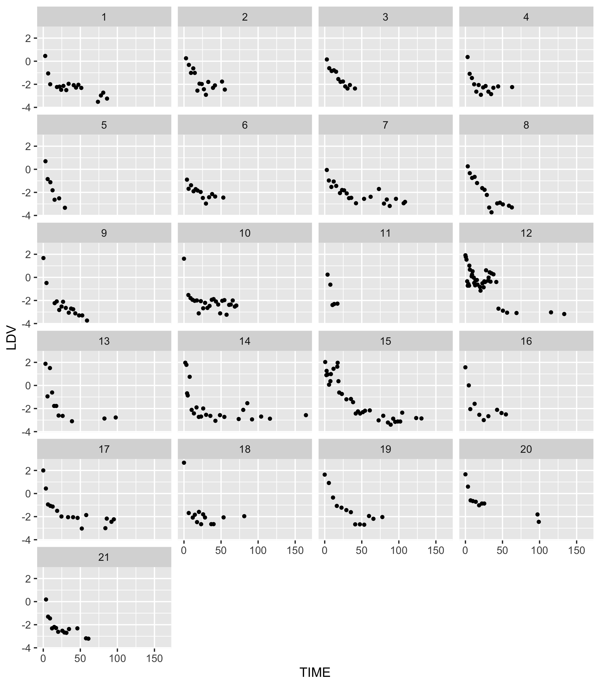

## Alpha and Betas in Hahnel et al. Cancer Research (2020).

Goal: Use BCR-ABL percentages above detection and before cessation to demo 
population level modeling of bi-exponential BCR-ABL 
decays often observed initially with TKI use. 

The model of interest is y=Ae<sup>αt</sup>+Be<sup>βt</sup>. When the first term dominates, the slope on a natural 
log scale is α and when the second term dominates the slope is β. On a log10 scale, these
values are log(10)=2.3 times smaller, as is the residual error of the fits. We will plot 
data and fits on a log10 scale, but we will perform fits on a natural log scale. Taking logs lets small y gain weight needed to estimate β. 

First we plot the data
```
rm(list=ls()) 
library(tidyverse)
library(myelo)
head(d<-hahnelFigS2)
(d=d%>%filter(UL==0)%>%select(-UL)) # use only non-zero measurements to keep it simple
names(d)=c("TIME","DV","ID")  #change names to NONMEM style
d=d%>%mutate(LDV=log10(DV),LNDV=log(DV)) # slopes match rates on natural log scale, not log10 scale
log(10)  # 2.3 is the slope factor decrease when plotted on log10 scale, which also makes sigma 2.3-fold smaller
d%>%ggplot(aes(x=TIME,y=LDV))+facet_wrap(ID~.,ncol=4)+geom_point(size=1)+theme(legend.position="top") 
ggsave("../docs/alphaNbetaData.png",width=7,height=8)

```




Next, as in Hahnel et al, maxLik is used to fit the model.
```
library(maxLik)
loglik <- function(param) {
  lA <- log(param[1])
  alpha <- param[2]
  lB <- log(param[3])
  beta <- param[4]
  mu <- log(exp(lA+alpha*t)+exp(lB+beta*t))
  sigma <- param[5]
 sum(dnorm(x, mu, sigma, log=TRUE))
} #indirect passing of x and t via global is a weakness of maxLik
(d21=d%>%group_by(ID)%>%summarize(Tf=max(TIME)))
d21$Tpred=lapply(d21$Tf,function(x) seq(0,x))
L=NULL
for (i in 1:21) {   # this weakness drove my use here of a for loop
  print(i)
  d1=d%>%filter(ID==i)
  print(d1)
  t=d1$TIME
  x=d1$LNDV
  N=length(x)
  L[[i]]=summary(maxLik(loglik, start=c(A=100,alpha=-1,B=1,beta=-0.05,sigma=0.5)))  
}
(L=lapply(L,coef))
(P=lapply(L,function(x) x[,1]))
d21$P=P
d21
simY <- function(param,tpred,id) {
  A <- param[1]
  alpha <- param[2]
  B <- param[3]
  beta <- param[4]
  data.frame(t=tpred,y=log10(A*exp(alpha*tpred)+B*exp(beta*tpred)),ID=id)
}
(D=mapply(simY,P,d21$Tpred,1:21,SIMPLIFY = F))
library(data.table)
(D=data.table(bind_rows(D)))
names(D)=c("TIME","LDV","ID")
(DTx=bind_rows(lapply(P,function(x) data.frame(TIME=100,LDV=2.5,a=round(x[["alpha"]],3),b=round(x[["beta"]],3)))))
DTx$ID=1:21
DTxb=DTx
DTxb$LDV=1
d%>%ggplot(aes(x=TIME,y=LDV))+facet_wrap(ID~.,ncol=4)+geom_point(size=1)+
   geom_line(data=D)+geom_text(aes(label=a),data=DTx,parse=T)+geom_text(aes(label=b),data=DTxb,parse=T)
ggsave("../docs/alphaNbetaDataNfits.png",width=7,height=8)
```


which shows reasonable fits and values of α and β ~2.3-fold higher than those in Fig S2. Full fits show broad variation across patients.


```
cbind(d21[,1:2],bind_rows(P))
   ID        Tf            A      alpha            B         beta     sigma
1   1  86.01102   42.2286197 -0.9970453 0.0160544502 -0.033776730 0.6272613
2   2  55.08346    4.6075267 -0.3300274 0.0021539996  0.024865636 0.8464224
3   3  40.81505   22.9812259 -1.0438443 0.4690139628 -0.130820280 0.4787884
4   4  62.95828   99.9998979 -1.0627191 0.0357998044 -0.051261541 0.3688622
5   5  29.22078  275.2051141 -1.3711429 0.2582689203 -0.222577565 0.6179687
6   6  53.02817 1171.9793225 -2.3246318 0.0279872162 -0.050265072 0.6637285
7   7 108.38124    0.5140817 -0.1885761 0.0053533259 -0.011377815 0.7660208
8   8  62.61634    3.2173211 -0.2475736 0.0002189793  0.021278971 0.7467047
9   9  59.00763   62.4505621 -1.2181436 0.0215412043 -0.074984498 0.4666018
10 10  70.57751   99.9997887 -1.0417356 0.0280718343 -0.032879217 0.3827729
11 11  17.19144   73.4501175 -0.8789277 0.0003120670  0.168390293 0.5906084
12 12 133.27273  163.9925480 -2.2976040 1.5865929223 -0.069040172 1.7783393
13 13  97.75399  104.4944570 -0.5194102 0.0010986393  0.003243757 1.6680958
14 14 164.49488  153.8728564 -0.8794149 0.0033837593 -0.002462134 1.4324898
15 15 130.50255   40.8244353 -0.1873713 0.0016172347 -0.002991918 1.3143236
16 16  54.57490   50.6342915 -1.1705643 0.0053600629 -0.009748653 0.9759647
17 17  95.19301   99.1778001 -1.0511198 0.0397887447 -0.030282900 0.8330277
18 18  81.30258   99.9997868 -1.0532572 0.0506743368 -0.035246391 0.4050289
19 19  77.74245   15.8629736 -0.2275802 0.0002396775  0.049598322 0.7996429
20 20  98.94875   51.7395212 -0.8518424 0.2773272757 -0.036869268 0.3764971
21 21  60.89312   25.8304064 -0.8507428 0.0086532360 -0.037461885 0.5230334


```