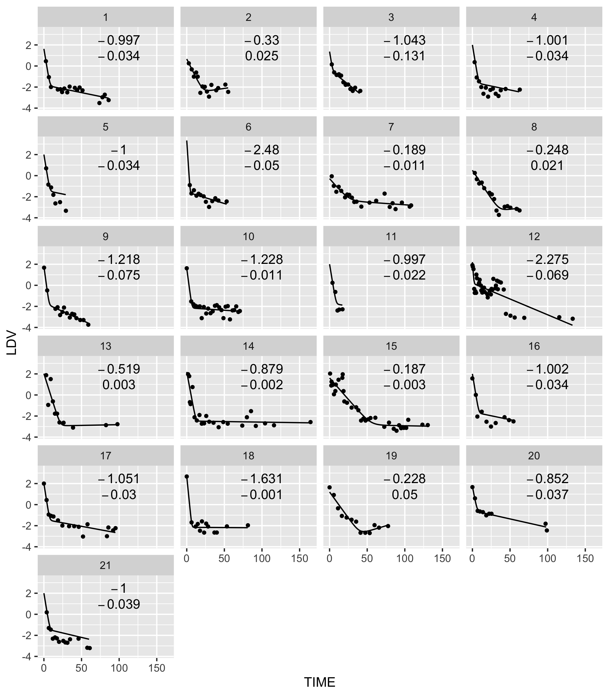
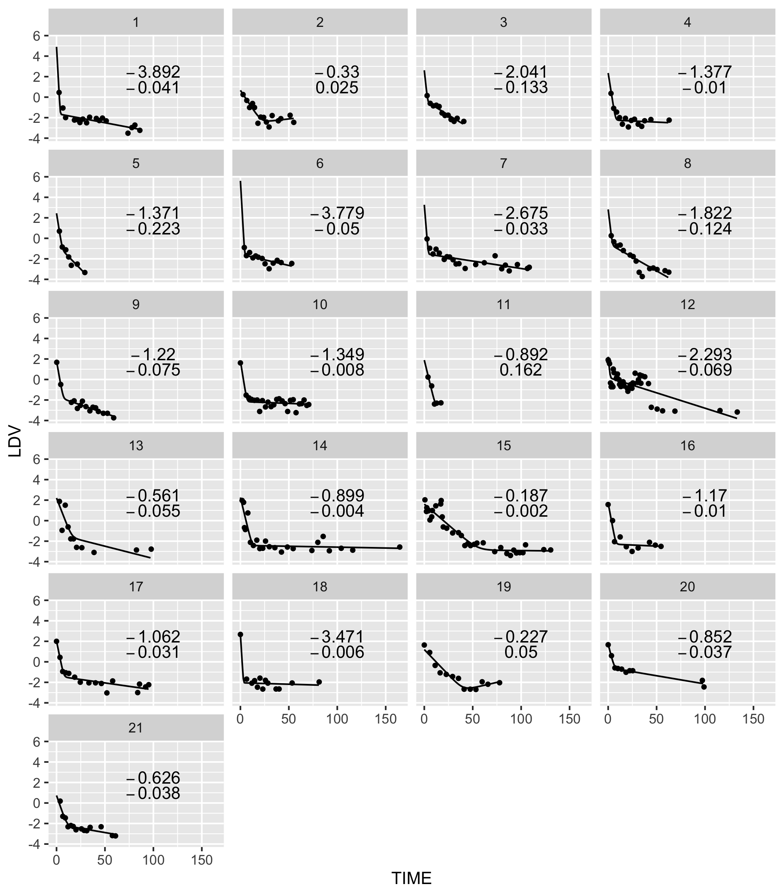
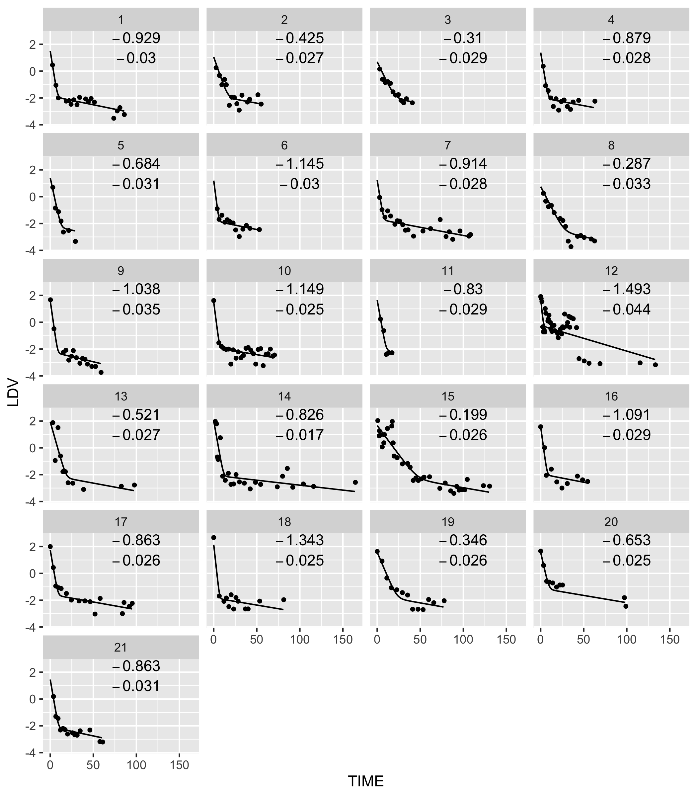
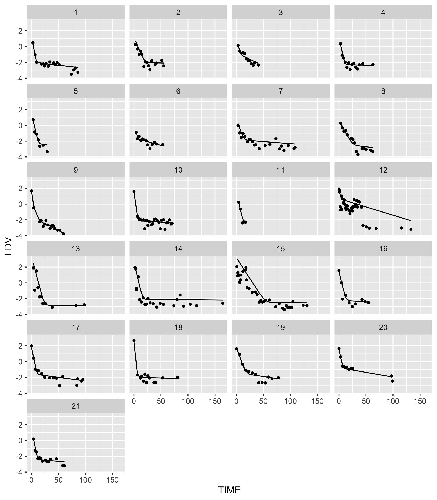

## Alpha and Betas in Hahnel et al. Cancer Research (2020).

Goal: Use BCR-ABL percentages above detection and before cessation to demo 
population level modeling of bi-exponential BCR-ABL 
decays often observed initially with TKI use. 

The model of interest is y=Ae<sup>αt</sup>+Be<sup>βt</sup>. When the first term dominates, the slope on a natural 
log scale is α and when the second term dominates the slope is β. On a log10 scale, these
values are log(10)=2.3 times smaller, as is the residual error of the fits. We will plot 
data and fits on a log10 scale, but we will perform fits on a natural log scale. Taking logs lets small y gain weight needed to estimate β. 


First, as in Hahnel et al, maxLik is used to fit the model.
```
rm(list=ls()) 
library(tidyverse)
library(myelo)
head(d<-hahnelFigS2)
(d=d%>%filter(UL==0)%>%select(-UL)) # use only non-zero measurements to keep it simple
names(d)=c("TIME","DV","ID")  #change names to NONMEM style
d=d%>%mutate(LDV=log10(DV),LNDV=log(DV)) 
library(maxLik)
loglik <- function(param) {
  lA <- log(param[1])
  alpha <- param[2]
  lB <- log(param[3])
  beta <- param[4]
  mu <- log(exp(lA+alpha*t)+exp(lB+beta*t))
  sigma <- param[5]
 sum(dnorm(x, mu, sigma, log=TRUE))
} #indirect passing of x and t via global is a weakness of maxLik
(d21=d%>%group_by(ID)%>%summarize(Tf=max(TIME)))
d21$Tpred=lapply(d21$Tf,function(x) seq(0,x))
L=NULL
for (i in 1:21) {   # this weakness drove my use here of a for loop
  print(i)
  d1=d%>%filter(ID==i)
  print(d1)
  t=d1$TIME
  x=d1$LNDV
  N=length(x)
  L[[i]]=summary(maxLik(loglik, start=c(A=100,alpha=-1,B=0.1,beta=-0.05,sigma=0.5)))  
}
(L=lapply(L,coef))
(P=lapply(L,function(x) x[,1]))
d21$P=P
d21
simY <- function(param,tpred,id) {
  A <- param[1]
  alpha <- param[2]
  B <- param[3]
  beta <- param[4]
  data.frame(t=tpred,y=log10(A*exp(alpha*tpred)+B*exp(beta*tpred)),ID=id)
}
(D=mapply(simY,P,d21$Tpred,1:21,SIMPLIFY = F))
library(data.table)
(D=data.table(bind_rows(D)))
names(D)=c("TIME","LDV","ID")
mkDF=function(x) data.frame(TIME=100,LDV=2.5,a=round(x[["alpha"]],3),b=round(x[["beta"]],3))
(DTx=bind_rows(lapply(P,mkDF)))
DTx$ID=1:21
DTxb=DTx
DTxb$LDV=1
d%>%ggplot(aes(x=TIME,y=LDV))+facet_wrap(ID~.,ncol=4)+geom_point(size=1)+
   geom_line(data=D)+geom_text(aes(label=a),data=DTx,parse=T)+geom_text(aes(label=b),data=DTxb,parse=T)
ggsave("../docs/alphaNbetaDataNfits.png",width=7,height=8)
```


which shows α and β values ~2.3-fold higher than log10 scale α and β slopes in Fig S2. 
Fits can be improved by tuning initial estimates.

Using the same initial estimates and the same 
optimization method (Nelder-Mead), but using bbmle instead of maxLik, the code 
is cleaner, as variables are no longer passed to functions via globals.  
```
library(bbmle)
dn=d%>%group_by(ID)%>%nest()
fitBi=function(d1)  {
  coef(summary(mle2(LNDV~dnorm(mean=log((exp(lA+alpha*TIME) + exp(lB+beta*TIME))),sd=sigma),
               method="Nelder-Mead", 
               start=list(lA=log(100),alpha=-1,lB=log(0.1),beta=-0.05,sigma=0.5),data=d1,
               control = list(maxit=500))))  
}
dn=dn%>%mutate(M=map(data,fitBi))
dn$M[[20]]
getPars=function(x){
  x=x[,1] 
  x[c(1,3)]=exp(x[c(1,3)])
  names(x)[c(1,3)]=c("A","B")
  x
}
dn=dn%>%mutate(P=map(M,getPars))

(D=mapply(simY,dn$P,d21$Tpred,1:21,SIMPLIFY = F))
(D=data.table(bind_rows(D)))
names(D)=c("TIME","LDV","ID")
(DTx=bind_rows(lapply(dn$P,mkDF)))
DTx$ID=1:21
DTxb=DTx
DTxb$LDV=1
d%>%ggplot(aes(x=TIME,y=LDV))+facet_wrap(ID~.,ncol=4)+geom_point(size=1)+
  geom_line(data=D)+geom_text(aes(label=a),data=DTx,parse=T)+geom_text(aes(label=b),data=DTxb,parse=T)
ggsave("../docs/alphaNbetaDataNfitsBB.png",width=7,height=8)

```


  

To bias estimates toward patient population averages, we can use the function nlmer in 
the mixed effects R package lme4. 

```
library(lme4)
(startvec <- c(lA = log(100), alpha = -1, lB=log(0.1), beta = -0.05))
nform <- ~ log(exp(lA+alpha*input) + exp(lB+beta*input))
nfun <- deriv(nform, namevec=c("lA", "alpha", "lB", "beta"),
              function.arg=c("input","lA", "alpha", "lB", "beta"))
nfun
(M<-nlmer(LNDV ~ nfun(TIME, lA, alpha, lB, beta) ~ (lA|ID) + (alpha|ID) +(lB|ID) + (beta|ID),
                        data=d,start = startvec,
      nAGQ = 0L,
      control = nlmerControl(tolPwrss = 1e-4)) )
(fe=fixef(M))
(RE=ranef(M)$ID)
apply(RE,2,mean) #check
(P=RE+t(t(rep(1,21)))%*%t(fe))
P=P%>%mutate(lA=exp(lA),lB=exp(lB))%>%rename(A=lA,B=lB)
P=lapply(1:21,function(i) unlist(P[i,]))
(D=mapply(simY,P,d21$Tpred,1:21,SIMPLIFY = F))
(D=data.table(bind_rows(D)))
names(D)=c("TIME","LDV","ID")
(DTx=bind_rows(lapply(P,mkDF)))
DTx$ID=1:21
DTxb=DTx
DTxb$LDV=1
d%>%ggplot(aes(x=TIME,y=LDV))+facet_wrap(ID~.,ncol=4)+geom_point(size=1)+
  geom_line(data=D)+geom_text(aes(label=a),data=DTx,parse=T)+geom_text(aes(label=b),data=DTxb,parse=T)
ggsave("../docs/alphaNbetaFitsLME4.png",width=7,height=8)

```


We now have nice fits with parameter estimates that are more similar. 
Information was borrowed across patients in one joint fit of 
population parameter means and variances. 
Assuming normality, estimates for individuals were 
brought closer to the population means. 

A limitation of lme4 is that it requires closed form models. Models are often more simply described by 
ordinary differential equations (ODEs). An R package that allows this is nlmixr. In 
this pharmacokinetic data analysis package, states are masses 
(drug amounts),  rate constants are clearances divided by volumes, and measured
drug concentrations are central comparment drug masses divided by volumes.

Bi-exponential decays are captured by two-compartment models. We thus
view BCR-ABL as if injected into a central compartment from which it is cleared 
permanently or set aside temporarily in a peripheral compartment that protects it, until it returns to the
central compartment. Needed then is a mapping of our initial estimates above 
(A=100, alpha=-1, B=0.1, and beta=-0.05) to initial estmates of two-compartment PK model parameters.
To get the initial BCR-ABL value of 100.1, we set the dose to 1001 and 
our initial estimate of the central volume (Vc) to 10. We then set
the initial estimate of the elimination rate constant Ke to 1 (i.e. -alpha) 
and the initial estimate of the peripheral-to-central
rate constant Kpc to 0.05 (i.e. -beta). Setting the reverse,
Kcp, to a similarly small initial value of 0.05, the nlmixr code is

```
library(nlmixr)
dn=d # will add dose rows into dn 
dn$TIME[dn$TIME<=0.001] #need these to come after bolus injection for ODEs
dn$TIME[dn$TIME<=0.001]= 0.001 # some are slightly negative (near zero)
dn$EVID=0
dn$AMT=0
(dn=dn%>%group_by(ID)%>%nest())
dn$data[[1]]
# EVID = 10,000 × (1 If IV Infusion 0 If Bolus) +100 × (Compartment #)+1
(dtop=data.frame(TIME=0,DV=0,LDV=0,LNDV=0,EVID=101,AMT=1001)) #101 =>into compartment 1 
dn=dn%>%mutate(ndata=map(data,function(x) rbind(dtop,x)))
(dn=dn%>%select(-data)%>%unnest(cols = c(ndata)))

two.compartment.IV.model <- function(){
  ini({ # Where initial conditions/variables are specified
    lVc <- log(10)    #log Vc    
    lKe <- log(1)     #log Ke   
    lKpc<- log(0.05)  #log Kpc      
    lKcp<- log(0.05)  #log Kcp  
    prop.err <- 0.3 
    eta.Vc ~ 0.15   
    eta.Ke ~ 0.15
    eta.Kpc ~ 0.15  
    eta.Kcp  ~ 0.15
  })
  model({ # Where the model is specified
    Vc  <- exp(lVc + eta.Vc)
    Ke  <- exp(lKe + eta.Ke)
    Kpc <- exp(lKpc + eta.Kpc)
    Kcp <- exp(lKcp + eta.Kcp)
    # RxODE-style differential equations are supported
    d/dt(centr)  = Kpc*periph-Kcp*centr-Ke*centr;
    d/dt(periph) =-Kpc*periph+Kcp*centr;
    cp = centr / Vc;
    cp ~ prop(prop.err)
  })
}
(fit <- nlmixr(two.compartment.IV.model,dn,est="saem"))
pfit=nlmixrPred(fit,ipred=TRUE)
str(pfit)
dp=data.frame(ID=pfit$id,TIME=pfit$time,Y=pfit$ipred)%>%mutate(LDV=log10(Y))
d%>%ggplot(aes(x=TIME,y=LDV))+facet_wrap(ID~.,ncol=4)+geom_point(size=1)+geom_line(data=dp)
ggsave("../docs/nlmixrFit1.png",width=7,height=8)
```


Patient-specific model parameter estimates corresponding to the plots above can be retrieved as follows.

```
fe=coef(fit)$fixed[1:4]
re=coef(fit)$random[,2:5]
(P=re+t(t(rep(1,21)))%*%t(fe))
(P=exp(P))
names(P)=c("Vc","Ke","Kpc","Kcp")
P

           Vc        Ke         Kpc          Kcp
1  190.022803 0.9683176 0.023447195 1.024638e-02
2  410.873068 0.4121233 0.009171166 1.004519e-02
3  206.820753 0.8199347 0.089255357 2.691175e-02
4  281.549731 0.8425779 0.009688618 1.449773e-02
5  235.062980 0.7039342 0.026637963 2.904405e-03
6  165.676543 1.3410858 0.036949112 2.052292e-02
7  285.489040 0.9074194 0.025367178 3.498893e-02
8  764.512689 0.3948731 0.028553293 3.769384e-03
9  145.398173 1.0819822 0.071341269 4.845837e-03
10 170.026827 1.2494456 0.008808499 3.080718e-02
11 181.425513 0.7539363 0.015390202 4.596884e-03
12  72.967882 0.6335443 0.097858338 4.628165e-01
13   5.778486 0.5723832 0.005194983 9.861744e-05
14  28.600861 0.6537157 0.003690037 3.437080e-03
15   7.789124 0.2410669 0.006206287 3.068806e-05
16 206.344675 0.7796115 0.014283552 8.859635e-03
17 122.805873 0.8659598 0.023525108 1.587549e-02
18  24.659964 1.7006906 0.007634866 1.231971e-02
19  82.711098 0.4727110 0.023823067 3.658259e-03
20 134.782622 0.7838043 0.029108729 6.414310e-02
21 261.690853 0.8096706 0.014647168 6.283243e-03

```
