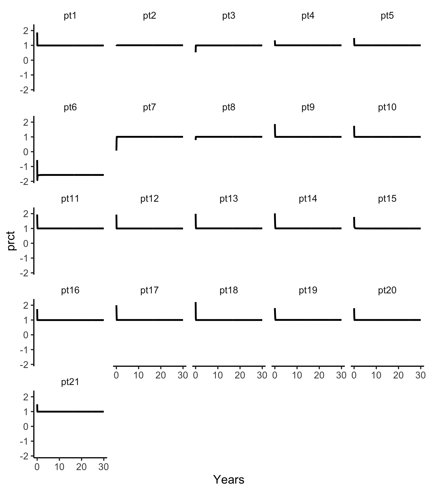
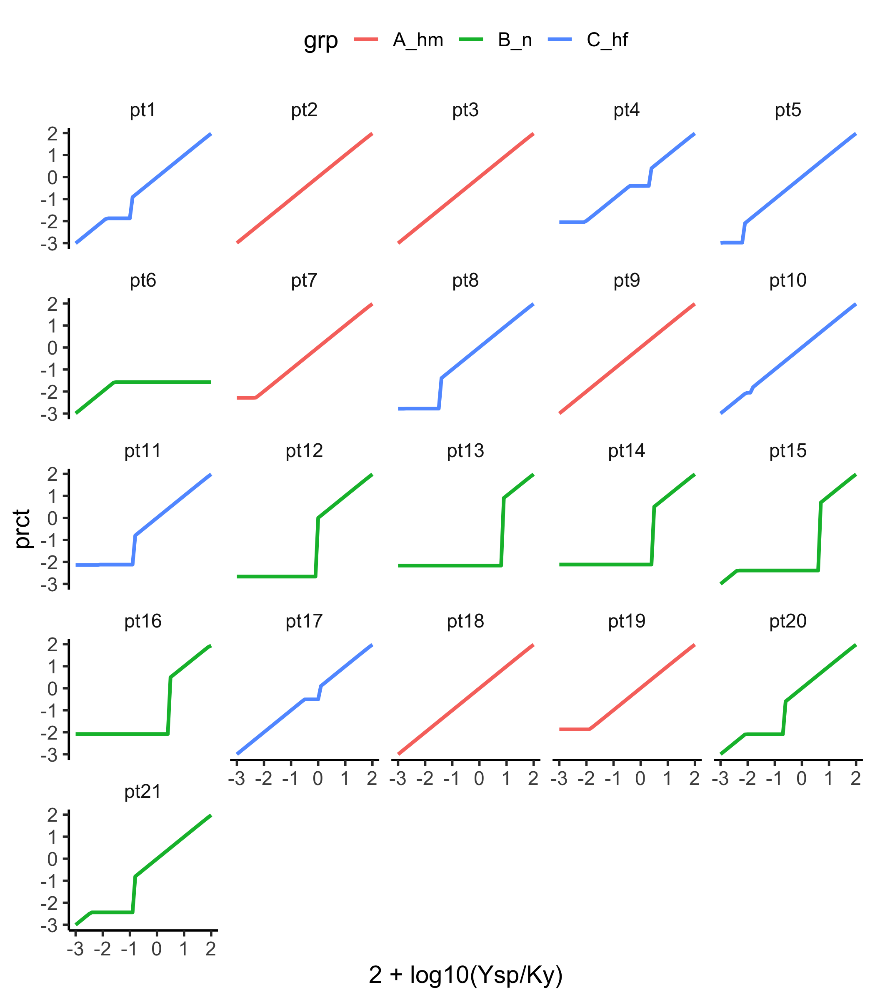
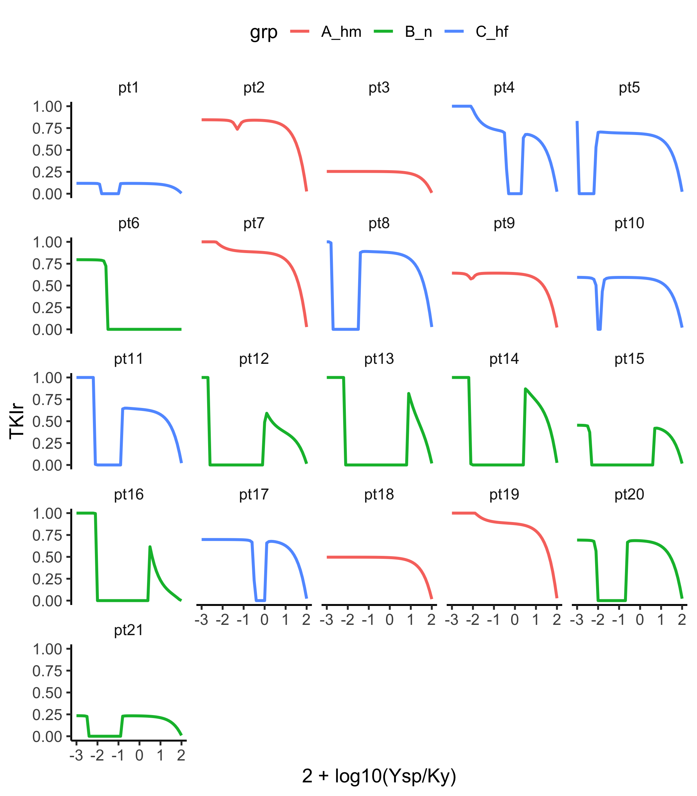
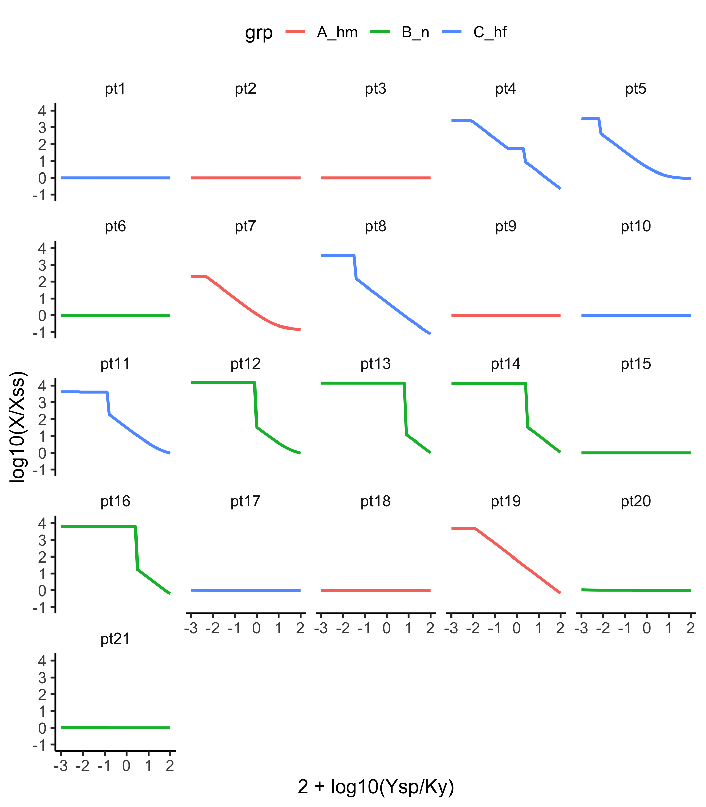
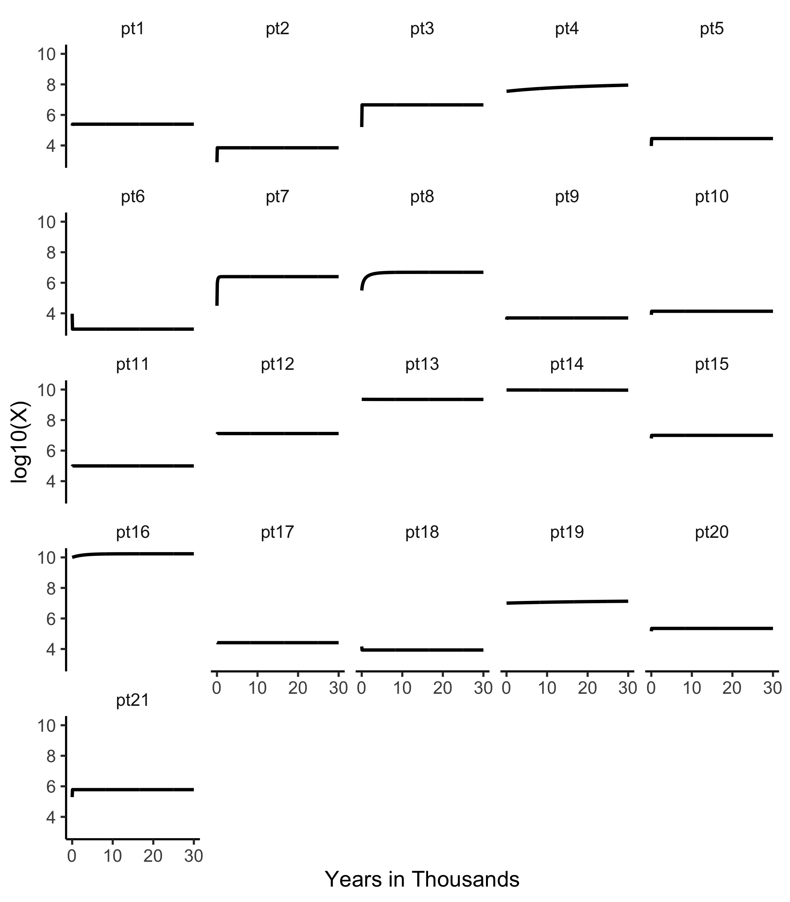
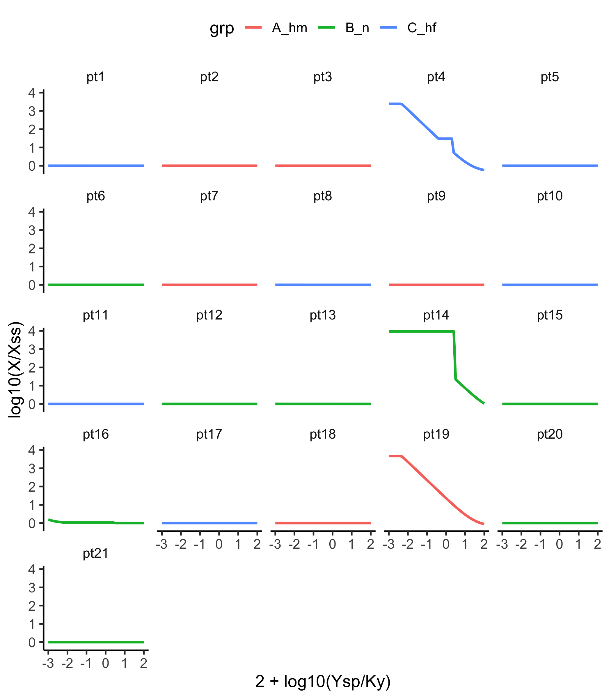
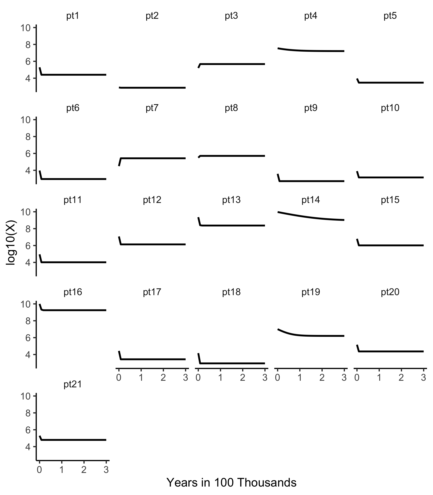
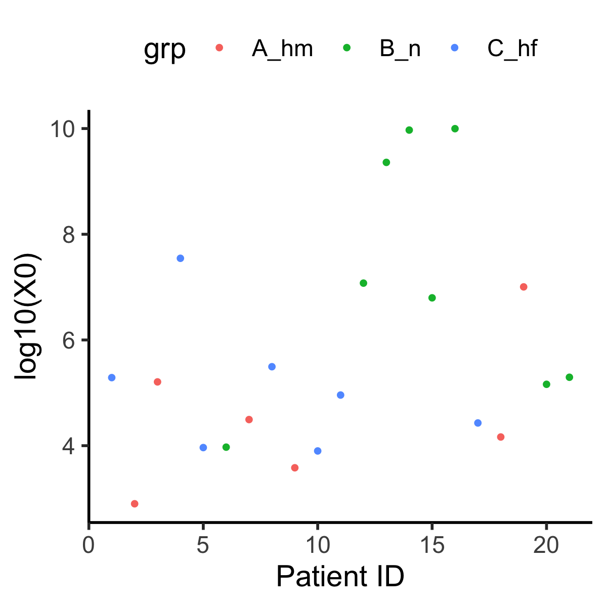

## Additional Notes on Hahnel et al. Cancer Research (2020).

The focus here is on doses needed to hold Y flat at a setpoint and how this differs across patients.   

```
library(tidyverse)
library(myelo)
library(deSolve)
head(d <- glauchePars20) 
#default values
d$Tf=360  # run 30 years to be sure to reach steady state
d$Ysp=1e5 # start at 10% = 1 on log10 scale
d$Kp=100  # Hahnel's controller gain (like a proportional constant)

fTa<-function(Time, State, Pars) {
  with(as.list(c(Time, State, Pars)),{
    TKIa=TKI/(1+exp(Kp*(1-Y/Ysp)))      # TKI adjustment rule of Hahnel et al 
    dX = -pxy*X + pyx*Y 
    dY =  pxy*X - pyx*Y + py*Y*(1-Y/Ky)   -  m*Y*Z - TKIa*Y
    dZ =  rz    -   a*Z                   + pz*Y*Z/(Kz^2+Y^2) 
    list(c(dX,dY,dZ),c(prct=2+log10(Y/Ky),TKIa=TKIa,TKIr=TKIa/TKI))
  })
}

fsimTa=function(x) {
  ic=c(X=x$X0,Y=x$Y0,Z=x$Z0)
  ode(y = ic, times = seq(0,x$Tf,1), func = fTa, parms = x)
}

getTcrs=function(x) {
  dn=x%>%group_by(id)%>%nest()
  dn=dn%>%mutate(out=map(data,fsimTa))
  dn=dn%>%mutate(D=map(out,function(x) as_tibble(x)%>%mutate_all(as.numeric)))
  dd=dn%>%select(id,D)
  dd$id=as_factor(dd$id)
  dd%>%unnest(cols=D)
}


### test default time courses
dd=getTcrs(d)
tc=function(sz) theme_classic(base_size=sz)
gx=xlab("Years")
gy=ylab("2+log10(Y/Ky)")
sbb=theme(strip.background=element_blank())
dd%>%ggplot(aes(x=time/12,y=prct))+facet_wrap(id~.)+geom_line(size=1)+gx+tc(14)+sbb 
ggsave("../docs/loadVsTime.png",width=7,height=8)

```


This shows us that the controlled variable Y easily reaches steady state in 30 years. It also reminds us that TKI 
cannot raise loads, so patient 6 cannot be driven to setpoint. 


The following generates results at 30 years across a fine range of setpoints.
```
getSS=function(x,xx) xx%>%filter(time==x$Tf)
(D=getSS(d,dd))
D=left_join(D,d)
D%>%select(Ysp,prct,Ymin,Y0,X0,X,lGap,id,grp,TKIa,TKIr,TKI,Kpe,Tf)%>%print(n=21)
L=NULL
# Ysp = c(1e1,5e1,1e2,5e2,1e3,5e3,1e4,5e4,1e5)
Ysp=10^seq(1,6,.1)
for (i in 1:length(Ysp)) {  # this take some time
  # i=1
  print(i)
  d$Ysp=Ysp[i]
  dd=getTcrs(d)
  D=getSS(d,dd)
  D=left_join(D,d)
  L[[i]]=D
}

D=bind_rows(L)
D$id=as_factor(D$id)

```

The first result below is a plot of how the ability of the controller 
to drive the system to setpoint depends on the setpoint and the patient.
```
D%>%ggplot(aes(x=2+log10(Ysp/Ky),y=prct,col=grp))+facet_wrap(id~.)+
  geom_line(size=1)+tc(14)+sbb +theme(legend.position="top")
ggsave("../docs/prctVsSetPoint.png",width=7,height=8)
```



Class B pts (green), wherein anti-CML immunity is strongest, deviate most from 
loads tracking setpoints (as in Class A pts 2 and 3), 
since immuno-control dominates TKI-mediated control and TKI cannot
raise loads above natural setpoints of stable subclinical steady states. We see
Class C pts 8 and 11 close to Class B,  Class B pts 20 and 21 
closes to Class C, and Class C pt 10 almost in Class A. 

The following shows how relative TKI doses used by the controller depend on the setpoint.

```
D%>%ggplot(aes(x=2+log10(Ysp/Ky),y=TKIr,col=grp))+facet_wrap(id~.)+
  geom_line(size=1)+tc(14)+sbb +theme(legend.position="top")
ggsave("../docs/TKIrVsSetPoint.png",width=7,height=8)

```



On the far right of each of these plots, Ysp = Ky (load = 100% = 2 in log10 units). 
This stable state of death is readily reached by TKIr = 0; here TKIr = TKIa/TKI, where 
TKI and TKIa are data-derived and dose-adjusted TKI cell killing rates. 
Right to left, many patients plateau at TKIr values below 1, i.e. using a dose lower than the dose
used to drive the load down in the actual patient (rather than just hold it flat).


To see if the uncontrolled latent variable X (quiescent CML cells) is also in steady state at 30 years, we compare
X at 30 years to the steady state value expected, Xss, based on the steady state of the controlled variable Y.  
```
names(D)
D=D%>%mutate(Xss=pyx*Y/pxy) 
D%>%ggplot(aes(x=2+log10(Ysp/Ky),y=log10(X/Xss),col=grp))+facet_wrap(id~.)+
  geom_line(size=1)+tc(14)+sbb +theme(legend.position="top")
ggsave("../docs/Xss.png",width=7,height=8)

```


This shows that 11 out of 21 have X in steady state 30 years out. 

The following code extends the final time to 30,000 years.  
```
# head(d <- glauchePars20) 
d$Ysp=1e5 # start at 10% = 1 on log10 scale
# d$Kp=100  # Hahnel's controller gain (like a proportional constant)
d$Tf=12*3e4
fsimTa=function(x) {
  ic=c(X=x$X0,Y=x$Y0,Z=x$Z0)
  # lsodes(y = ic, times = seq(0,x$Tf,1e3), func = fTa, parms = x,maxsteps = 5000) very slow
  lsoda(y = ic, times = seq(0,x$Tf,1e3), func = fTa, parms = x) #faster than above (slow on some)
}

dd=getTcrs(d)

tc=function(sz) theme_classic(base_size=sz)
gx=xlab("Years in Thousands")
gy=ylab("2+log10(Y/Ky)")
sbb=theme(strip.background=element_blank())

dd%>%ggplot(aes(x=time/12e3,y=log10(X)))+facet_wrap(id~.)+geom_line(size=1)+gx+tc(14)+sbb 
ggsave("../docs/XtimeCrs.png",width=7,height=8)

```

It thus takes >10,000 years for X in pt 4 to reach steady state

```
L=NULL
Ysp=10^seq(1,6,.1)
for (i in 1:length(Ysp)) {  # this take some time
  # i=1
  print(i)
  d$Ysp=Ysp[i]
  dd=getTcrs(d)
  D=getSS(d,dd)
  D=left_join(D,d)
  L[[i]]=D
}

D=bind_rows(L)
D$id=as_factor(D$id)

D=D%>%mutate(Xss=pyx*Y/pxy) 
D%>%ggplot(aes(x=2+log10(Ysp/Ky),y=log10(X/Xss),col=grp))+facet_wrap(id~.)+
  geom_line(size=1)+tc(14)+sbb +theme(legend.position="top")
ggsave("../docs/Xss3e4.png",width=7,height=8)
```


This shows that at 30,000 years, pts 4, 14 and 19 are still not at steady state


Continuing out to 300,000 years
```
d$Ysp=1e5 # start at 10% = 1 on log10 scale
d$Tf=12*3e5
fsimTa=function(x) {
  ic=c(X=x$X0,Y=x$Y0,Z=x$Z0)
  ode(y = ic, times = seq(0,x$Tf,1e5), func = fTa, parms = x,rtol = 1e-14, atol = 1e-14,maxsteps = 50000) 
  # ode(y = ic, times = seq(0,x$Tf,1e5), method="ode45",func = fTa, parms = x,rtol = 1e-10, atol = 1e-10) #
}

dd=getTcrs(d)

tc=function(sz) theme_classic(base_size=sz)
gx=xlab("Years in 100 Thousands")
gy=ylab("2+log10(Y/Ky)")
sbb=theme(strip.background=element_blank())

dd%>%ggplot(aes(x=time/12e5,y=log10(X)))+facet_wrap(id~.)+geom_line(size=1)+gx+tc(14)+sbb 
ggsave("../docs/XtimeCrs3e5.png",width=7,height=8)

```

It thus takes >300,000 years for X in pt 14 to reach steady state.


Patient 14's initial X value (X0), based on initial Y values (Y0), seems to be too high.  
```
d$id=as_factor(d$id)
d%>%ggplot(aes(x=1:21,y=log10(X0),col=grp))+
  geom_point(size=1)+tc(14)+sbb +theme(legend.position="top")+xlab("Patient ID")
ggsave("../docs/X0.png",width=4,height=4)

```


X0 values of 10 billion cells seem too high, given Ky = 1 million dividing LSC are lethal and 
our estimates of normal quiescent HSC are on the order of 10 to 20 million, see
https://pubmed.ncbi.nlm.nih.gov/22353999/.


