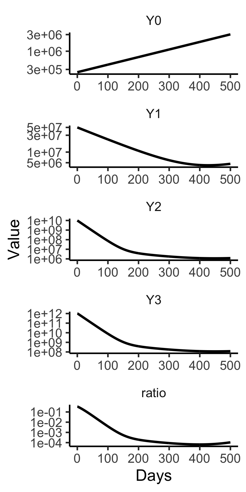
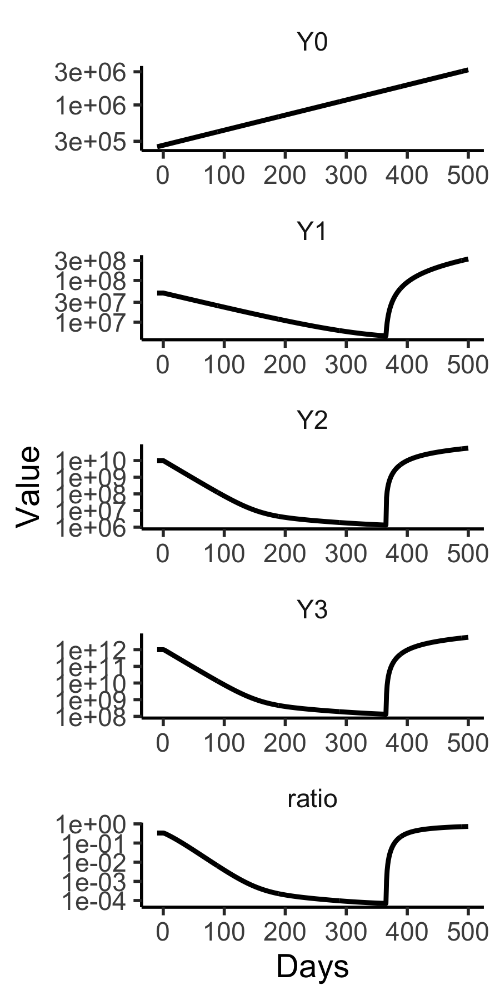

#  Dynamics of Chronic Myeloid Leukaemia  
## Michor et al, Nature (2005). 
This model represents stem (0)-, progenitor (1)-, differentiated (2)-, and terminally differentiated (3) cells that are normal (X) or cancerous. Cancerous (CML) cells and either sensitive (Y) or resistant (Z) to TKI; normal cells are resistant to TKI. In R the model is
```
michoR<-function(Time, State, Pars) {
	with(as.list(c(State, Pars)), {
# lambda is a controller that manipulates inflow
# to move a level (x) toward setpoint (sp)
				lambda= -0.5*(X0-sp)
				dX0 = (lambda-d0)*X0 
				dX1 = ax*X0-d1*X1
				dX2 = bx*X1-d2*X2
				dX3 = cx*X2-d3*X3
				dY0 = (ry*(1-u)-d0)*Y0
				dY1 = Y0*az/(1+D/D0a) - d1*Y1
				dY2 = Y1*bz/(1+D/D0b) - d2*Y2
				dY3 = cx*Y2 - d3*Y3
				dZ0 = (rz-d0)*Z0+ry*u*Y0
				dZ1 = az*Z0-d1*Z1
				dZ2 = bz*Z1-d2*Z2
				dZ3 = cx*Z2-d3*Z3
				dD  = 0
				return(list(c(dX0,dX1, dX2, dX3, 
				              dY0,dY1, dY2, dY3, 
				              dZ0,dZ1, dZ2, dZ3,dD),
				    c(ratio=(Y3+Z3)/(Y3+Z3+X3))))
			})
}

```

The following shows how a setpoint(sp)-sized bolus of stem cells repopulates pools downstream.

```
library(tidyverse)
library(deSolve)
pars=c(d0=0.003, d1=0.008, d2=0.05, d3=1,
       ax=0.8, bx=5, cx=100, 
       ry=0.008, 
# 1/(1+D/D0a)= 1/100 => 45/D0a =  99 => D0a= 45/99
# 1/(1+D/D0b)= 1/750 => 45/D0b = 749 => D0b= 45/749
       D0a=45/99, D0b= 45/749,  
       rz=0.023, az=1.6, bz=10,
       u=4e-8, sp=2e6)
(y0<-c(X0=2e6,X1=0,X2=0,X3=0,
       Y0=0,Y1=0,Y2=0,Y3=0,
       Z0=0,Z1=0,Z2=0,Z3=0,D=0))
out=ode(y=y0,times=seq(0,400,1),michoR, parms=pars)
D=as.data.frame(out)
d=D%>%select(time,X1:X3)%>%
       gather(key="Cell",value="Value",-time)
tc=function(sz) theme_classic(base_size=sz)
gx=xlab("Days")
sbb=theme(strip.background=element_blank())
d%>%ggplot(aes(x=time,y=Value))+
  facet_grid(Cell~.,scales = "free")+
  geom_line(size=1)+tc(14)+sbb+gx
ggsave("../docs/michorSim.png",width=4,height=6)
```


The following code reproduces Figure 4A
```
(y0<-c(X0=2e6,X1=2e8,X2=2e10,X3=2e12,
       Y0=2.5e5,Y1=5e7,Y2=1e10,Y3=1e+12,
       Z0=0,Z1=0,Z2=0,Z3=0,D=45))
out=ode(y=y0,times=seq(0,500,1),michoR, parms=pars)
D=as.data.frame(out)
D
names(D)
d=D%>%select(time,Y0:Y3,ratio)%>%gather(key="Cell",value="Value",-time)
tc=function(sz) theme_classic(base_size=sz)
gx=xlab("Days")
sy=scale_y_log10()
sbb=theme(strip.background=element_blank())
d$Cell=fct_relevel(d$Cell,"ratio",after=4)
d%>%ggplot(aes(x=time,y=Value))+
  facet_wrap(Cell~.,ncol=1,scales = "free")+
  geom_line(size=1)+tc(14)+sbb+gx+sy
ggsave("../docs/michorFg4a.png",width=3,height=6)
```



To start and stop dosing at 0 and 365 days as in Figure 4B, the code is 

```
(y0<-c(X0=2e6,X1=2e8,X2=2e10,X3=2e12,
       Y0=2.5e5,Y1=5e7,Y2=1e10,Y3=1e+12,
       Z0=0,Z1=0,Z2=0,Z3=0,D=0))
event=data.frame()
(evnt=data.frame(var="D",time=c(0,365),value=c(45,0),method="rep"))
out=ode(y=y0,times=seq(-10,500,1),michoR,events=list(data=evnt), parms=pars)
D=as.data.frame(out)
d=D%>%select(time,Y0:Y3,ratio)%>%gather(key="Cell",value="Value",-time)
tc=function(sz) theme_classic(base_size=sz)
gx=xlab("Days")
sy=scale_y_log10()
sbb=theme(strip.background=element_blank())
d$Cell=fct_relevel(d$Cell,"ratio",after=4)
d%>%ggplot(aes(x=time,y=Value))+
  facet_wrap(Cell~.,ncol=1,scales = "free")+
  geom_line(size=1)+tc(14)+sbb+gx+sy
ggsave("../docs/michorFg4b.png",width=3,height=6)
```



For resistant clone expansion in Figure 4C, set initial Z values and don't stop dosing
```
(y0<-c(X0=2e6,X1=2e8,X2=2e10,X3=2e12,
       Y0=2.5e5,Y1=5e7,Y2=1e10,Y3=1e+12,
       Z0=10,Z1=2e3,Z2=4e5,Z3=4e7,D=45))
out=ode(y=y0,times=seq(0,500,1),michoR, parms=pars)
D=as.data.frame(out)
d=D%>%select(time,Z0:Z3,ratio)%>%gather(key="Cell",value="Value",-time)
tc=function(sz) theme_classic(base_size=sz)
gx=xlab("Days")
sy=scale_y_log10()
sbb=theme(strip.background=element_blank())
d$Cell=fct_relevel(d$Cell,"ratio",after=4)
d%>%ggplot(aes(x=time,y=Value))+
  facet_wrap(Cell~.,ncol=1,scales = "free")+
  geom_line(size=1)+tc(14)+sbb+gx+sy
ggsave("../docs/michorFg4c.png",width=3,height=6)
```


Data in Fig. 5, obtained via WebPlotDigitizer, is shown by this code
```
library(myelo)
head(d<-michor)
gy=ylab("BCR-ABL/BCR %")
d%>%ggplot(aes(x=Days,y=Prct))+
  facet_wrap(Pt~.,ncol=4)+
  geom_line()+geom_point(size=1)+gy+tc(14)+sbb+
  scale_y_log10()+theme(legend.position="top")
ggsave("../docs/michorData.png",width=6,height=30)
```


