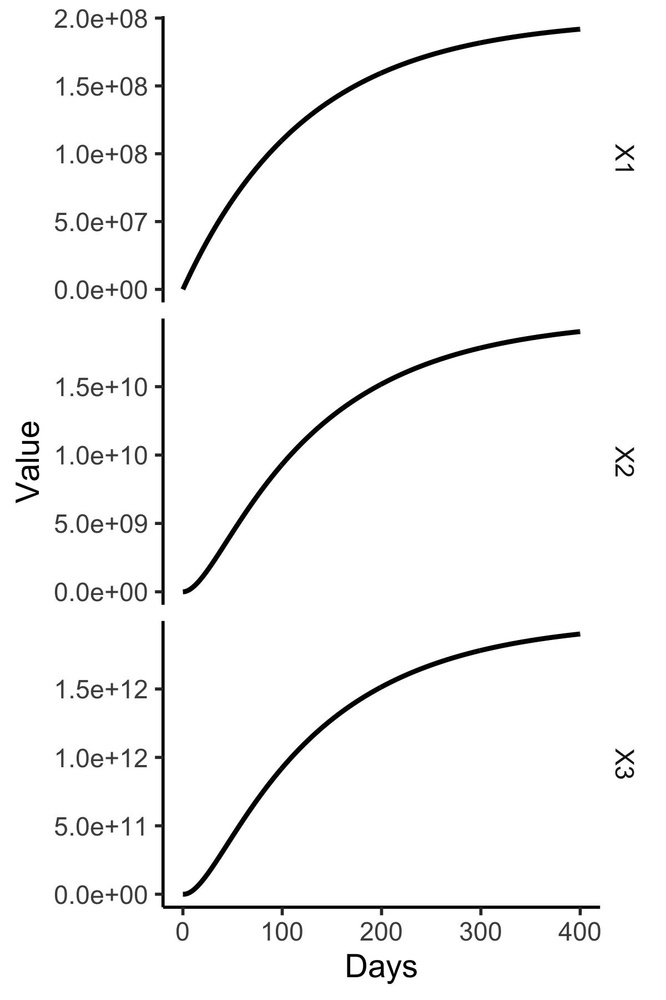
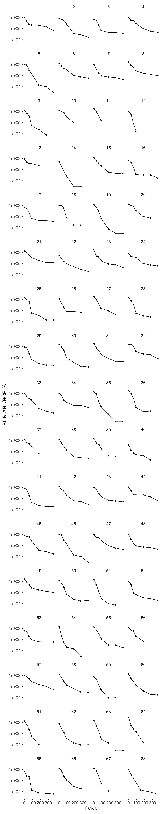

#  Dynamics of Chronic Myeloid Leukaemia  
## Michor et al, Nature (2005). 
Modeled were stem (0)-, progenitor (1)-, differentiated (2)-, and terminal (3) normal (X) 
and CML sensitive (Y) and resistant (Z) cells as
```
michor05<-function(Time, State, Pars) {
	with(as.list(c(State, Pars)), {
				if (trt==1) {   #During therapy 
					ay=ay/100
					byy=byy/750
				}
				lambda<- function(x,sp) -0.5*(x-sp)
# lambda is a controller that manipulates inflow
# to move a leaky tank level (x) toward setpoint (sp)
				dX0 = (lambda(X0,X0sp)-d0)*X0
				dX1 = ax*X0-d1*X1
				dX2 = bx*X1-d2*X2
				dX3 = cx*X2-d3*X3
				dY0 = (ry*(1-u)-d0)*Y0
				dY1 = ay*Y0-d1*Y1
				dY2 = byy*Y1-d2*Y2
				dY3 = cy*Y2-d3*Y3
				dZ0 = (rz-d0)*Z0+ry*u*Y0
				dZ1 = az*Z0-d1*Z1
				dZ2 = bz*Z1-d2*Z2
				dZ3 = cz*Z2-d3*Z3
				return(list(c(dX0,dX1, dX2, dX3, 
				              dY0,dY1, dY2, dY3, 
				              dZ0,dZ1, dZ2, dZ3),
				    c(ratio=(Y3+Z3)/(Y3+Z3+X3))))
			})
}
```

The following shows how a setpoint(sp)-sized bolus of stem cells repopulates vacant pools down to 
mature granulocytes.

```
library(tidyverse)
library(deSolve)
pars=c(d0=0.003,d1=0.008,d2=0.05,d3=1,
       ax=0.8,bx=5,   cx=100, ry=0.008,
      ay=1.6, byy=10, cy=100, rz=0.023, 
      az=1.6, bz=10, cz=100, trt=0, u=0, X0sp=2e6)
(y0<-c(X0=2e6,X1=0,X2=0,X3=0,
       Y0=0,Y1=0,Y2=0,Y3=0,
       Z0=0,Z1=0,Z2=0,Z3=0))
#  for Figure 4C increase Z0 to 10 and u from to 4e-8 
out=ode(y=y0,times=seq(0,400,1),michor05, parms=pars)
D=as.data.frame(out)
d=D%>%select(time,X1:X3)%>%
       gather(key="Cell",value="Value",-time)
tc=function(sz) theme_classic(base_size=sz)
gx=xlab("Days")
sbb=theme(strip.background=element_blank())
d%>%ggplot(aes(x=time,y=Value))+
  facet_grid(Cell~.,scales = "free")+
  geom_line(size=1)+tc(14)+sbb+gx
ggsave("../docs/michorSim.png",width=4,height=6)
```



The data in Figure 5 of this paper, captured using WebPlotDigitizer, is


This plot was created as follows.
```
library(myelo)
head(d<-michor)
gy=ylab("BCR-ABL/BCR %")
d%>%ggplot(aes(x=Days,y=Prct))+
  facet_wrap(Pt~.,ncol=4)+
  geom_line()+geom_point(size=1)+gy+tc(14)+sbb+
  scale_y_log10()+theme(legend.position="top")
ggsave("../docs/michorData.png",width=6,height=30)

```


