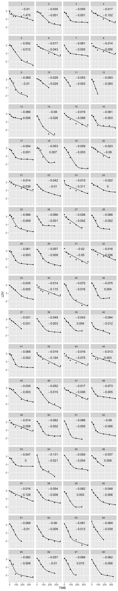
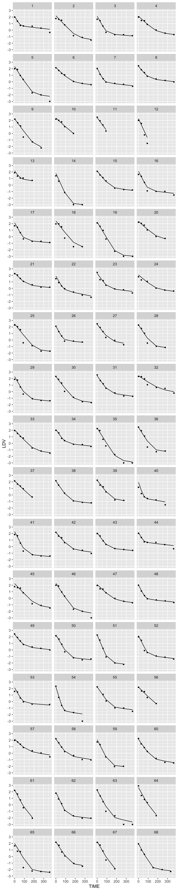
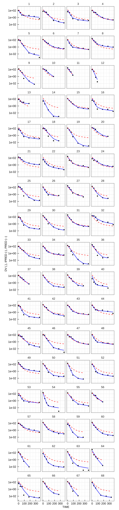
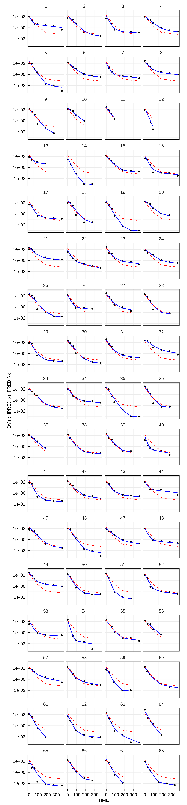
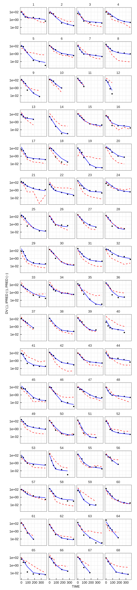
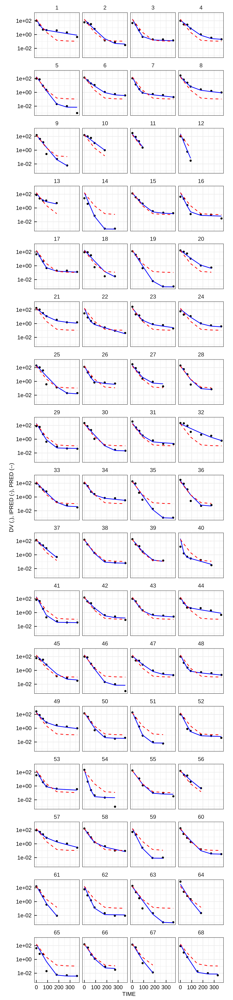
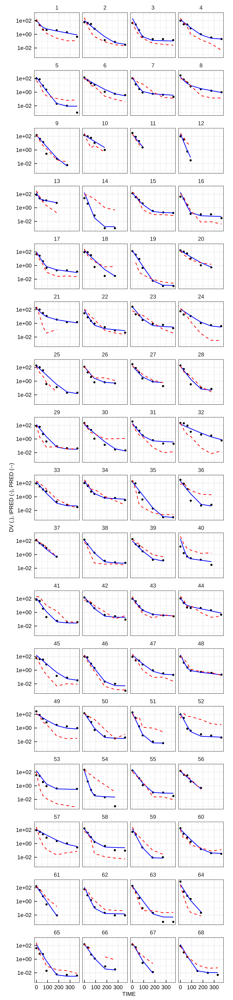

## Alpha and Beta in Michor et al. Nature (2005).

The goal here is to fit y=Ae<sup>αt</sup>+Be<sup>βt</sup> 
to Michor et al's 68-patient BCR-ABL decay data, to see how 
close we get to 0.05 and 0.008 reported.

First use bbmle
```
rm(list=ls()) 
library(tidyverse)
library(myelo)
head(d<-michor)
names(d)=c("TIME","DV","ID")  #change names to NONMEM style
head(d<-d%>%mutate(LDV=log10(DV),LNDV=log(DV)))
library(bbmle)
dn=d%>%group_by(ID)%>%nest()
fitBi=function(d1)  {
  coef(summary(mle2(LNDV~dnorm(mean=log((exp(lA+alpha*TIME) + exp(lB+beta*TIME))),sd=sigma),
               method="Nelder-Mead", 
               start=list(lA=log(100),alpha=-0.05,lB=log(0.1),beta=-0.005,sigma=0.5),data=d1,
               control = list(maxit=500))))  
}
dn=dn%>%mutate(M=map(data,fitBi))
dn$M[[20]]
getPars=function(x){
  x=x[,1] 
  x[c(1,3)]=exp(x[c(1,3)])
  names(x)[c(1,3)]=c("A","B")
  x
}
dn=dn%>%mutate(P=map(M,getPars))

d68=d%>%group_by(ID)%>%summarize(Tf=max(TIME))
d68$Tpred=lapply(d68$Tf,function(x) seq(0,x))
head(d68)

simY <- function(param,tpred,id) {
  A <- param[1]
  alpha <- param[2]
  B <- param[3]
  beta <- param[4]
  data.frame(t=tpred,y=log10(A*exp(alpha*tpred)+B*exp(beta*tpred)),ID=id)
}


(D=mapply(simY,dn$P,d68$Tpred,1:68,SIMPLIFY = F))
(D=bind_rows(D))
names(D)=c("TIME","LDV","ID")
mkDF=function(x) data.frame(TIME=250,LDV=2.5,a=round(x[["alpha"]],3),b=round(x[["beta"]],3))
(DTx=bind_rows(lapply(dn$P,mkDF)))
DTx$ID=1:68
DTxb=DTx
DTxb$LDV=1
d%>%ggplot(aes(x=TIME,y=LDV))+facet_wrap(ID~.,ncol=4)+geom_point(size=1)+
  geom_line(data=D)+geom_text(aes(label=a),data=DTx,parse=T)+geom_text(aes(label=b),data=DTxb,parse=T)
ggsave("outs/michorAlphaBetaBB.png",width=6,height=30)

```


  
Note the poor fit to patient 49. Using the R package lme4 fixes this. 

```
library(lme4)
(startvec <- c(lA = log(100), alpha = -1, lB=log(0.1), beta = -0.05))
nform <- ~ log(exp(lA+alpha*input) + exp(lB+beta*input))
nfun <- deriv(nform, namevec=c("lA", "alpha", "lB", "beta"),
              function.arg=c("input","lA", "alpha", "lB", "beta"))
nfun
(M<-nlmer(LNDV ~ nfun(TIME, lA, alpha, lB, beta) ~ (lA|ID) + (alpha|ID) +(lB|ID) + (beta|ID),
                        data=d,start = startvec,
      nAGQ = 0L,
      control = nlmerControl(tolPwrss = 1e-4)) )
(fe=fixef(M))
(RE=ranef(M)$ID)
apply(RE,2,mean) #check
(P=RE+t(t(rep(1,68)))%*%t(fe))
P=P%>%mutate(lA=exp(lA),lB=exp(lB))%>%rename(A=lA,B=lB)
P=lapply(1:68,function(i) unlist(P[i,]))
(D=mapply(simY,P,d68$Tpred,1:68,SIMPLIFY = F))
(D=bind_rows(D))
names(D)=c("TIME","LDV","ID")
(DTx=bind_rows(lapply(P,mkDF)))
DTx$ID=1:68
DTxb=DTx
DTxb$LDV=1
d%>%ggplot(aes(x=TIME,y=LDV))+facet_wrap(ID~.,ncol=4)+geom_point(size=1)+
  geom_line(data=D)+geom_text(aes(label=a),data=DTx,parse=T)+geom_text(aes(label=b),data=DTxb,parse=T)
ggsave("outs/michorAlphaBetaLME4.png",width=6,height=30)

```


We now have nice fits with estimates that are more similar. 
Information was borrowed across patients in one joint fit of 
population parameter means and variances. 
Assuming normality, estimates for individuals were 
brought closer to the population means. 

A limitation of lme4 is that it requires closed form solutions. Models are often more simply described by 
ordinary differential equations (ODEs). An R package that allows this is nlmixr. In 
this pharmacokinetic data analysis package, bi-exponential decays can be modeled using two-compartments. We thus
view BCR-ABL as if injected into a central compartment from which it is cleared 
permanently or set aside temporarily in a peripheral compartment that protects it, until it returns to the
central compartment. 
To get an initial BCR-ABL value of 100.1, we set the dose to 1001 and 
our initial estimate of the central volume (Vc) to 10. We then set
the initial estimate of the elimination rate constant Ke to 0.05 (i.e. -alpha) 
and the initial estimate of the peripheral-to-central
rate constant Kpc to 0.005 (i.e. -beta). Setting the reverse,
Kcp, to a similarly small value of 0.005, the nlmixr code is

```
library(nlmixr)
dn=d # will add dose rows into dn 
dn$TIME[dn$TIME<=0.001] #need these to come after bolus injection for ODEs
dn$TIME[dn$TIME<=0.001]= 0.001 # some are slightly negative (near zero)
dn$EVID=0
dn$AMT=0
(dn=dn%>%group_by(ID)%>%nest())
dn$data[[1]]
# EVID = 10,000 × (1 If IV Infusion 0 If Bolus) +100 × (Compartment #)+1
(dtop=data.frame(TIME=0,DV=0,LDV=0,LNDV=0,EVID=101,AMT=1001)) #101 =>into compartment 1 
dn=dn%>%mutate(ndata=map(data,function(x) rbind(dtop,x)))
(dn=dn%>%select(-data)%>%unnest(cols = c(ndata)))

two.compartment.IV.model <- function(){
  ini({ # Where initial conditions/variables are specified
    lVc <- log(10)    #log Vc    
    lKe <- log(0.05)     #log Ke   
    lKpc<- log(0.005)  #log Kpc      
    lKcp<- log(0.005)  #log Kcp  
    prop.err <- 0.3 
    eta.Vc ~ 0.15   
    eta.Ke ~ 0.15
    eta.Kpc ~ 0.15  
    eta.Kcp  ~ 0.15
  })
  model({ # Where the model is specified
    Vc  <- exp(lVc + eta.Vc)
    Ke  <- exp(lKe + eta.Ke)
    Kpc <- exp(lKpc + eta.Kpc)
    Kcp <- exp(lKcp + eta.Kcp)
    # RxODE-style differential equations are supported
    d/dt(centr)  = Kpc*periph-Kcp*centr-Ke*centr;
    d/dt(periph) =-Kpc*periph+Kcp*centr;
    cp = centr / Vc;
    cp ~ prop(prop.err)
  })
}
(fit <- nlmixr(two.compartment.IV.model,dn,est="saem"))
pfit=nlmixrPred(fit,ipred=TRUE)
str(pfit)
dp=data.frame(ID=pfit$id,TIME=pfit$time,Y=pfit$ipred)%>%mutate(LDV=log10(Y))
d%>%ggplot(aes(x=TIME,y=LDV))+facet_wrap(ID~.,ncol=4)+geom_point(size=1)+geom_line(data=dp)
ggsave("outs/michorNLMIXR.png",width=6,height=30)
```



Using the R package IQRtools (https://iqrtools.intiquan.com/) in IQdesktop
(https://iqdesktop.intiquan.com/),
a single representation of the model can be applied
to NONMEM, Monolix, and nlmixr. 
The code for this is 

```
library(IQRtools)
setwd("~/soft/iqDeskTop/bi/michor") # on mac
# data first needs to be put in a backend agnostic form
dn$EVID[dn$EVID==101]=1
dn$CMT=1
(d=dn%>%rename(USUBJID=ID,VALUE=DV)%>%mutate(TIMEUNIT="Months",
                                         VALUE=ifelse(EVID==1,1001,VALUE),
                                         ROUTE=ifelse(EVID==1,"IV",NA),
                                         UNIT=ifelse(EVID==1,"mg","prct"),
                                         NAME=ifelse(EVID==1,"Dose","BCRABL")))
(d=d%>%select(USUBJID,TIME,TIMEUNIT,VALUE,NAME,UNIT,ROUTE))
fQ="data/biExpQ.csv"
write.table(d,fQ,sep=",",row.names = FALSE)

# now switch into IQdesktop to run code below 
library(IQRtools)
setwd("~/PROJECTS/SHARE/bi/michor") # in IQ Desktop
fQ="data/biExpQ.csv"
(dq=IQRdataGENERAL(input=fQ)) 
exportNLME_IQRdataGENERAL(dq,filename = "data/biExport")
data=data_IQRest(datafile= "data/biExport.csv")     
(dosing=dosing_IQRest(INPUT1=c(type="BOLUS")) )## Define dosing
modK=IQRmodel("mods/modK.txt")
cat(export_IQRmodel(modK))
modelSpecK=modelSpec_IQRest(POPvalues0=c(Ke=0.05,Vc=10,Kpc=0.005,Kcp=0.005), 
                            errorModel = list(OUTPUT1 = c(type = "rel", guess = 0.3) ))
estK <- IQRnlmeEst(model         = modK,
                   dosing        = dosing,
                   data          = data,
                   modelSpec     = modelSpecK)

# finally, these last two function calls are backend specific                     
prNONK <- IQRnlmeProject(est = estK,
                         projectPath="projs/NONK",
                         tool="NONMEM",
                         algOpt.K1 = 50,
                         algOpt.K2 = 20,
                         comment = "BiExp Ke NONMEM version") 
run_IQRnlmeProject(prNONK) 

prMONK <- IQRnlmeProject(est = estK,
                         projectPath="projs/MONK",
                         tool="MONOLIX",
                         algOpt.K1 = 50,
                         algOpt.K2 = 20,
                         comment = "BiExp Ke  MONOLIX version")
run_IQRnlmeProject(prMONK) 

projMIXK <- IQRnlmeProject(est = estK,
                           projectPath="projs/MIXK",
                           tool="NLMIXR",
                           algOpt.K1 = 50,
                           algOpt.K2 = 20,
                           comment = "BiExp Ke  NLMIXR version")
run_IQRnlmeProject(projMIXK) 


g=plotINDIV_IQRnlmeProject("projs/NONK",outputNr = 1,filename =NULL ,plotLog = TRUE,nindiv = 68)
g[[1]]+facet_wrap(ID~.,ncol=4)
ggsave("outs/NONK.png",width = 7, height = 30)

g=plotINDIV_IQRnlmeProject("projs/MONK",outputNr = 1,filename =NULL ,plotLog = TRUE,nindiv = 68)
g[[1]]+facet_wrap(ID~.,ncol=4)
ggsave("outs/MONK.png",width = 7, height = 30)

g=plotINDIV_IQRnlmeProject("projs/MIXK",outputNr = 1,filename =NULL ,plotLog = TRUE,nindiv = 68)
g[[1]]+facet_wrap(ID~.,ncol=4)
ggsave("outs/MIXK.png",width = 7, height = 30)

###### now we update the model to its CL form
modCL=IQRmodel("mods/modCL.txt")
cat(export_IQRmodel(modCL))
modelSpecCL=modelSpec_IQRest(POPvalues0=c(CL=0.5,Vc=10,Q1=0.05,Vp1=10), 
                             IIVdistribution = c(CL="L",Vc="L",Q1="L",Vp1 ="L"),
                             errorModel = list(OUTPUT1 = c(type = "rel", guess = 0.3) ))
estCL <- IQRnlmeEst(model         = modCL,
                    dosing        = dosing,
                    data          = data,
                    modelSpec     = modelSpecCL)

prNONCL <- IQRnlmeProject(est = estCL,
                          projectPath="projs/NONCL",
                          tool="NONMEM",
                          algOpt.K1 = 50,
                          algOpt.K2 = 20,
                          comment = "BiExp CL NONMEM version") 
run_IQRnlmeProject(prNONCL) 

prMONCL <- IQRnlmeProject(est = estCL,
                          projectPath="projs/MONCL",
                          tool="MONOLIX",
                          algOpt.K1 = 50,
                          algOpt.K2 = 20,
                          comment = "BiExp CL  MONOLIX version")
run_IQRnlmeProject(prMONCL) 

projMIXR <- IQRnlmeProject(est = estCL,
                           projectPath="projs/MIXCL",
                           tool="NLMIXR",
                           algOpt.K1 = 50,
                           algOpt.K2 = 20,
                           comment = "BiExp CL  NLMIXR version")
run_IQRnlmeProject(projMIXR) 


g=plotINDIV_IQRnlmeProject("projs/NONCL",outputNr = 1,filename =NULL ,plotLog = TRUE,nindiv = 68)
g[[1]]+facet_wrap(ID~.,ncol=4)
ggsave("outs/NONCL.png",width = 7, height = 30)

g=plotINDIV_IQRnlmeProject("projs/MONCL",outputNr = 1,filename =NULL ,plotLog = TRUE,nindiv = 68)
g[[1]]+facet_wrap(ID~.,ncol=4)
ggsave("outs/MONCL.png",width = 7, height = 30)

g=plotINDIV_IQRnlmeProject("projs/MIXCL",outputNr = 1,filename =NULL ,plotLog = TRUE,nindiv = 68)
g[[1]]+facet_wrap(ID~.,ncol=4)
ggsave("outs/MIXCL.png",width = 7, height = 30)
```

Using the K parameterization of the two compartment model in mods/modK.txt
yielded

for NONMEM



for Monolix 



and for nlmixr




Using  the CL-Q-Vp parameterization in mods/modCL.txt yielded 

for NONMEM


for Monolix




and for nlmixr 



