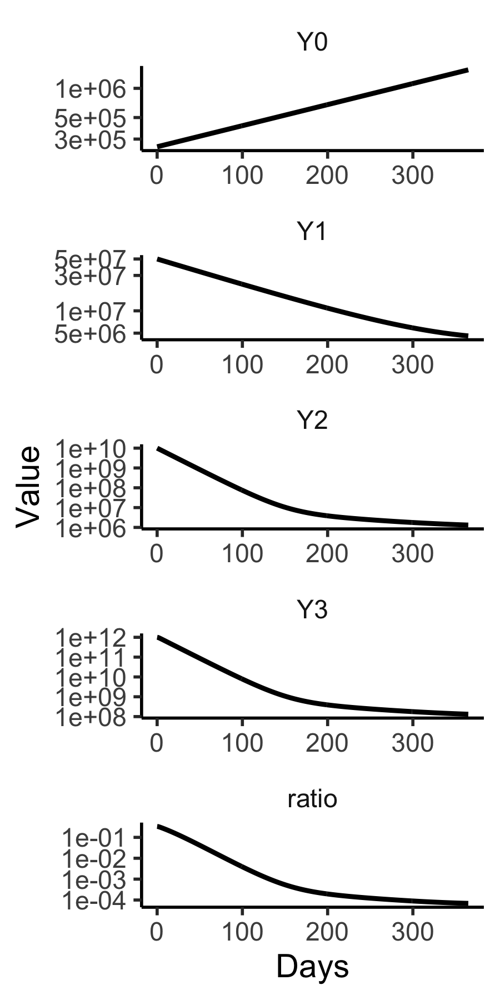
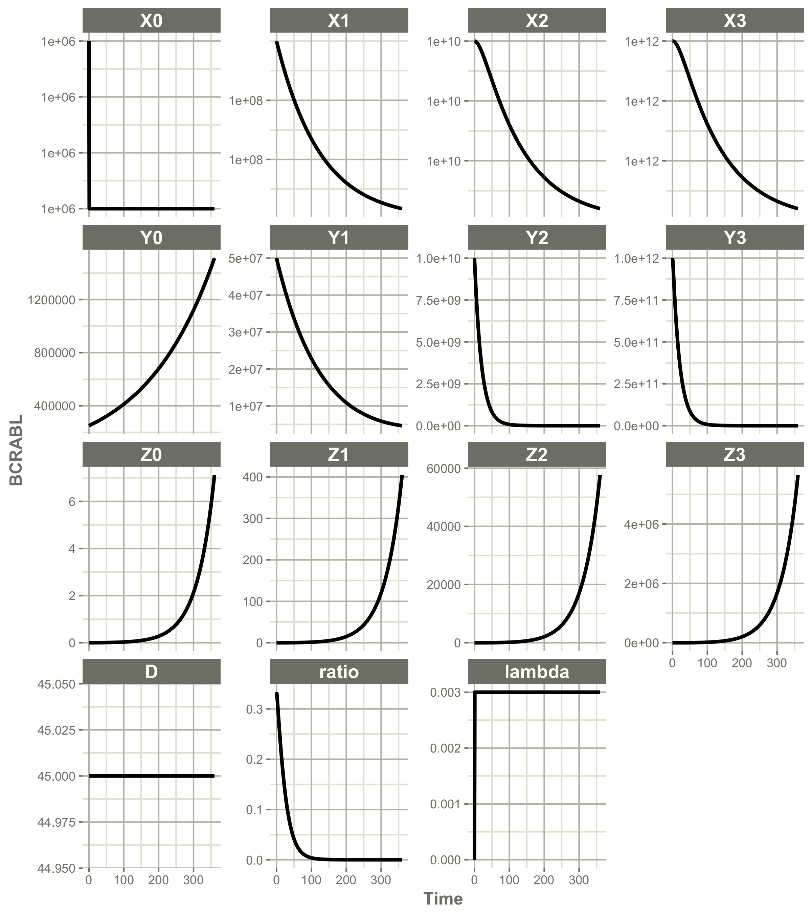
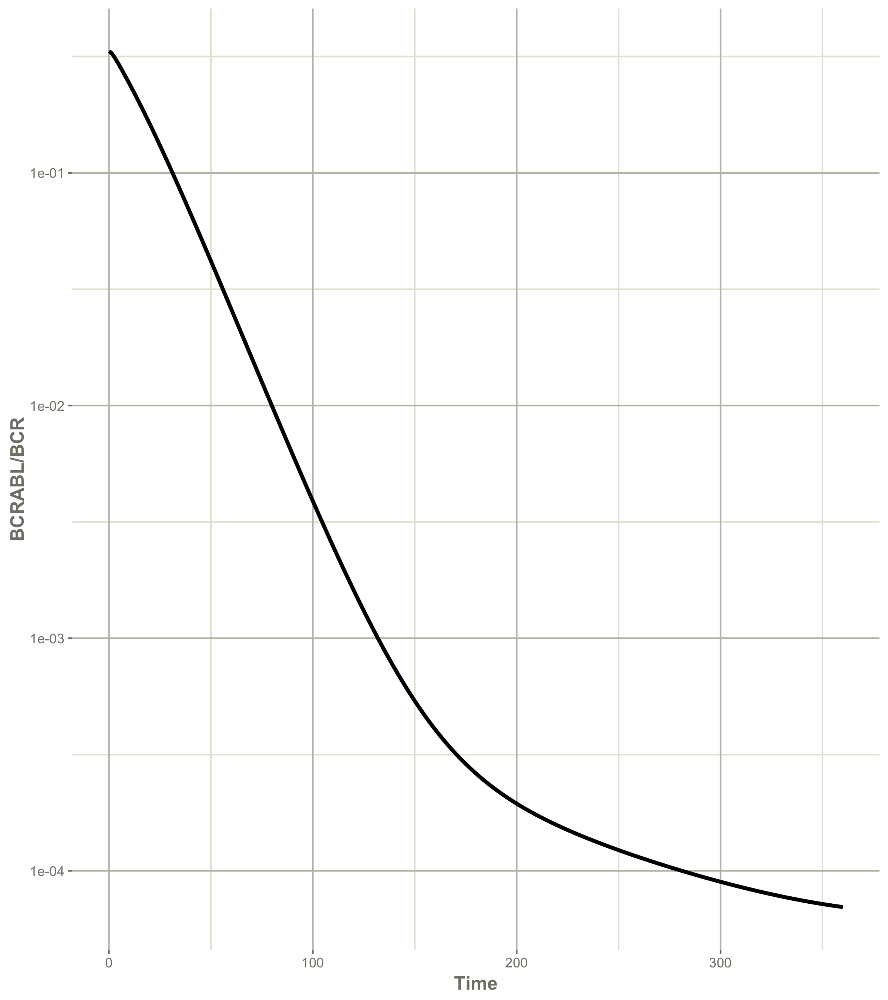

#  Compiled Models
For faster integration it is best to define the model in C. 

The deSolve code for this is 

```
#include <R.h>
#include <Rinternals.h>
#include <Rdefines.h>
#include <R_ext/Rdynload.h>
static double  parms[15];
#define d0    parms[0]
#define d1    parms[1]
#define d2    parms[2]
#define d3    parms[3]
#define ax    parms[4]
#define bx    parms[5]
#define cx    parms[6]
#define D0a   parms[7]
#define D0b   parms[8]
#define az    parms[9]
#define bz    parms[10]
#define ry    parms[11]
#define rz    parms[12]
#define u     parms[13]
#define sp    parms[14]


void parmsMichor(void (* odeparms)(int *, double *))
{   int N=15;
    odeparms(&N, parms);
}


void derivsMichor(int *neq, double *t, double *y, double *ydot, double *yout, int *ip)
{
    double X0, X1, X2, X3, Y0, Y1, Y2, Y3, Z0, Z1, Z2, Z3, D;
    double dX0,dX1,dX2,dX3,dY0,dY1,dY2,dY3,dZ0,dZ1,dZ2,dZ3, dD;
    double lambda;
    
    if (ip[0] <1) error("nout should be at least 1");
    
    X0=y[0];  X1=y[1];   X2=y[2];  X3=y[3];   
    Y0=y[4];  Y1=y[5];   Y2=y[6];  Y3=y[7];   
    Z0=y[8];  Z1=y[9];   Z2=y[10]; Z3=y[11]; D=y[12];   
    
    lambda=-0.5*(X0-sp);
    dX0 = (lambda-d0)*X0;
    dX1 = ax*X0-d1*X1;
    dX2 = bx*X1-d2*X2;
    dX3 = cx*X2-d3*X3;
    dY0 = (ry*(1-u)-d0)*Y0;
    dY1 = Y0*az/(1+D/D0a) - d1*Y1;
    dY2 = Y1*bz/(1+D/D0b) - d2*Y2;
    dY3 = cx*Y2-d3*Y3;
    dZ0 = (rz-d0)*Z0+ry*u*Y0;
    dZ1 = az*Z0-d1*Z1;
    dZ2 = bz*Z1-d2*Z2;
    dZ3 = cx*Z2-d3*Z3;
    dD = 0;
    ydot[0] = dX0; 
    ydot[1] = dX1;
    ydot[2] = dX2;
    ydot[3] = dX3;
    ydot[4] = dY0;
    ydot[5] = dY1;
    ydot[6] = dY2;
    ydot[7] = dY3;
    ydot[8] = dZ0;
    ydot[9] = dZ1;
    ydot[10]= dZ2;
    ydot[11]= dZ3;
    ydot[12]= dD;
    
    yout[0]=(Y3+Z3)/(Y3+Z3+2*X3);

}
```
This source exists in myelo's src folder. It is compiled automatically when myelo is built from source.


To recreate Figure 4B using this compiled code, the R code is
```
library(tidyverse)
library(deSolve)
pars=c(d0=0.003, d1=0.008, d2=0.05, d3=1,
       ax=0.8, bx=5, cx=100, 
       D0a=45/99, D0b= 45/749,  
       az=1.6, bz=10,
       ry=0.008, rz=0.023, 
       u=4e-8, sp=1e6)
(y0<-c(X0=1e6,X1=1e8,X2=1e10,X3=1e12,
       Y0=2.5e5,Y1=5e7,Y2=1e10,Y3=1e+12,
       Z0=0,Z1=0,Z2=0,Z3=0,D=45))
(evnt=data.frame(var="D",time=c(0,365),value=c(45,0),method="rep"))
(f=file.path(system.file(paste("libs",Sys.getenv("R_ARCH"),sep=""), package = "myelo"),
         paste("myelo",.Platform$dynlib.ext,sep="")))
dyn.load(f)
out=ode(y=y0,times=seq(0,500,1),func="derivsMichor",
       dllname = "myelo",initfunc = "parmsMichor",
       events=list(data=evnt),
       parms=pars,
       nout = 1, outnames = c("ratio"))
       
D=as.data.frame(out)
d=D%>%select(time,Y0:Y3,ratio)%>%gather(key="Cell",value="Value",-time)
tc=function(sz) theme_classic(base_size=sz)
gx=xlab("Days")
sy=scale_y_log10()
sbb=theme(strip.background=element_blank())
d$Cell=fct_relevel(d$Cell,"ratio",after=4)
d%>%ggplot(aes(x=time,y=Value))+
  facet_wrap(Cell~.,ncol=1,scales = "free")+
  geom_line(size=1)+tc(14)+sbb+gx+sy
ggsave("../docs/michorCFg4b.png",width=3,height=6)
```


Another option is to use the R package mrgsolve as follows.


```
library(mrgsolve)
code='
$PARAM d0=0.003, d1=0.008, d2=0.05, d3=1,
       ax=0.8, bx=5, cx=100, 
       D0a=45/99, D0b= 45/749,  
       az=1.6, bz=10,
       ry=0.008, rz=0.023, 
       u=4e-8, sp=1e6
$INIT X0=1e6,X1=1e8,X2=1e10,X3=1e12
       Y0=2.5e5,Y1=5e7,Y2=1e10,Y3=1e+12
       Z0=0,Z1=0,Z2=0,Z3=0,D=45
$ODE 
double ratio=(Y3+Z3)/(Y3+Z3+2*X3);
double lambda=-0.5*(X0-sp);
dxdt_X0 = (lambda-d0)*X0;
dxdt_X1 = ax*X0-d1*X1;
dxdt_X2 = bx*X1-d2*X2;
dxdt_X3 = cx*X2-d3*X3;
dxdt_Y0 = (ry*(1-u)-d0)*Y0;
dxdt_Y1 = Y0*az/(1+D/D0a) - d1*Y1;
dxdt_Y2 = Y1*bz/(1+D/D0b) - d2*Y2;
dxdt_Y3 = cx*Y2-d3*Y3;
dxdt_Z0 = (rz-d0)*Z0+ry*u*Y0;
dxdt_Z1 = az*Z0-d1*Z1;
dxdt_Z2 = bz*Z1-d2*Z2;
dxdt_Z3 = cx*Z2-d3*Z3;
dxdt_D = 0;
$CAPTURE ratio'
mod <- mread("michorMRG", "~/tmp", code)
out=mod%>%mrgsim(start=0,end = 365, delta = 1)
out%>%plot(xlab="Days")
(d=as.data.frame(out))
d=d%>%select(time,Y0:Y3,ratio)%>%gather(key="Cell",value="Value",-time)
d$Cell=fct_relevel(d$Cell,"ratio",after=4)
d%>%ggplot(aes(x=time,y=Value))+
  facet_wrap(Cell~.,ncol=1,scales = "free")+
  geom_line(size=1)+tc(14)+sbb+gx+sy
ggsave("../docs/michorMRGfg4a.png",width=3,height=6)

```



A third option is to use the R package RxODE as follows
```
library(RxODE)
ode <- "
ratio=(Y3+Z3)/(Y3+Z3+2*X3);
lambda=-0.5*(X0-sp);
d/dt(X0) = (lambda-d0)*X0;
d/dt(X1) = ax*X0-d1*X1;
d/dt(X2) = bx*X1-d2*X2;
d/dt(X3) = cx*X2-d3*X3;
d/dt(Y0) = (ry*(1-u)-d0)*Y0;
d/dt(Y1) = Y0*az/(1+D/D0a) - d1*Y1;
d/dt(Y2) = Y1*bz/(1+D/D0b) - d2*Y2;
d/dt(Y3) = cx*Y2-d3*Y3;
d/dt(Z0) = (rz-d0)*Z0+ry*u*Y0;
d/dt(Z1) = az*Z0-d1*Z1;
d/dt(Z2) = bz*Z1-d2*Z2;
d/dt(Z3) = cx*Z2-d3*Z3;
d/dt(D) = 0;
"
library(ggplot2)
m1 <- RxODE(model = ode)
print(m1)
ev  <- et(amountUnits="mg", timeUnits="Days") %>%
  et(time=0, amt=0, addl=0, ii=0, cmt="D") %>%
  et(0:360) # Add sampling 
x <- m1 %>% rxSolve(pars, ev, y0);
knitr::kable(head(x))
plot(x)+scale_y_log10() 
ggsave("../docs/michorRxODEfg4a.png",width=8,height=9)
plot(x,"ratio")+scale_y_log10()+ ylab("BCRABL/BCR")
ggsave("../docs/michorRxODEfg4aRatio.png",width=8,height=9)

```


