#  FME Identifiability Analysis 
The goal here is to see how well parameters can be recovered from bi-exponential model simulations. 

First we need to examine the log(BCRABL/BCR) variance-mean relationship 
to see if it is roughly flat, consistent with normality.

```
rm(list=ls())
library(tidyverse)
library(myelo)
library(lme4)
head(d<-michor)
names(d)=c("TIME","DV","ID")  #change names to NONMEM style
head(d<-d%>%mutate(DV=DV/100,DV=ifelse(DV>0.99,0.99,DV),LNDV=log(DV)))
(startvec <- c(lA = log(0.995), alpha = -0.05, lB=log(0.005), beta = -0.005))
nform=~log((exp(lA+alpha*input)+exp(lB+beta*input))/(2+exp(lA+alpha*input)+exp(lB+beta*input)))
nfun=deriv(nform, namevec=c("lA", "alpha", "lB", "beta"),
              function.arg=c("input","lA", "alpha", "lB", "beta"))
(M<-nlmer(LNDV ~ nfun(TIME, lA, alpha, lB, beta) ~ (lA|ID) + (alpha|ID) +(lB|ID) + (beta|ID),
          data=d,start = startvec,
          nAGQ = 0L,
          control = nlmerControl(tolPwrss = 1e-4)) )
head(d<-d%>%mutate(EY=predict(M),res=LNDV-EY,var=res^2,sd=sqrt(var)))
d%>%ggplot(aes(x=TIME,y=LNDV))+facet_wrap(ID~.,ncol=4)+geom_point(size=1)+geom_line(aes(y=EY)) 
ggsave("outs/ratFits68.png",width=6,height=30)  
```
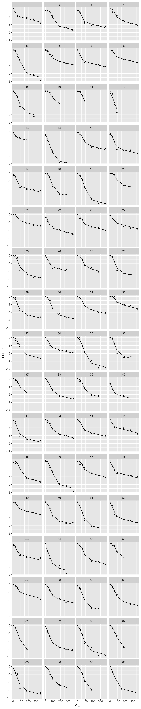

Squared residuals of these fits are plotted vs means by this

```
d%>%ggplot(aes(x=EY,y=var))+geom_point()+scale_y_log10() 
ggsave("outs/ratVarMean.png",width=6,height=4)
sqrt(mean(d$var)) # sd=0.43
```


There is no major trend, so assuming normality is acceptable. The standard deviation of 
the additive noise is 0.43. BCRABL/BCR ratios r were clipped at 0.99. This clipping 
corresponds, via r = Y/(Y+2), to an upper limit on the ratio of CML-to-normal cells, Y, of ~200. 


A bi-exponential model is simulated densely by this
```
rm(list=ls())
library(ggplot2)
library(myelo)
setwd("~/soft/iqDeskTop/bi/fme") # on mac
library(tidyverse)
library(deSolve)
library(FME)

pars=c(Ke=0.05, Kpc=0.005,Ac0=0.995,Ap0=0.005)
(f=file.path(system.file(paste("libs",Sys.getenv("R_ARCH"),sep=""), package = "myelo"),
             paste("myelo",.Platform$dynlib.ext,sep="")))
dyn.load(f)
biExp <- function (pars) {
  y0=with(as.list(pars),c(Ac=Ac0,Ap=Ap0))
  out=ode(y=y0,times=seq(0,360,1),func="derivsBiExp",
          dllname = "myelo",initfunc = "parmsBiExp",
          parms=pars[1:2],
          nout = 1, outnames = c("ratio"))
  D=as.data.frame(out)
  D%>%mutate(lrat=log(ratio))
}

head(D<-biExp(pars))
head(D<-D%>%mutate(lrat=rnorm(dim(D)[1],mean=lrat,sd=0.43),sd=0.43))
D=D%>%mutate(lrat=ifelse(lrat> -0.01,-0.01,lrat))# if >0.99, set to it 

tc=function(sz) theme_classic(base_size=sz)
gx=xlab("Days")
D%>%ggplot(aes(x=time,y=lrat))+geom_point()+tc(14)+gx
ggsave("outs/simData.png",width=4,height=4)
```
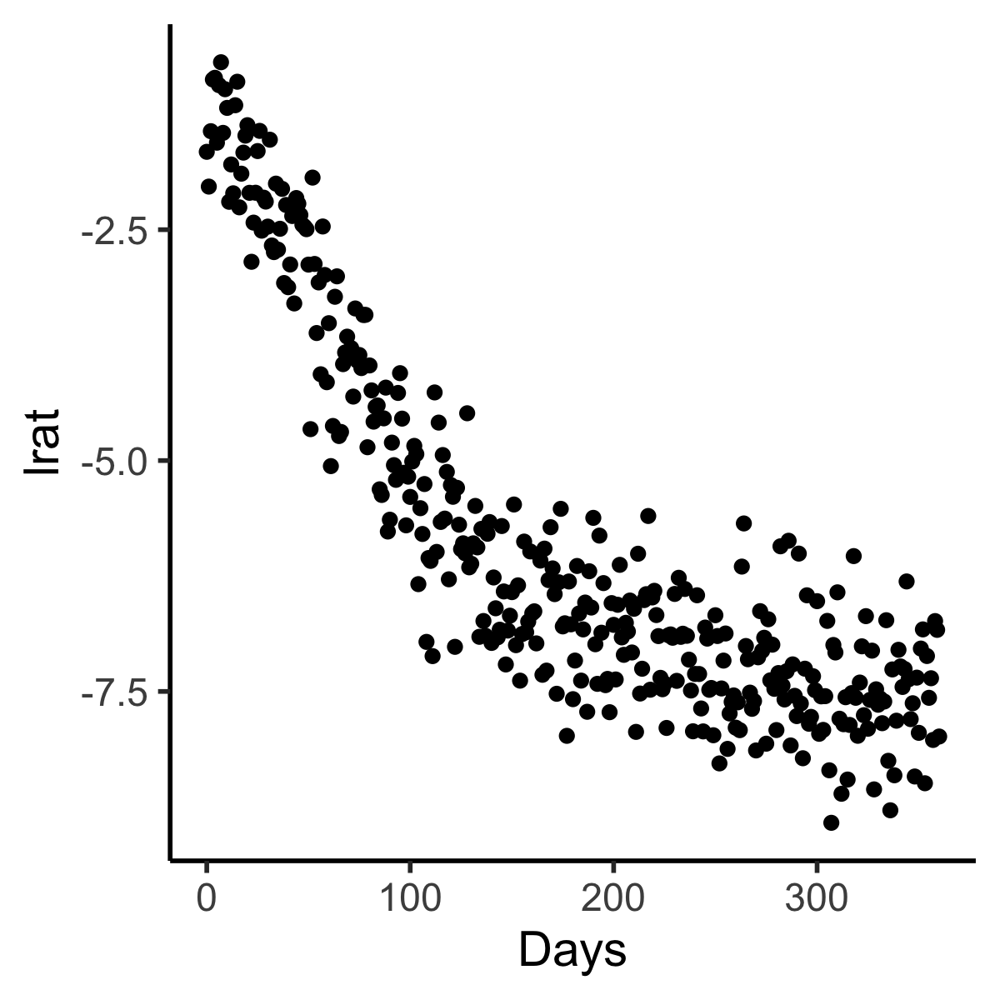


Now define the cost of a lack of fit, assuming normality.
```
head(DataLogRat<-D%>%select(time, lrat,sd))
# we narrowed D above to make lrat the only choice 
biCost <- function (pars) {    #for the output 
  out = biExp(pars)            #picked out from out 
  return(modCost(model = out, obs = DataLogRat, err = "sd")) #here
}
```


The following shows the impact of a 30% increase in Ke 
```
par(fig=c(0,1,0,1))
ref  <- biExp(pars)
pert <- biExp(pars*c(1.3,1,1,1))
plot(ref$time,ref$lrat,type="l",lwd=2,xlab="Days",ylab="lrat",
     main="local sensitivity, parameter Ke")
lines(pert$time,pert$lrat,lwd=2,lty=2)

arrseq <- seq(50,150,20)#c(10,30,50,70,90)
arrows(ref$time[arrseq],ref$lrat[arrseq],
       ref$time[arrseq],pert$lrat[arrseq], length= 0.075)
legend("bottomleft",c("Ke=0.05","Ke=0.065"),lty=c(1,2))
par(new=TRUE)
par(fig=c(0.5,0.99,0.5,0.95))

# note, denom below is negative, as is num, so this
ss <- (pert$lrat-ref$lrat)/pert$lrat # is positive
plot(ref$time,ss,type="l",lwd=2,
     xlab="",ylab="",axes=FALSE,frame.plot=TRUE)
points(ref$time[arrseq],ss[arrseq])
title("Sensitivity functions ",line=0.5,cex.main=1)
par(fig=c(0,1,0,1))
# save as KeSensTimeCrs.png by hand from gui
```
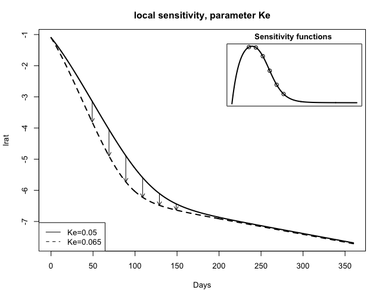


Sensitivities for all parameters are created by this 
```
Sfun <- sensFun(biCost, pars)
summary(Sfun)
plot(Sfun, which = c("lrat"), xlab="time", lwd = 2,legpos="topright")
# save as sensTimeCourses.png via gui
```
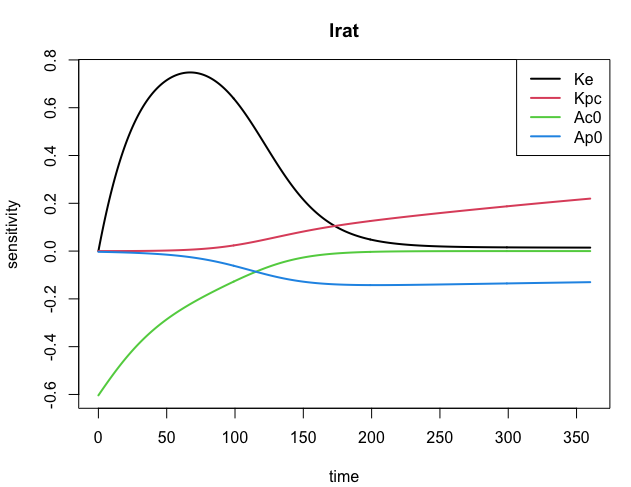

Note that sensitivity is defined as output changes/values, and numerator and denominator minus signs cancel. 


The following creates pairwise phase-plane-like sensitivity plots. 
```
pairs(Sfun, which = c("lrat"), col = c("blue"))  
```


For example, in row 1 col 2, starting at the origin, Ke sensitivity jumps first and Kpc sensitivity  later.
Lower diags are correlation coefficients. 

Next let's look at collinearity
```
ident <- collin(Sfun)
head(ident, n = 20)
#    Ke Kpc Ac0 Ap0 N collinearity
# 1   1   1   0   0 2          1.1
# 2   1   0   1   0 2          1.9
# 3   1   0   0   1 2          1.2
# 4   0   1   1   0 2          1.0
# 5   0   1   0   1 2          4.5
# 6   0   0   1   1 2          1.1
# 7   1   1   1   0 3          2.0  #pick this
# 8   1   1   0   1 3          5.3
# 9   1   0   1   1 3          2.0  #or this
# 10  0   1   1   1 3          4.6
# 11  1   1   1   1 4          5.5
plot(ident, log = "y") #collinearity.png
```
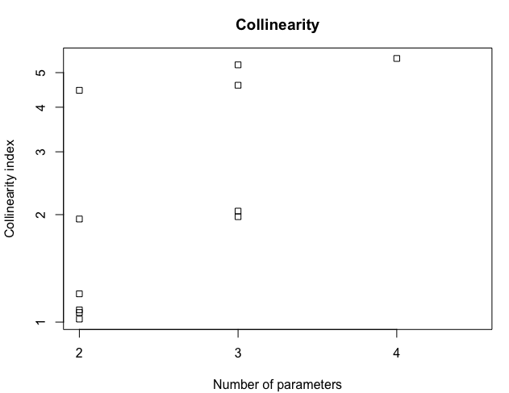

This suggests fixing the slope or intercept of the beta exponential.


Perturbing initial estimates 2-fold, we get back values that resemble true values
```
biCost2 <- function(lpars) #nest to insure positive
  biCost(c(exp(lpars), n = 900)) # parameters
Pars <- pars[1:4] * 2  #double to make it work to find the opt
Fit <- modFit(f = biCost2, p = log(Pars))
exp(coef(Fit))
#         Ke         Kpc         Ac0         Ap0 
#0.049132426 0.004317588 0.926145667 0.004205642 

deviance(Fit)

ini   <- biExp(pars = c(Pars, n = 900))
final <- biExp(pars = c(exp(coef(Fit)), n = 900))
plot(D$time,D$lrat, xlab = "time", ylab = "lrat")
lines(ini$time, ini$lrat, lty = 2)
lines(final$time, final$lrat)
legend("topright", c("data", "initial", "fitted"),
       lty = c(NA,2,1), pch = c(1, NA, NA)) #=> initFitted.png
```


The following MCMC code takes ~10 min to run, so we save the result. 
```    
# MCMC <- modMCMC(f = biCost2, p = Fit$par,niter=1e5)
# save(MCMC, file="data/mcmc.Rdata")
```

Now check convergence
```
load("data/mcmc.Rdata")
options(width = 50)
MCMC$pars <- exp(MCMC$pars)
summary(MCMC)
par(mar=c(4, 4, 3, 1) + .1)
plot(MCMC, Full = TRUE) #converge.png
```
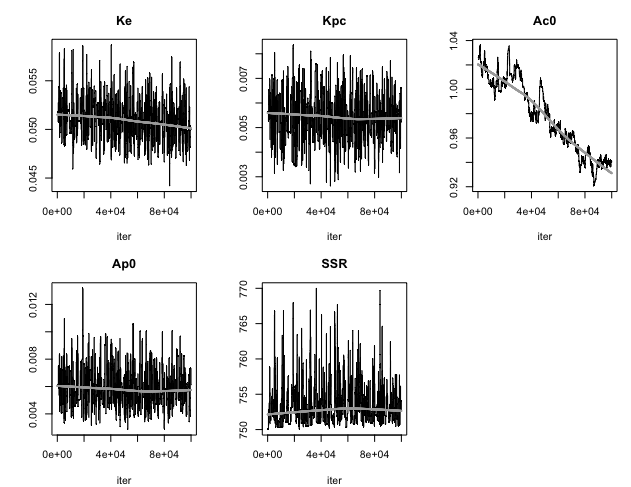

Ac0 struggles. This may be due to 
saturation of Y/(Y+2) with Y=Ac+Ap. 

Now look at correlations
```
pairs(MCMC,nsample=1000,cex.labels=1.4,cex=0.7)
```
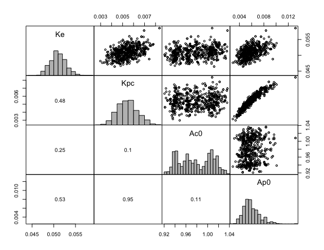

Beta exponential slope-intercept correlation is strong. 

Beta intercept burial below the alpha intercept is seen here
```
sR=sensRange(func=biExp,parms=pars,parInput=MCMC$par)
plot(summary(sR),xlab="time")
```
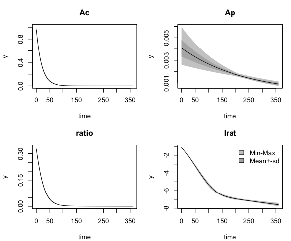

Letting parameters vary by 25%. 
```
parRange=cbind(min=0.75*pars, max=1.25*pars)
crlfun=function(pars) return(m=mean(biExp(pars)$lrat))
CRL=modCRL(fun=crlfun,parRange=parRange,num=500)
cor(CRL)[5,]
plot(CRL,ylab="lrat",cex=0.5,trace=TRUE)
```
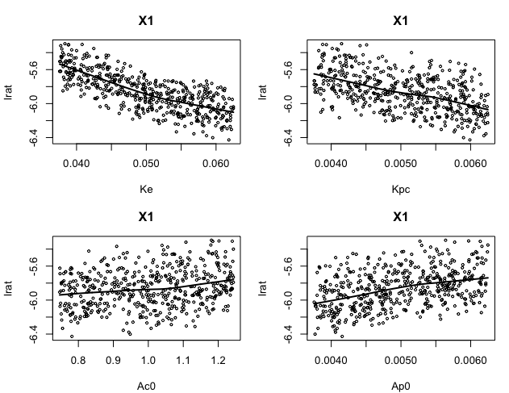

consistent with  convergence, we see weak dependence of lrat on Ac0. 


What if we fix the two decay rate constants. 
```
pars=c(Ac0=0.995,Ap0=0.005)
(f=file.path(system.file(paste("libs",Sys.getenv("R_ARCH"),sep=""), package = "myelo"),
             paste("myelo",.Platform$dynlib.ext,sep="")))
dyn.load(f)
biExp <- function (pars) {
  y0=with(as.list(pars),c(Ac=Ac0,Ap=Ap0))
  out=ode(y=y0,times=seq(0,360,1),func="derivsBiExp",
          dllname = "myelo",initfunc = "parmsBiExp",
          parms=c(Ke=0.05, Kpc=0.005),
          nout = 1, outnames = c("ratio"))
  D=as.data.frame(out)
  D%>%mutate(lrat=log(ratio))
}

head(D<-biExp(pars))
head(D<-D%>%mutate(lrat=rnorm(dim(D)[1],mean=lrat,sd=0.43),sd=0.43))
D=D%>%mutate(lrat=ifelse(lrat> -0.01,-0.01,lrat))# if >0.99, set to it 
head(DataLogRat<-D%>%select(time, lrat,sd))
biCost <- function (pars) {
  out = biExp(pars)            #picked out from out 
  return(modCost(model = out, obs = DataLogRat, err = "sd")) #here
}

Sfun <- sensFun(biCost, pars)
summary(Sfun)
plot(Sfun, which = c("lrat"), xlab="time", lwd = 2,legpos="topright")
```
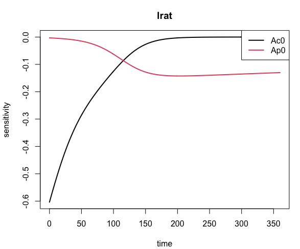


```
biCost2 <- function(lpars) #nest to insure positive
  biCost(c(exp(lpars), n = 900)) #parameters
Pars <- pars * 2  #double to make work to find opt
Fit <- modFit(f = biCost2, p = log(Pars))
# system.time(MCMC <- modMCMC(f = biCost2, p = Fit$par,niter=5e3)) # 10% => 30s
# save(MCMC, file="data/mcmcFx2.Rdata")
load("data/mcmcFx2.Rdata")
options(width = 50)
MCMC$pars <- exp(MCMC$pars)
summary(MCMC)
par(mar=c(4, 4, 3, 1) + .1)
plot(MCMC, Full = TRUE) #convergeFx2.png #same struggle due to saturation
pairs(MCMC,nsample=1000,cex.labels=1.4,cex=0.7)# pairsMCMCfx2.png
sR <- sensRange(func = biExp, parms = pars, parInput = MCMC$par)
plot(summary(sR),xlab="time",legpos="topright") #sensRangeTimeCrsFx2.png
parRange=cbind(min=0.75*pars, max=1.25*pars)
crlfun=function(pars) return(m=mean(biExp(pars)$lrat))
CRL=modCRL(fun=crlfun,parRange=parRange,num=500)
plot(CRL,ylab="lrat",cex=0.5,trace=TRUE)# globalSensFx2.png
```

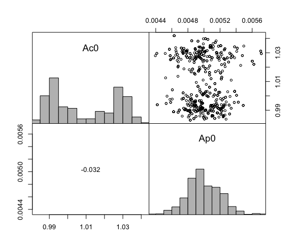

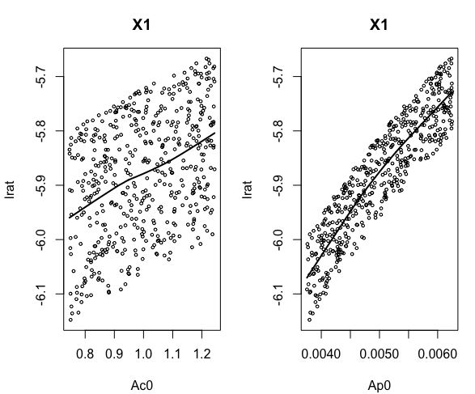

Ac0 convergence failed likely due to  Y/(Y+2) saturation:
running 100,000 iterations did not help 


but halving initial conditions to reduce saturation yielded this


This initial condition of Y = 0.5 maps to a ratio of 0.5/(0.5+2) = 0.2. 
I suggest t=0 be defined as the first time BCRABL/BCR drops below 0.2 (20%).

