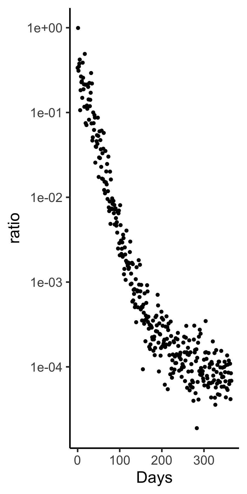

#  Identifiability
The goal here is to see how well parameters can be recovered from simulations of Figure 4A. 
```
library(tidyverse)
library(RxODE)
michor <- "
ratio=(Y3+Z3)/(Y3+Z3+2*X3);
lambda=-0.5*(X0-sp);
d/dt(X0) = (lambda-d0)*X0;
d/dt(X1) = ax*X0-d1*X1;
d/dt(X2) = bx*X1-d2*X2;
d/dt(X3) = cx*X2-d3*X3;
d/dt(Y0) = (ry*(1-u)-d0)*Y0;
d/dt(Y1) = Y0*az/(1+D/D0a) - d1*Y1;
d/dt(Y2) = Y1*bz/(1+D/D0b) - d2*Y2;
d/dt(Y3) = cx*Y2-d3*Y3;
d/dt(Z0) = (rz-d0)*Z0+ry*u*Y0;
d/dt(Z1) = az*Z0-d1*Z1;
d/dt(Z2) = bz*Z1-d2*Z2;
d/dt(Z3) = cx*Z2-d3*Z3;
d/dt(D) = 0;
"
(m1=RxODE(model = michor))
ev  <- et(amountUnits="mg", timeUnits="Days") %>%
  et(time=0, amt=45, addl=0, ii=0, cmt="D") %>%
  et(-10:360) # Add sampling 
pars=c(d0=0.003, d1=0.008, d2=0.05, d3=1,
       ax=0.8, bx=5, cx=100, 
       D0a=45/99, D0b= 45/749,  
       az=1.6, bz=10,
       ry=0.008, rz=0.023, 
       u=4e-8, sp=1e6)
(y0<-c(X0=1e6,X1=1e8,X2=1e10,X3=1e12,
       Y0=2.5e5,Y1=5e7,Y2=1e10,Y3=1e+12,
       Z0=0,Z1=0,Z2=0,Z3=0,D=0))
x <- m1 %>% rxSolve(pars, ev, y0);
head(x,3)
plot(x)+scale_y_log10()
plot(x,"ratio")+scale_y_log10()+ ylab("BCRABL/BCR")
head(d<-as.data.frame(x)%>%select(time,ratio))
dns=d%>%mutate(ratio=ratio*exp(0.05*rnorm(n=n())))
tc=function(sz) theme_classic(base_size=sz)
gx=xlab("Days")
gy=ylab("BCR-ABL/BCR")
sy=scale_y_log10()
sbb=theme(strip.background=element_blank())
dns%>%ggplot(aes(x=time,y=ratio))+
  geom_point(size=1)+tc(14)+sbb+gx+sy+gy
ggsave("../docs/michorSim365.png",width=4,height=4)
```



To fit the model to this noisy but rich simulated data, using bbmle, the code is

```
library(bbmle)
nLL<-function(d1,d2) { 
  d1=exp(d1)
  d2=exp(d2)
  pars["d1"]=d1
  pars["d2"]=d2
  x <- m1 %>% rxSolve(pars, ev, y0)
  y.pred=x[,"ratio"]
  sigma  <- sqrt(sum((dns$ratio-y.pred)^2)/length(dns$ratio))
  -sum(dnorm(dns$ratio, mean=y.pred,sd=sigma,log=TRUE)) 
}

(IC0=c(d1=0.005,d2=0.05)) 
(IC=log(2*IC0))
(s=summary(M<-mle2(nLL,method="Nelder-Mead",
                start=as.list(IC),
                control = list(maxit=50000, parscale=IC) ) ) )
data.frame(IC=exp(IC),fit=exp(coef(M)),trueVals=IC0)
data.frame(point=exp(s@coef[,1]),
           lowCI=exp(s@coef[,1]-1.96*s@coef[,2]),
           hiCI=exp(s@coef[,1]+1.96*s@coef[,2])  )
#          point        lowCI         hiCI
#d1 2.031812e-07 8.720681e-34 4.733875e+19 # not recovered!
#d2 4.262276e-02 3.972522e-02 4.573164e-02
```


