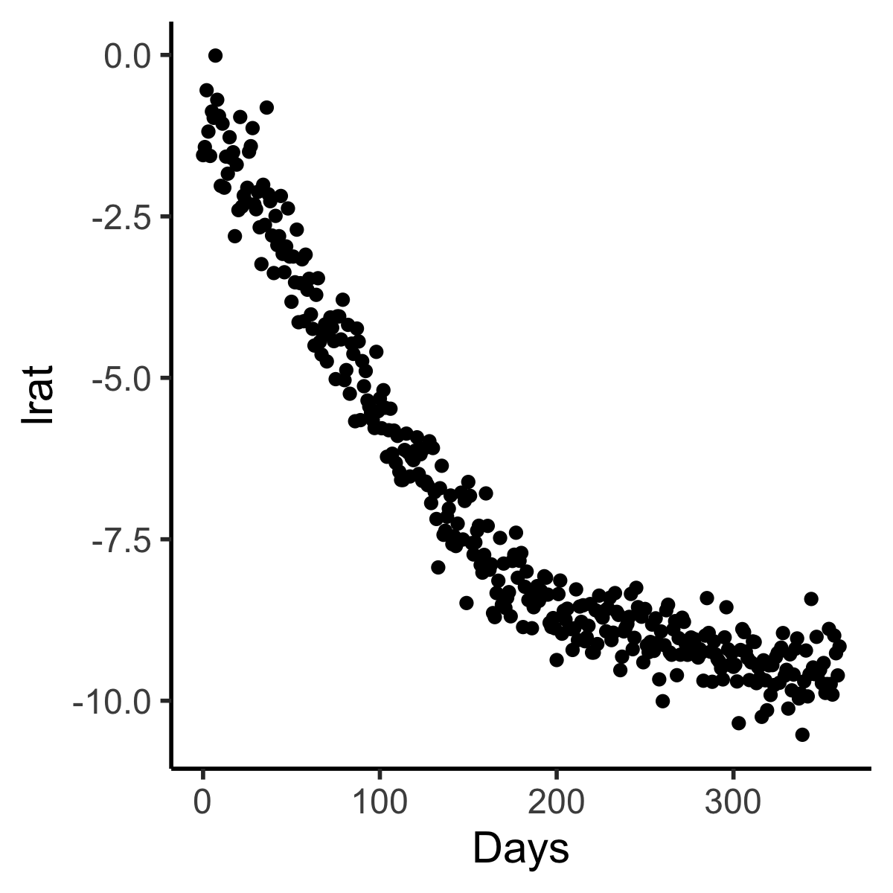
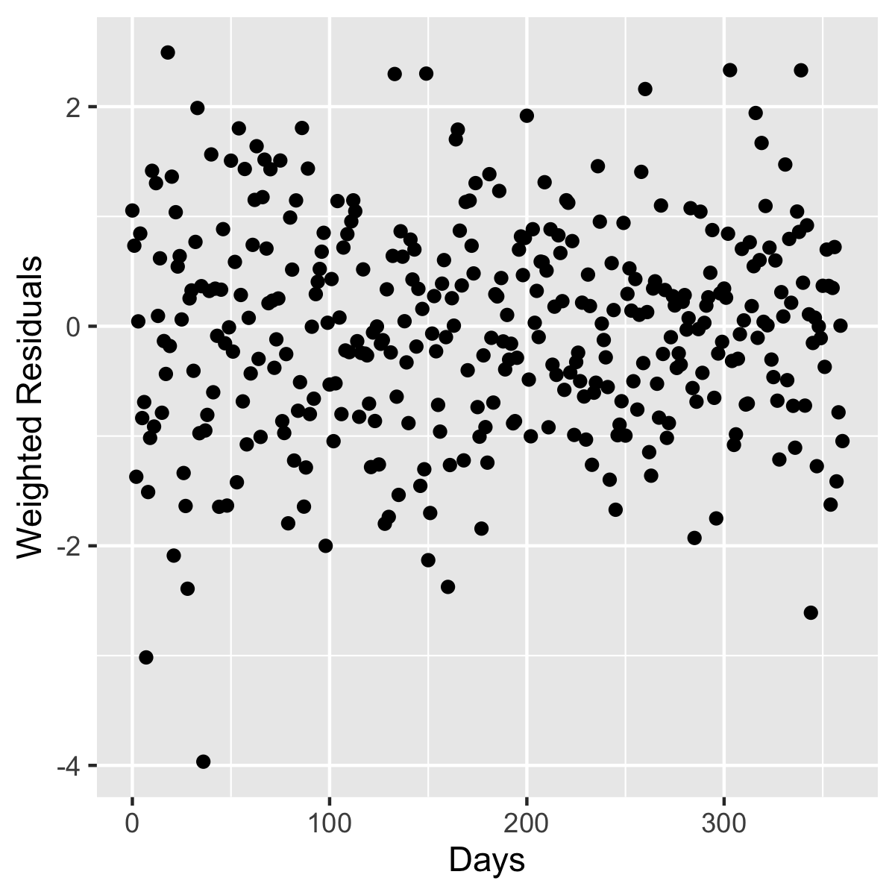
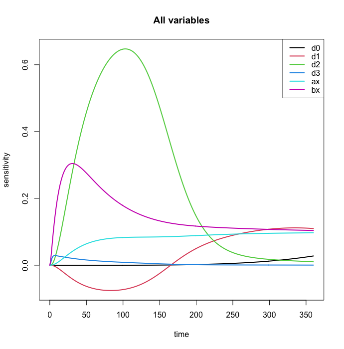
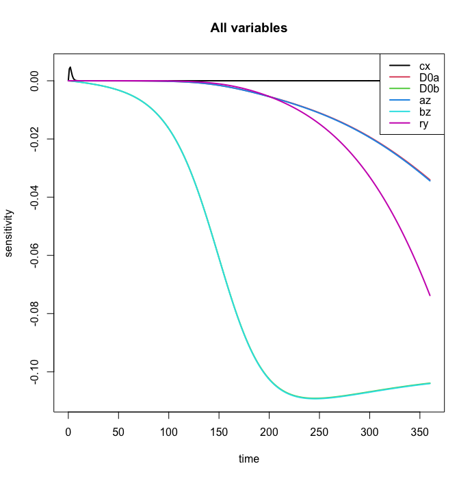
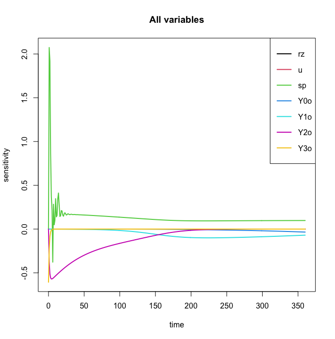
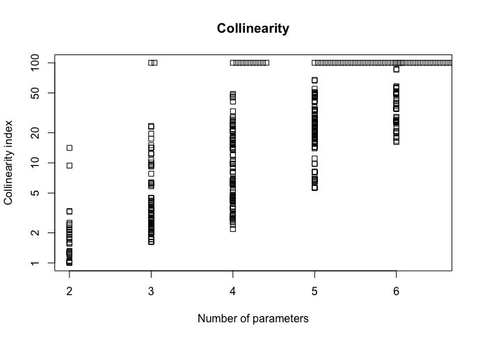
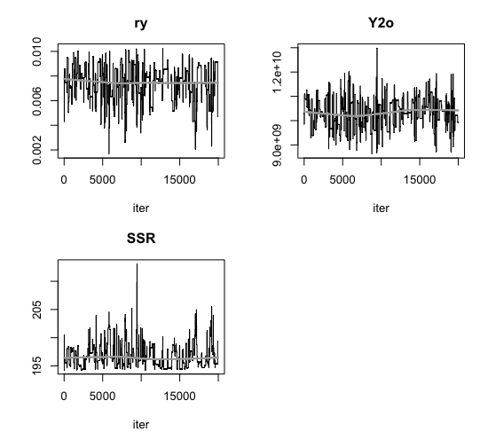
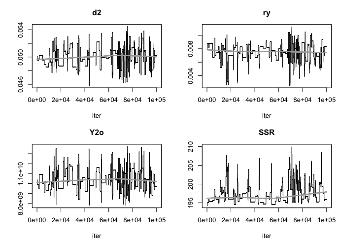
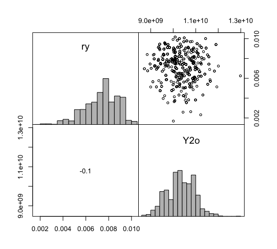
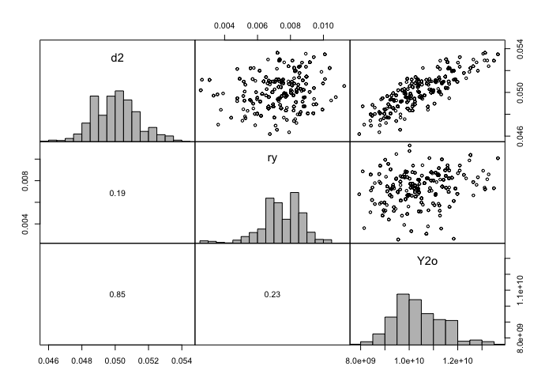

#  Identifiability of Michor's Model using FME 

The goal here is to explore Michor model identifiability using the R package FME. 

First we simulate data. 

```
rm(list=ls())
library(ggplot2)
library(myelo)
setwd("~/soft/iqDeskTop/bi/fme") # on mac
library(tidyverse)
library(deSolve)
library(FME)
pars=c(d0=0.003, d1=0.008, d2=0.05, d3=1,
       ax=0.8, bx=5, cx=100, 
       D0a=45/99, D0b= 45/749,  
       az=1.6, bz=10,
       ry=0.008, rz=0.023, 
       # u=4e-8, 
       u=0,  #focus for now on those without relapses
       sp=1e6, Y0o=2.5e5,Y1o=5e7,Y2o=1e10,Y3o=1e12)
(f=file.path(system.file(paste("libs",Sys.getenv("R_ARCH"),sep=""), package = "myelo"),
             paste("myelo",.Platform$dynlib.ext,sep="")))
dyn.load(f)

miMod <- function (pars) {
  y0=with(as.list(pars),c(X0=1e6,X1=1e8,X2=1e10,X3=1e12,
                          Y0=Y0o,Y1=Y1o,Y2=Y2o,Y3=Y3o,
                          Z0=0,Z1=0,Z2=0,Z3=0,D=45) )
  out=ode(y=y0,times=seq(0,360,1),func="derivsMichor",
          dllname = "myelo",initfunc = "parmsMichor",
          parms=pars[1:15],
          nout = 1, outnames = c("ratio"))
  D=as.data.frame(out)
  D%>%mutate(lrat=log(ratio))
}

head(D<-miMod(pars))
range(D$lrat)
head(D<-D%>%mutate(lrat=lrat+rnorm(n=361,sd=0.43),sd=0.43))
range(D$lrat)
# (D<-D%>%mutate(lrat=rnorm(n=dim(D)[1],mean=lrat,sd=0.43),sd=0.43))
D=D%>%mutate(lrat=ifelse(lrat> -0.01,-0.01,lrat))# if >0.99, set to it 
tc=function(sz) theme_classic(base_size=sz)
gx=xlab("Days")
D%>%ggplot(aes(x=time,y=lrat))+geom_point()+tc(14)+gx
ggsave("outs/miSim.png",width=4,height=4)
```



Now define the cost of a lack of fit, assuming normality.
```
head(DataLogRat<-D%>%select(time, lrat,sd))
miCost <- function (pars) {
  out = miMod(pars)            #picked out from out 
  return(modCost(model = out, obs = DataLogRat, err = "sd")) #here
}
gy=ylab("Weighted Residuals")
x$residuals%>%ggplot(aes(x,res))+geom_point()+xlab("Days")+gy
ggsave("outs/miResids.png",width=4,height=4)
```



Now examine sensitivities of the model parameters
```
Sfun <- sensFun(miMod, pars,sensvar="lrat",senspar=1:6)
summary(Sfun)
plot(Sfun, xlab="time", lwd = 2,legpos="topright")

Sfun <- sensFun(miMod, pars,sensvar="lrat",senspar=7:12)
summary(Sfun)
plot(Sfun, xlab="time", lwd = 2,legpos="topright")

Sfun <- sensFun(miMod, pars,sensvar="lrat",senspar=13:19)
summary(Sfun)
plot(Sfun, xlab="time", lwd = 2,legpos="topright")
```




Note that sensitivity is defined as output changes/values, and numerator and denominator minus signs cancel. 


Based on plots above, next we look at the collinearity of 9 influential parameters 
```
Sfun <- sensFun(miMod, pars,sensvar="lrat",
                senspar=c("d1","d2","ax","bx","bz","az","ry","Y1o","Y2o"))
summary(Sfun)
ident <- collin(Sfun)
ident=ident%>%filter(N<=6)
ident=ident%>%mutate(collinearity=ifelse(collinearity>100,100,collinearity))
plot(ident, log = "y") #miCollin.png
```


We should thus consider only up to 4-parameter models.
Those with lowest collinearity are
```
ident%>%filter(N==2,collinearity==min(collinearity))
# d1 d2 ax bx bz az ry Y1o Y2o N collinearity
#  0  0  0  0  0  0  1   0   1 2            1
ident%>%filter(N==3)%>%filter(collinearity==min(collinearity))
# d1 d2 ax bx bz az ry Y1o Y2o N collinearity
#  0  1  0  0  0  0  1   0   1 3          1.6
ident%>%filter(N==4)%>%filter(collinearity==min(collinearity))
# d1 d2 ax bx bz az ry Y1o Y2o N collinearity
#  0  1  0  0  0  0  1   1   1 4          2.2
```

Let's see how robust the fits to these models are to 10-fold perturbations in
initial estimates.
```
miCost2P <- function (subpars) {
  pars["ry"]=subpars["ry"]
  pars["Y2o"]=subpars["Y2o"]
  out = miMod(pars)            
  return(modCost(model = out, obs = DataLogRat, err = "sd"))
}
miCost2 <- function(lsubpars) #nest to insure positive
  miCost2P(exp(lsubpars)) #parameters

Pars=10*pars[c("ry","Y2o")] # handles big changes from true
Fit <- modFit(f = miCost2, p = log(Pars))
exp(coef(Fit)) # recovers 0.008 and 1e10 nicely!
# ry           Y2o 
# 8.086250e-03 1.029256e+10 
deviance(Fit) #  334.4854
Fit2=Fit
#######################

miCost3P <- function (subpars) {
  pars["d2"]=subpars["d2"]
  pars["ry"]=subpars["ry"]
  pars["Y2o"]=subpars["Y2o"]
  out = miMod(pars)            
  return(modCost(model = out, obs = DataLogRat, err = "sd"))
}
miCost3 <- function(lsubpars) #nest to insure positive
  miCost3P(exp(lsubpars)) #parameters

Pars=10*pars[c("d2","ry","Y2o")] # handles big changes from true
Fit <- modFit(f = miCost3, p = log(Pars))
exp(coef(Fit)) # also nice!
#           d2           ry          Y2o 
# 5.010920e-02 8.095203e-03 1.035857e+10 
deviance(Fit) # 334.4727 
Fit3=Fit

##########
miCost4P <- function (subpars) {
  pars["d2"]=subpars["d2"]
  pars["ry"]=subpars["ry"]
  pars["Y1o"]=subpars["Y1o"]
  pars["Y2o"]=subpars["Y2o"]
  out = miMod(pars)            
  return(modCost(model = out, obs = DataLogRat, err = "sd"))
}
miCost4 <- function(lsubpars) #nest to insure positive
  miCost4P(exp(lsubpars)) #parameters

Pars=10*pars[c("d2","ry","Y1o","Y2o")] # handles big changes from true
Fit <- modFit(f = miCost4, p = log(Pars))
exp(coef(Fit)) # still close but drift
#           d2           ry          Y1o          Y2o 
# 5.003219e-02 8.215759e-03 4.957516e+07 1.032831e+10 
# true are
#    d2    ry   Y1o   Y2o 
# 5e-02 8e-03 5e+07 1e+10   # so some drift, but still OK 
deviance(Fit) # 334.4547
Fit4=Fit

###########################
# 5 should be worse
ident%>%filter(N==5)%>%filter(collinearity==min(collinearity))
#   d1 d2 ax bx bz az ry Y1o Y2o N collinearity
#    0  1  0  1  0  0  1   1   1 5          5.6

miCost5P <- function (subpars) {
  pars["d2"]=subpars["d2"]
  pars["bx"]=subpars["bx"]
  pars["ry"]=subpars["ry"]
  pars["Y1o"]=subpars["Y1o"]
  pars["Y2o"]=subpars["Y2o"]
  out = miMod(pars)            
  return(modCost(model = out, obs = DataLogRat, err = "sd"))
}
miCost5 <- function(lsubpars) #nest to insure positive
  miCost5P(exp(lsubpars)) #parameters

Pars=10*pars[c("d2","bx","ry","Y1o","Y2o")] # can't handle
Fit <- modFit(f = miCost5, p = log(Pars))
exp(coef(Fit)) # comp
#          d2           bx           ry          Y1o          Y2o 
# 5.076612e-01 9.526203e+00 8.220860e-03 9.649524e+08 2.280135e+11 
# far from true
#    d2    bx    ry   Y1o   Y2o 
# 5e-02 5e+00 8e-03 5e+07 1e+10 
deviance(Fit) # 6555.437 and fit sucks

Pars=5*pars[c("d2","bx","ry","Y1o","Y2o")] #handles but still off 
Fit <- modFit(f = miCost5, p = log(Pars))
exp(coef(Fit)) # comp
#          d2           bx           ry          Y1o          Y2o 
#4.860084e-02 8.032327e+00 1.020889e-02 7.897664e+07 1.459501e+10 
deviance(Fit) # 332.092 better fit than real=>fitting noise
```
Results above confirm that we should fit at most 4 parameters. 

Now lets see how well these three models converge using FME's MCMC. 
```    
# the following takes time, so save the result
# system.time(MCMC<-modMCMC(f=miCost2,p=Fit2$par,niter=2e4))#336/2e4 95s
# save(MCMC, file="data/mcmc2.Rdata")
load("data/mcmc2.Rdata")
MCMC$pars <- exp(MCMC$pars)
summary(MCMC)
par(mar=c(4, 4, 3, 1) + .1)
plot(MCMC, Full = TRUE) #converge2.png
pairs(MCMC,nsample=1000,cex.labels=1.4,cex=0.7)# pairsMCMC2.png
# system.time(MCMC <- modMCMC(f = miCost3, p = Fit3$par,niter=1e5)) 
#1e3 0% 5s  # 5e3 12/5000 in 30s, 1e5  218/1e5 630s
# save(MCMC, file="data/mcmc3.Rdata")
load("data/mcmc3.Rdata")
options(width = 50)
MCMC$pars <- exp(MCMC$pars)
summary(MCMC)
par(mar=c(4, 4, 3, 1) + .1)
plot(MCMC, Full = TRUE) #converge3.png
pairs(MCMC,nsample=1000,cex.labels=1.4,cex=0.7)# pairsMCMC3.png
### 4 params below => too poor of an acceptance rate!
# system.time(MCMC <- modMCMC(f = miCost4, p = Fit4$par,niter=1e5)) 
# save(MCMC, file="data/mcmc4.Rdata")
# number of accepted runs: 3 out of 1e+05 (0.003%) in 511s !!! BAD!!
## test it in monolix
```




Convergence of these 2- and 3-parameter models is considerably better than
observed for the 2-parameter bi-exponential model in the adjacent biFME folder. 

Parameter estimate correlations of these two models are  






