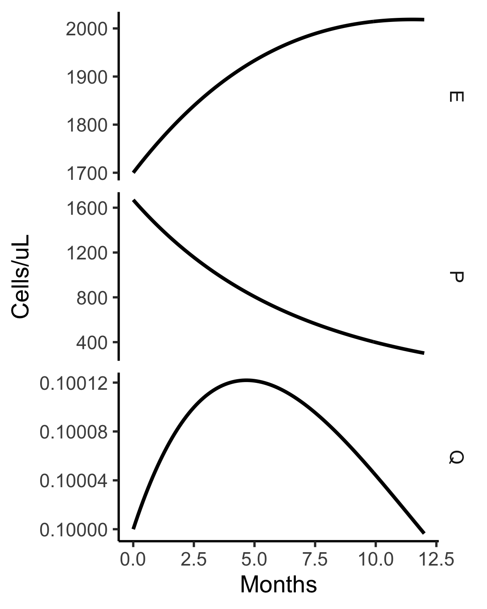

## Optimization of combination therapy for chronic myeloid leukemia with dosing constraints
#### Helen Moore, Lewis Strauss, Urszula Ledzewicz, Journal of Mathematical Biology (2018) 77:1533–1561


Using deSolve, the following code reproduces the top plots (Year 1) in Figure 2. 




```
library(myelo)  
library(bvpSolve)
library(tidyverse)

moore18<-function(Time, State, Pars) {
  with(as.list(c(State, Pars)),{
    dQ = rq*Q - dq*Q*(1+(1+U2m1*u2/(U2C50+u2))*(1+U3m1*u3/(U3C50+u3))*Em1*E/(EC50+E)) 
    dP = (1-U1m1*u1/(U1C50+u1))*(1-U2m2*u2/(U2C50+u2))*(kp*Q + rp*P*log(Pss/P)) -
         dp*P*(1+U1m2*u1/(U1C50+u1))*(1+U2m3*u2/(U2C50+u2))  -
         dp*P*(1+U2m1*u2/(U2C50+u2))*(1+U3m1*u3/(U3C50+u3))*Em2*E/(EC50+E) 
    dE = se*E*log(Ess/E)*(1+(1+U2m4*u2/(U2C50+u2))*(1+U3m2*u3/(U3C50+u3))*Pm1*P/(PC50+P)) -
         de*E*(1+(1-U2m5*u2/(U2C50+u2))*(1-U3m3*u3/(U3C50+u3))*Pm2*P/(PC50+P)) 
    list( c(dQ,dP,dE) )
  }) 
} 

(p=c(Pss=3330,Ess=3500,    PC50=1110,EC50=2500,
     rq=0.011,dq=0.00225,  kp=1.6,rp=0.03,dp=0.002,   se=0.01,de=0.02,
     Pm1=0.8,Pm2=0.5,   Em1=2,   Em2=2,
     u1m=800,U1C50=300,U1m1=0.8,U1m2=10,
     u2m=140,U2C50= 40,U2m1=2,  U2m2=0.6, U2m3=10, U2m4=10, U2m5=0.4,
     u3m=240,U3C50= 80,U3m1=1,  U3m2=1,   U3m3=0.7
     ))
(y0=c(Q=0.1,P=1670,E=1700)) # units are cells/uL, mg and 1/months

t= seq(0,12,.1)   
# Start with top of Figure 2 with all 3 controls constant
pf2top=c(p,u1=800, # imatinib
         u2=140, # dasatinib
         u3=240) # nivolumab (opdivo = anti-PD1)
D=ode(y=y0,times=t,func=moore18,parms=pf2top)
plot(D)
tc=function(sz) theme_classic(base_size=sz)
gy=ylab("Cells/uL")
gx=xlab("Months")
sbb=theme(strip.background=element_blank())
data.frame(D)%>%select(time:E)%>%gather(key="Var",value="Value",-time)%>%
  mutate(Var=factor(Var))%>%
  ggplot(aes(x=time,y=Value))+facet_grid(Var~.,scales="free_y")+geom_line(size=1)+gx+gy+tc(14)+sbb 
ggsave("CML/immuno/outs/moore18Fig2top.png",height=5,width=4)
```


The following code reproduces the top 6 rows of Table 2. 


```
a1=y0[["Q"]]*75e4  
a2=y0[["P"]]*1e-1
(pJ=c(p,b1=(0.5/60)*a1,b2=(0.05/60)*a2,g1=250/p[["u1m"]],g2=100/p[["u2m"]],g3=20/p[["u3m"]]))


moore18J<-function(Time, State, Pars) {
  with(as.list(c(State, Pars)),{
    dQ = rq*Q - dq*Q*(1+(1+U2m1*u2/(U2C50+u2))*(1+U3m1*u3/(U3C50+u3))*Em1*E/(EC50+E)) 
    dP = (1-U1m1*u1/(U1C50+u1))*(1-U2m2*u2/(U2C50+u2))*(kp*Q + rp*P*log(Pss/P)) -
      dp*P*(1+U1m2*u1/(U1C50+u1))*(1+U2m3*u2/(U2C50+u2))  -
      dp*P*(1+U2m1*u2/(U2C50+u2))*(1+U3m1*u3/(U3C50+u3))*Em2*E/(EC50+E) 
    dE = se*E*log(Ess/E)*(1+(1+U2m4*u2/(U2C50+u2))*(1+U3m2*u3/(U3C50+u3))*Pm1*P/(PC50+P)) -
      de*E*(1+(1-U2m5*u2/(U2C50+u2))*(1-U3m3*u3/(U3C50+u3))*Pm2*P/(PC50+P)) 
    dJ=b1*Q + b2*P + g1*u1 + g2*u2 + g3*u3
    list( c(dQ,dP,dE,dJ) )
  }) 
} 

(y40=c(y0,J=0))  # start J at 0
t= seq(0,60,1) # 5 years   
p1=c(pJ,u1=400,u2=0,  u3=  0) # row 1 in Table 2, etc 
p2=c(pJ,u1=0  ,u2=140,u3=  0) 
p3=c(pJ,u1=0  ,u2=0,  u3=240) 
p4=c(pJ,u1=0  ,u2=70, u3= 80) 
p5=c(pJ,u1=200,u2=70, u3=  0) 
p6=c(pJ,u1=200,u2=70, u3= 80) 
(P=list(row1=p1,row2=p2,row3=p3,row4=p4,row5=p5,row6=p6))
bind_rows(P)%>%select(-(Pss:U3m3))
L=lapply(P, function(x) ode(y=y40,times=t,func=moore18J,parms=x))
(n=dim(L[[1]])[1])
L=lapply(L,function(x) c(J=a1*x[[n,"Q"]]+a2*x[[n,"P"]]+x[[n,"J"]],
                       Q=x[[n,"Q"]],Qrat=x[[n,"Q"]]/y0[["Q"]],
                       P=x[[n,"P"]],Prat=x[[n,"P"]]/y0[["P"]],
                       E=x[[n,"E"]],Erat=x[[n,"E"]]/y0[["E"]]
                       ))
bind_rows(L)

#         J     Q  Qrat      P   Prat     E  Erat
# 1 281789. 0.155  1.55 1468.  0.879   925. 0.544
# 2 212995. 0.124  1.24 1093.  0.654  2083. 1.23 
# 3 474670. 0.143  1.43 2632.  1.58   1231. 0.724
# 4 233981. 0.110  1.10 1237.  0.741  2345. 1.38 
# 5  40762. 0.133  1.33   95.0 0.0569 1389. 0.817
# 6  37953. 0.114  1.14   86.6 0.0518 1594. 0.938
```

The first 4 P are 10-fold higher here than in the paper and likely correct, 
as the first 4 J are also ~10-fold larger
