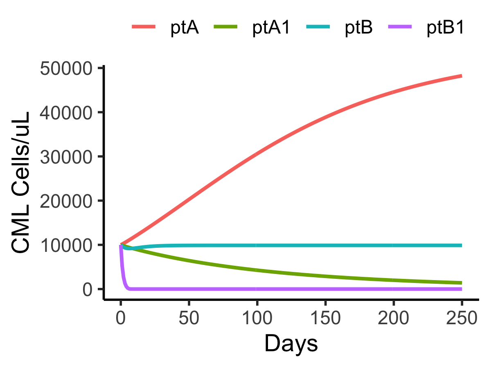
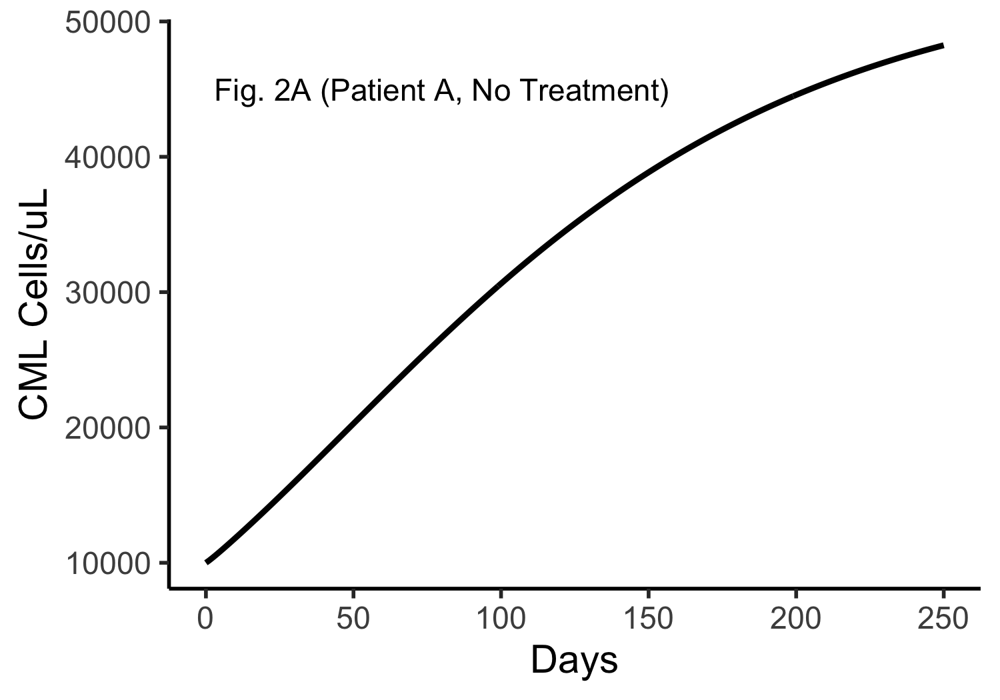
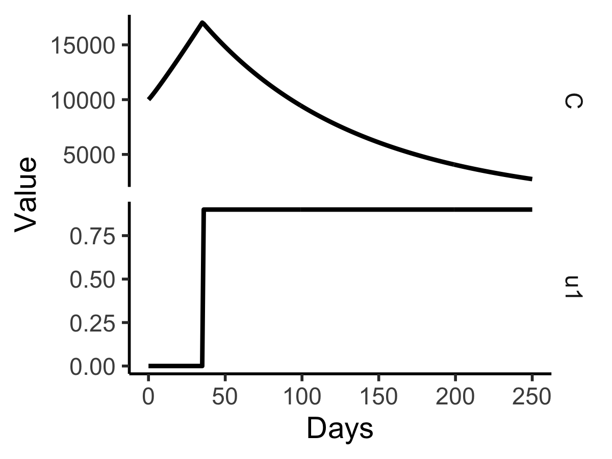
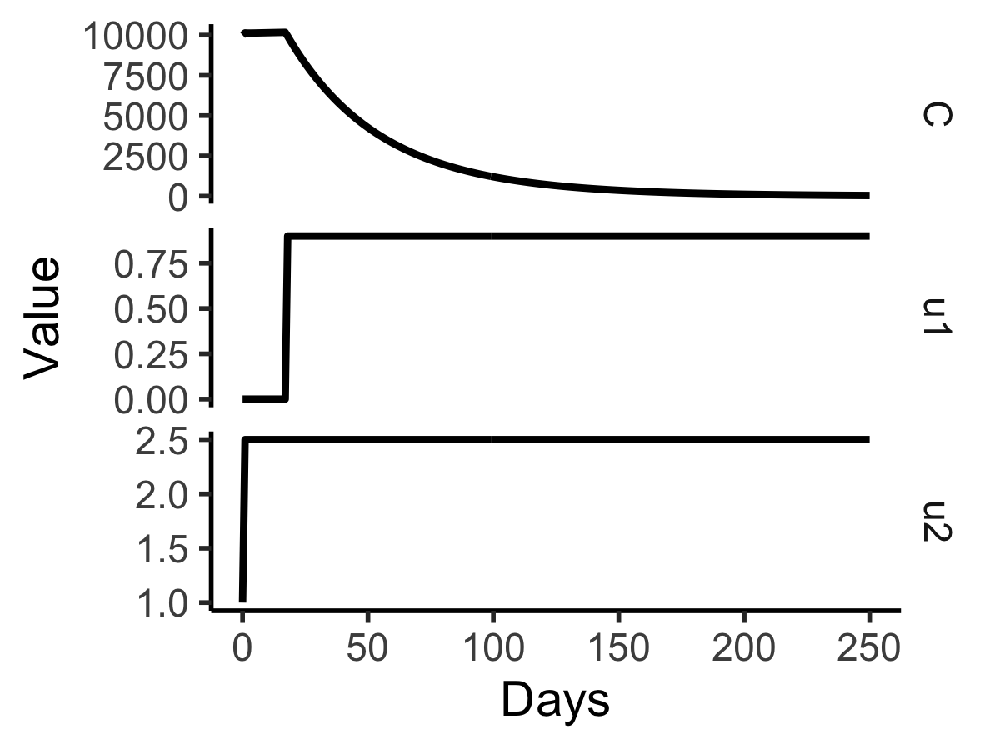
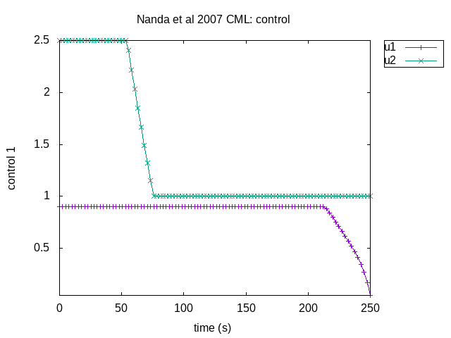
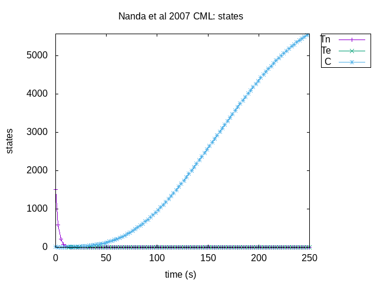

## Optimal control of treatment in a mathematical model of chronic myelogenous leukemia 
#### Seema Nanda, Helen Moore, Suzanne Lenhart, Mathematical Biosciences 210 (2007) 143–156

This model captures CML cells (C) interacting with naive T cells (Tn) and effector T cells (Te). 
The differential equations of this model are:


Using deSolve, the following code reproduces untreated Patients A and B in Figure 2. It also approximates TKI action by reducing the *r<sub>c</sub>* parameters of these patients by a factor of 10. 




```
library(myelo)  
library(deSolve)
library(tidyverse)
(pA=c(sn=0.29, dn=0.35,de=0.40,dc=0.012,kn=.066,eta=140,alfn=0.39,alfe=0.65,
      Cmax=16e4,rc=.011, ge=.079, gc=.058,B1=1000,B2=500,B3=0.1,B4=1e5,M2=2.5)) 
(pA1=c(sn=0.29, dn=0.35,de=0.40,dc=0.012,kn=.066,eta=140,alfn=0.39,alfe=0.65,
      Cmax=16e4,rc=.0011, ge=.079, gc=.058,B1=1000,B2=500,B3=0.1,B4=1e5,M2=2.5)) 
(pB=c(sn=0.071,dn=0.05,de=0.12,dc=0.68, kn=.063,eta=43, alfn=0.56,alfe=0.53,
      Cmax=19e4,rc=.23, ge=.0077,gc=.047, B1= 100,B2= 50,B3= 1, B4=1e5,M2=1/.68)) 
(pB1=c(sn=0.071,dn=0.05,de=0.12,dc=0.68, kn=.063,eta=43, alfn=0.56,alfe=0.53,
      Cmax=19e4,rc=.023, ge=.0077,gc=.047, B1= 100,B2= 50,B3= 1, B4=1e5,M2=1/.68)) 
(P=list(ptA=pA,ptA1=pA1,ptB=pB,ptB1=pB1))
M1=0.9
m1=0
m2=1
(ic=c(Tn=1510,Te=10,C=1e4)) # units are cells/uL 
t= seq(0,250,1)   #  and days
(L=lapply(P, function(params) ode(y=ic,times=t,func=moore04,parms=params)))
D=do.call(rbind, lapply(names(L), function(x) data.frame(L[[x]],x,stringsAsFactors=F)))
ltb=theme(legend.margin=margin(0,0,0,0),legend.title=element_blank())
ltp=theme(legend.position="top",legend.direction="horizontal")
tc=function(sz) theme_classic(base_size=sz);
gy=ylab("CML Cells/uL")
gx=xlab("Days")
D%>%ggplot(aes(x=time,y=C,color=x))+geom_line(size=1)+gx+gy+tc(14)+ltb+ltp
ggsave("CML/immuno/outs/nandaApproxFig2.png",height=3,width=4)
```


The following code attempts to use bvpSolve to reproduce Patient A optimal control results in Figure 2.

First we reproduce the untreated result above using bvpSolve and extended equations




```
library(myelo)  
library(bvpSolve)
library(tidyverse)
# Optimal control of treatment in a mathematical model of chronic myelogenous leukemia
# Seema Nanda, Helen Moore, Suzanne Lenhart, Mathematical Biosciences 210 (2007) 143–156

# Focus on  patient A. First no treatment, then add u1, then u2.
nanda<-function(Time, State, Pars) {
  with(as.list(c(State, Pars)),{
    u1=0
    u2=1
    dTn = sn - u2*dn*Tn - kn*Tn*C/(C+eta) 
    dTe = alfn*kn*Tn*C/(C+eta) + alfe*Te*C/(C+eta) - u2*de*Te - ge*C*Te
    dC  = (1-u1)*rc*C*log(Cmax/C) - u2*dc*C - gc*C*Te 
    dL1 = L1*(u2*dn + kn*C/(C+eta)) - L2*(alfn*kn*C/(C+eta))
    dL2 = L3*gc*C + L2*(u2*de*Te + ge*C*Te  - alfe*C/(C+eta))
    dL3 = -1 + 
          L1*kn*Tn*eta/(C+eta)^2 +
          L2*(ge*Te - alfn*kn*Tn*eta/(C+eta)^2 - alfe*Te*eta/(C+eta)^2)  +
          L3*(u2*dc + gc*Te - (1-u1)*rc*(log(Cmax/C)-1) ) 
    list( c(dTn,dTe,dC,dL1,dL2,dL3), c(T=Tn+Te) )
  }) 
} 

(pA=c(sn=0.29, dn=0.35,de=0.40,dc=0.012,kn=.066,eta=140,alfn=0.39,alfe=0.65,
      Cmax=16e4,rc=.011, ge=.079,gc=.058)) 
B3=0.1
B4=1e5
(y0=c(Tn=1510,Te=10,C=1e4,L1= NA,L2= NA,L3= NA)) # units are cells/uL 
(yf=c(Tn=NA,Te= NA,C= NA,L1= -B4,L2= 0,L3= B3)) 
t= seq(0,250,1)   #  and days
sol1  <- bvpshoot(yini=y0,yend=yf,x=t,func=nanda,parms=pA)
# plot (sol1, which = c("C"), lty = 1)
# pairs(sol1)
tc=function(sz) theme_classic(base_size=sz)
gy=ylab("CML Cells/uL")
gx=xlab("Days")
data.frame(sol1)%>%ggplot(aes(x=x,y=C))+geom_line(size=1)+gx+gy+tc(14)+
  annotate("text", x =80, y =45000, label = "Fig. 2A (Patient A, No Treatment)")
ggsave("CML/immuno/outs/nandaFig2aC.png",height=3.5,width=5)

```

Next we add in the control effort u1 alone



```
(pA1=c(pA,B1=1000,m1=0,M1=0.9))  #add in u1 effort


nanda1<-function(Time, State, Pars) {
  with(as.list(c(State, Pars)),{
    u1 = L3*rc*C*log(Cmax/C)/B1
    u1 = min(M1,max(m1,u1))
    u2=1
    dTn = sn - u2*dn*Tn - kn*Tn*C/(C+eta) 
    dTe = alfn*kn*Tn*C/(C+eta) + alfe*Te*C/(C+eta) - u2*de*Te - ge*C*Te
    dC  = (1-u1)*rc*C*log(Cmax/C) - u2*dc*C - gc*C*Te 
    
    dL1 = L1*(u2*dn + kn*C/(C+eta)) - L2*(alfn*kn*C/(C+eta))
    dL2 = L3*gc*C + L2*(u2*de*Te + ge*C*Te  - alfe*C/(C+eta))
    dL3 = -1 + 
      L1*kn*Tn*eta/(C+eta)^2 +
      L2*(ge*Te - alfn*kn*Tn*eta/(C+eta)^2 - alfe*Te*eta/(C+eta)^2)  +
      L3*(u2*dc + gc*Te - (1-u1)*rc*(log(Cmax/C)-1) ) 
    
    list( c(dTn,dTe,dC,dL1,dL2,dL3), c(T=Tn+Te,u1=u1) )
  }) 
} 

sol2  <- bvpshoot(yini=y0,yend=yf,x=t,func=nanda1,parms=pA1)
data.frame(sol2)%>%select(x,C,u1)%>%gather(key="Var",value="Value",-x)%>%
  mutate(Var=factor(Var))%>%
  ggplot(aes(x=x,y=Value))+facet_grid(Var~.,scales="free_y")+geom_line(size=1)+gx+tc(14)+sbb 
ggsave("CML/immuno/outs/nandaFig2aCU1.png",height=3,width=4)

```

Finally, we also add in u2



```

(pA12=c(pA1,B2=500,m2=1,M2=2.5)) 

nanda12<-function(Time, State, Pars) {
  with(as.list(c(State, Pars)),{
    u1 = L3*rc*C*log(Cmax/C)/B1
    u2 = (L1*dn*Tn + L2*de*Te + L3*dc*C)/B2
    u1 = min(M1,max(m1,u1))
    u2 = min(M2,max(m2,u2))
    dTn = sn - u2*dn*Tn - kn*Tn*C/(C+eta) 
    dTe = alfn*kn*Tn*C/(C+eta) + alfe*Te*C/(C+eta) - u2*de*Te - ge*C*Te
    dC  = (1-u1)*rc*C*log(Cmax/C) - u2*dc*C - gc*C*Te 
    
    dL1 = L1*(u2*dn + kn*C/(C+eta)) - L2*(alfn*kn*C/(C+eta))
    dL2 = L3*gc*C + L2*(u2*de*Te + ge*C*Te  - alfe*C/(C+eta))
    dL3 = -1 + 
      L1*kn*Tn*eta/(C+eta)^2 +
      L2*(ge*Te - alfn*kn*Tn*eta/(C+eta)^2 - alfe*Te*eta/(C+eta)^2)  +
      L3*(u2*dc + gc*Te - (1-u1)*rc*(log(Cmax/C)-1) ) 
    
    list( c(dTn,dTe,dC,dL1,dL2,dL3), c(T=Tn+Te,u1=u1,u2=u2) )
  }) 
} 

sol3  <- bvpshoot(yini=y0,yend=yf,x=t,func=nanda12,parms=pA12)
plot (sol3, which = c("C","u1","u2"), lty = 1)
sbb=theme(strip.background=element_blank())
D=data.frame(sol3)%>%select(x,C,u1,u2)%>%gather(key="Var",value="Value",-x)%>%
  mutate(Var=factor(Var))
D%>%ggplot(aes(x=x,y=Value))+facet_grid(Var~.,scales="free_y")+geom_line(size=1)+gx+tc(14)+sbb 
ggsave("CML/immuno/outs/nandaFig2aCU12.png",height=3,width=4)

```

The control efforts do not match the paper exactly, but their impacts on C are fairly similar. 
Note: replacing bvpshoot() with bvptwp() and bvpcol() threw errors. 

The C++ program PSOPT (see user.cxx in this folder) produced these plots.  




Here u1 and u2 match the paper better in that they start high and fall, but drop timings
are sooner here, which may explain CML cells rising at large times. 



