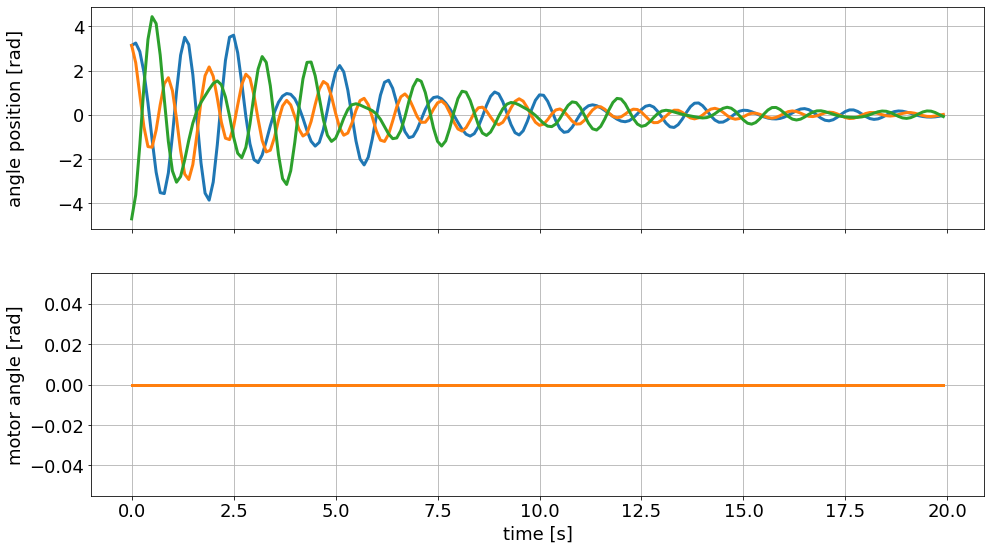
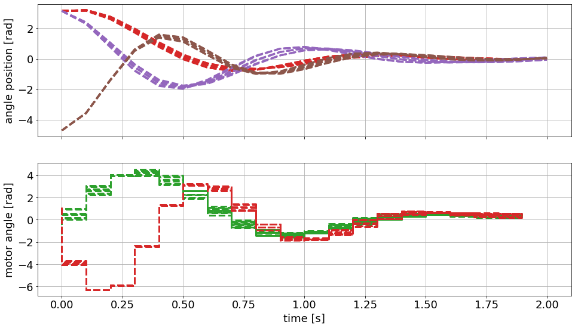
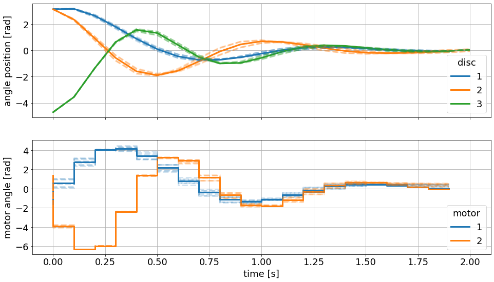

# Two Motors Controlling Three Rotating Masses
## Model Definition


```python
import numpy as np
import do_mpc   #install via pip (like CRAN, gets binaries) using Python 3.6 
model_type = 'continuous' # either 'discrete' or 'continuous' 
model = do_mpc.model.Model(model_type)
phi_1 = model.set_variable(var_type='_x', var_name='phi_1', shape=(1,1)) 
phi_2 = model.set_variable(var_type='_x', var_name='phi_2', shape=(1,1)) 
phi_3 = model.set_variable(var_type='_x', var_name='phi_3', shape=(1,1)) 
# Variables can also be vectors:
dphi = model.set_variable(var_type='_x', var_name='dphi', shape=(3,1)) 
# Two states for the desired (set) motor position:
phi_m_1_set = model.set_variable(var_type='_u', var_name='phi_m_1_set') 
phi_m_2_set = model.set_variable(var_type='_u', var_name='phi_m_2_set') 
# Two additional states for the true motor position:
phi_1_m = model.set_variable(var_type='_x', var_name='phi_1_m', shape=(1,1)) 
phi_2_m = model.set_variable(var_type='_x', var_name='phi_2_m', shape=(1,1))

print('phi_1={}, with phi_1.shape={}'.format(phi_1, phi_1.shape)) 
# phi_1=phi_1, with phi_1.shape=(1, 1)
print('dphi={}, with dphi.shape={}'.format(dphi, dphi.shape))
# dphi=[dphi_0, dphi_1, dphi_2], with dphi.shape=(3, 1)

model.x  #states of the model
model.x['phi_1'] # gets back what was set above
bool(model.x['phi_1'] == phi_1) # proven here
model.x['dphi',0]
model.x.keys()
model.x.labels()

Theta_1 = model.set_variable('parameter', 'Theta_1') 
Theta_2 = model.set_variable('parameter', 'Theta_2') 
Theta_3 = model.set_variable('parameter', 'Theta_3')
c = np.array([2.697, 2.66, 3.05, 2.86])*1e-3 
d = np.array([6.78, 8.01, 8.82])*1e-5

model.set_rhs('phi_1', dphi[0]) 
model.set_rhs('phi_2', dphi[1]) 
model.set_rhs('phi_3', dphi[2])

from casadi import *
dphi_next = vertcat( -c[0]/Theta_1*(phi_1-phi_1_m)-c[1]/Theta_1*(phi_1-phi_2)-d[0]/Theta_1*dphi[0], 
-c[1]/Theta_2*(phi_2-phi_1)-c[2]/Theta_2*(phi_2-phi_3)-d[1]/Theta_2*dphi[1], 
-c[2]/Theta_3*(phi_3-phi_2)-c[3]/Theta_3*(phi_3-phi_2_m)-d[2]/Theta_3*dphi[2],
)
model.set_rhs('dphi', dphi_next)

tau = 1e-2
model.set_rhs('phi_1_m', 1/tau*(phi_m_1_set - phi_1_m)) 
model.set_rhs('phi_2_m', 1/tau*(phi_m_2_set - phi_2_m))

model.setup()
```

    phi_1=phi_1, with phi_1.shape=(1, 1)
    dphi=[dphi_0, dphi_1, dphi_2], with dphi.shape=(3, 1)


## Controller Definition


```python
mpc = do_mpc.controller.MPC(model)

setup_mpc = { 
  'n_horizon': 20,
  't_step': 0.1,
  'n_robust': 1, 
  'store_full_solution': True,
} 

mpc.set_param(**setup_mpc)

mterm = phi_1**2 + phi_2**2 + phi_3**2 
lterm = phi_1**2 + phi_2**2 + phi_3**2
mpc.set_objective(mterm=mterm, lterm=lterm)

mpc.set_rterm( phi_m_1_set=1e-2, phi_m_2_set=1e-2)

# Lower bounds on states:
mpc.bounds['lower','_x', 'phi_1'] = -2*np.pi 
mpc.bounds['lower','_x', 'phi_2'] = -2*np.pi 
mpc.bounds['lower','_x', 'phi_3'] = -2*np.pi
# Upper bounds on states 
mpc.bounds['upper','_x', 'phi_1'] = 2*np.pi 
mpc.bounds['upper','_x', 'phi_2'] = 2*np.pi 
mpc.bounds['upper','_x', 'phi_3'] = 2*np.pi
# Lower bounds on inputs:
mpc.bounds['lower','_u', 'phi_m_1_set'] = -2*np.pi 
mpc.bounds['lower','_u', 'phi_m_2_set'] = -2*np.pi 
# Lower bounds on inputs:
mpc.bounds['upper','_u', 'phi_m_1_set'] = 2*np.pi 
mpc.bounds['upper','_u', 'phi_m_2_set'] = 2*np.pi

mpc.scaling['_x', 'phi_1'] = 2 
mpc.scaling['_x', 'phi_2'] = 2 
mpc.scaling['_x', 'phi_3'] = 2

inertia_mass_1 = 2.25*1e-4*np.array([1., 0.9, 1.1]) 
inertia_mass_2 = 2.25*1e-4*np.array([1., 0.9, 1.1]) 
inertia_mass_3 = 2.25*1e-4*np.array([1.])
mpc.set_uncertainty_values( 
  Theta_1 = inertia_mass_1, 
  Theta_2 = inertia_mass_2, 
  Theta_3 = inertia_mass_3
)

mpc.setup()
```

## Simulator Definition


```python
simulator = do_mpc.simulator.Simulator(model)
simulator.set_param(t_step = 0.1)
p_template = simulator.get_p_template()
type(p_template)
p_template.keys()

def p_fun(t_now): 
  p_template['Theta_1'] = 2.25e-4 
  p_template['Theta_2'] = 2.25e-4 
  p_template['Theta_3'] = 2.25e-4 
  return p_template

simulator.set_p_fun(p_fun)
simulator.setup()
```

##  Estimator Definition  (none since states are measureable)

## Execution
### 1. Uncontrolled Perturbation (simulate  non-steady state initial condition)


```python
x0 = np.pi*np.array([1, 1, -1.5, 1, -1, 1, 0, 0]).reshape(-1,1)
simulator.x0 = x0 
mpc.x0 = x0
mpc.x0
mpc.x0['phi_1']

mpc.set_initial_guess()

import matplotlib.pyplot as plt 
import matplotlib as mpl
# Customizing Matplotlib: 
mpl.rcParams['font.size'] = 18 
mpl.rcParams['lines.linewidth'] = 3 
mpl.rcParams['axes.grid'] = True

mpc_graphics = do_mpc.graphics.Graphics(mpc.data) 
sim_graphics = do_mpc.graphics.Graphics(simulator.data)

# %%capture
# We just want to create the plot and not show it right now. This "inline magic" ˓→supresses the output.
fig, ax = plt.subplots(2, sharex=True, figsize=(16,9)) 
fig.align_ylabels()

for g in [sim_graphics, mpc_graphics]:
  # Plot the angle positions (phi_1, phi_2, phi_2) on the first axis: 
  g.add_line(var_type='_x', var_name='phi_1', axis=ax[0]) 
  g.add_line(var_type='_x', var_name='phi_2', axis=ax[0]) 
  g.add_line(var_type='_x', var_name='phi_3', axis=ax[0])
  # Plot the set motor positions (phi_m_1_set, phi_m_2_set) on the second axis:
  g.add_line(var_type='_u', var_name='phi_m_1_set', axis=ax[1]) 
  g.add_line(var_type='_u', var_name='phi_m_2_set', axis=ax[1])


ax[0].set_ylabel('angle position [rad]') 
ax[1].set_ylabel('motor angle [rad]') 
ax[1].set_xlabel('time [s]')

u0 = np.zeros((2,1))  # no controller input
for i in range(200):
  simulator.make_step(u0)


sim_graphics.plot_results()
# Reset the limits on all axes in graphic to show the data. 
sim_graphics.reset_axes()
# Show the figure:
fig
```


    

    


    

    


### 2. Controlled Perturbation


```python
u0 = mpc.make_step(x0) # runs controller all the way out, like pontryagin open loop

sim_graphics.clear()

mpc_graphics.plot_predictions() 
mpc_graphics.reset_axes()
# Show the figure:
fig
```

    This is Ipopt version 3.12.3, running with linear solver mumps.
    NOTE: Other linear solvers might be more efficient (see Ipopt documentation).
    
    Number of nonzeros in equality constraint Jacobian...:    19448
    Number of nonzeros in inequality constraint Jacobian.:        0
    Number of nonzeros in Lagrangian Hessian.............:     1229
    
    Total number of variables............................:     6408
                         variables with only lower bounds:        0
                    variables with lower and upper bounds:     2439
                         variables with only upper bounds:        0
    Total number of equality constraints.................:     5768
    Total number of inequality constraints...............:        0
            inequality constraints with only lower bounds:        0
       inequality constraints with lower and upper bounds:        0
            inequality constraints with only upper bounds:        0
    
    iter    objective    inf_pr   inf_du lg(mu)  ||d||  lg(rg) alpha_du alpha_pr  ls
       0  8.8086219e+02 1.65e+01 1.07e-01  -1.0 0.00e+00    -  0.00e+00 0.00e+00   0
       1  2.8794996e+02 2.32e+00 1.68e+00  -1.0 1.38e+01  -4.0 2.82e-01 8.60e-01f  1
       2  2.0017562e+02 1.42e-14 3.95e+00  -1.0 3.56e+00  -4.5 1.96e-01 1.00e+00f  1
       3  1.6039802e+02 2.71e-14 3.82e-01  -1.0 3.43e+00  -5.0 5.14e-01 1.00e+00f  1
       4  1.3046012e+02 2.33e-14 7.36e-02  -1.0 2.94e+00  -5.4 7.75e-01 1.00e+00f  1
       5  1.1452477e+02 1.95e-14 1.94e-02  -1.7 2.62e+00  -5.9 8.44e-01 1.00e+00f  1
       6  1.1247422e+02 1.62e-14 7.23e-03  -2.5 9.17e-01  -6.4 8.27e-01 1.00e+00f  1
       7  1.1235000e+02 1.60e-14 4.31e-08  -2.5 3.14e-01  -6.9 1.00e+00 1.00e+00f  1
       8  1.1230585e+02 1.78e-14 8.91e-09  -3.8 1.95e-01  -7.3 1.00e+00 1.00e+00f  1
       9  1.1229857e+02 2.06e-14 8.02e-10  -5.7 5.26e-02  -7.8 1.00e+00 1.00e+00f  1
    iter    objective    inf_pr   inf_du lg(mu)  ||d||  lg(rg) alpha_du alpha_pr  ls
      10  1.1229833e+02 2.11e-14 2.91e-11  -5.7 5.73e-03  -8.3 1.00e+00 1.00e+00f  1
      11  1.1229831e+02 1.60e-14 3.25e-13  -8.6 1.92e-04  -8.8 1.00e+00 1.00e+00f  1
    
    Number of Iterations....: 11
    
                                       (scaled)                 (unscaled)
    Objective...............:   1.1229831239969914e+02    1.1229831239969914e+02
    Dual infeasibility......:   3.2479574585408955e-13    3.2479574585408955e-13
    Constraint violation....:   1.5987211554602254e-14    1.5987211554602254e-14
    Complementarity.........:   4.2481089749997798e-09    4.2481089749997798e-09
    Overall NLP error.......:   4.2481089749997798e-09    4.2481089749997798e-09
    
    
    Number of objective function evaluations             = 12
    Number of objective gradient evaluations             = 12
    Number of equality constraint evaluations            = 12
    Number of inequality constraint evaluations          = 0
    Number of equality constraint Jacobian evaluations   = 12
    Number of inequality constraint Jacobian evaluations = 0
    Number of Lagrangian Hessian evaluations             = 11
    Total CPU secs in IPOPT (w/o function evaluations)   =      0.431
    Total CPU secs in NLP function evaluations           =      0.009
    
    EXIT: Optimal Solution Found.
               S  :   t_proc      (avg)   t_wall      (avg)    n_eval
           nlp_f  | 258.00us ( 21.50us) 258.58us ( 21.55us)        12
           nlp_g  |   2.52ms (210.08us)   2.51ms (209.19us)        12
        nlp_grad  | 554.00us (554.00us) 553.33us (553.33us)         1
      nlp_grad_f  | 794.00us ( 61.08us) 794.34us ( 61.10us)        13
      nlp_hess_l  | 238.00us ( 21.64us) 235.04us ( 21.37us)        11
       nlp_jac_g  |   4.88ms (375.08us)   4.91ms (377.80us)        13
           total  | 459.68ms (459.68ms) 456.56ms (456.56ms)         1


    

    


```python
mpc_graphics.pred_lines
mpc_graphics.pred_lines['_x', 'phi_1']

for line_i in mpc_graphics.pred_lines['_x', 'phi_1']: line_i.set_color('#1f77b4') #
for line_i in mpc_graphics.pred_lines['_x', 'phi_2']: line_i.set_color('#ff7f0e') #
for line_i in mpc_graphics.pred_lines['_x', 'phi_3']: line_i.set_color('#2ca02c') #
# Change the color for the two inputs:
for line_i in mpc_graphics.pred_lines['_u', 'phi_m_1_set']: line_i.set_color('#1f77b4')
for line_i in mpc_graphics.pred_lines['_u', 'phi_m_2_set']: line_i.set_color('#ff7f0e')
# Make all predictions transparent:
for line_i in mpc_graphics.pred_lines.full: line_i.set_alpha(0.2)

 # Get line objects (note sum of lists creates a concatenated list)
lines = sim_graphics.result_lines['_x', 'phi_1']+sim_graphics.result_lines['_x', 'phi_2']+sim_graphics.result_lines['_x', 'phi_3']
ax[0].legend(lines,'123',title='disc')
# also set legend for second subplot:
lines = sim_graphics.result_lines['_u', 'phi_m_1_set']+sim_graphics.result_lines['_u', 'phi_m_2_set']
ax[1].legend(lines,'12',title='motor')

simulator.reset_history() 
simulator.x0 = x0 
mpc.reset_history()
```


```python
%%capture  
#capture above is cell magic that grabs up lengthy output
for i in range(20):
  u0 = mpc.make_step(x0)     # reruns optimal control optimization at each time step, i.e. does MPC
  x0 = simulator.make_step(u0)
```

The closed loop MPC result below is very similar to the open loop Pontryagin-like result above. 


```python
mpc_graphics.plot_predictions(t_ind=0) # Plot results until current time 
sim_graphics.plot_results() 
sim_graphics.reset_axes()
fig
```


    

    


```python

```
