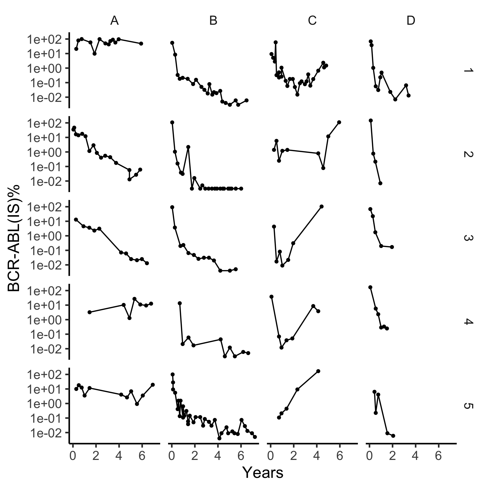
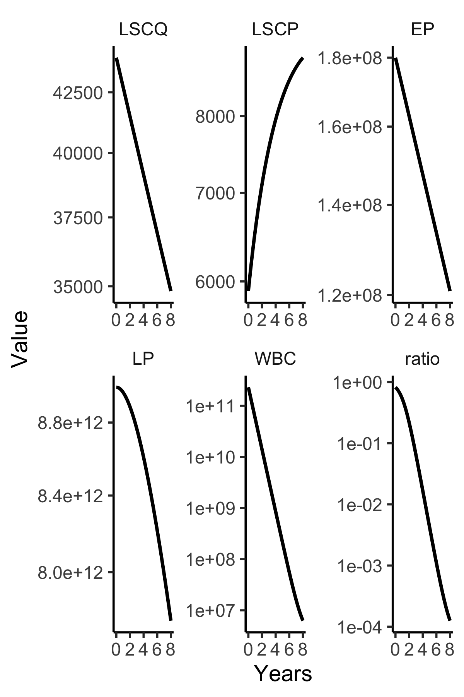

#  BCR-ABL Transcript Dynamics Support the Hypothesis that LSC are Reduced during Imatinib Treatment 
## Stein, Bottino...Clin Canc Res 2011 

The following code plots data in Supplemental Figure 1A-D
```
library(myelo)
library(tidyverse)
head(d<-stein)
tc=function(sz) theme_classic(base_size=sz)
gy=ylab("BCR-ABL(IS)%")
sbb=theme(strip.background=element_blank())
d%>%ggplot(aes(x=Years,y=Prct))+facet_grid(Pt~Grp)+geom_line()+geom_point(size=1)+
  gy+tc(14)+sbb+scale_y_log10()+theme(legend.position="top")
ggsave("../docs/stein.png",width=6,height=6)
```



The model presented in this paper is 
```
steinR<-function(Time, State, Pars) {
	with(as.list(c(State, Pars)), {
				dLSCQ = -k12*LSCQ + k21*LSCP 
				dLSCP = k12*LSCQ + (r2md2-k21)*LSCP 
				dEP = a23*LSCP-d3*EP
				dLP = a34*EP-d4*LP
				dWBC = a45*LP-d5*WBC
				return(list(c(dLSCQ,dLSCP, dEP, dLP,dWBC),
				    c(ratio=(WBC)/(WBC+2*2.5e10))))
			})
}

```

The following simulates this model out to 1 year
```
library(tidyverse)
library(deSolve)
pars=c(
 # r2md2=0.005,  #no treatment
 r2md2= -.1,     #treatment
 d3=0.05,d4=0.14, d5=1.4,
 k12=0.03, k21= 0.004,
 # a23=1.5e3,  #no treatment
 a23=3.1,  # treatment
 a34=7e3, a45=0.035)
(y0<-c(LSCQ=4.4e4,LSCP=5.9e3,EP=1.8e8,LP=9e12,WBC=2.3e11))
out=ode(y=y0,times=seq(0,2*365,10),steinR, parms=pars)
D=as.data.frame(out)
d=D%>%gather(key="Cell",value="Value",-time)
d$Cell=as_factor(d$Cell)
tc=function(sz) theme_classic(base_size=sz)
gx=xlab("Years")
sbb=theme(strip.background=element_blank())
d%>%ggplot(aes(x=time/365,y=Value))+
  facet_wrap(Cell~.,scales = "free")+
  geom_line(size=1)+tc(14)+sbb+gx+scale_y_log10()
ggsave("../docs/steinSim.png",width=6,height=4)
```


This shows a slightly biphasic drop, 
but total drops are too large at 2 years.

