# myelo
This R package houses models of myeloid hematopoiesis. To install it use:  
```
devtools::install_github("radivot/myelo",subdir="myelo")
```
The help pages can then be reached via:

help(pack="myelo")

# A Mathematical Model of Granulopoiesis Incorporating the Negative Feedback Dynamics and Kinetics of G-CSF/Neutrophil Binding and Internalization

The model of   [Craig et al  *Bull Math Biol* **78** 2304-2357 (2016)](https://www.ncbi.nlm.nih.gov/pubmed/27324993) includes as state variables  numbers of quiescent stem cells (Q),  marrow neutrophil reserves  (Nr), neutrophils in the blood (N), free GCSF (G1), and GCSF bound to Nr and N (G2). Stem cells self replicate at a net rate of &#0946;<sub>S</sub> which decreases with Q, or they differentiate toward Nr or other cell types (not modeled). Lineaage committed cells have net amplifications A<sub>N</sub>; here net means multiplied by the probability of having zero lethal hits by the end of maturation (the number of lethal hits is the product of the time spent maturing and the apoptosis rate).  The model is depicted below. Dashed lines are feedback signals and solid lines are cell fluxes.  

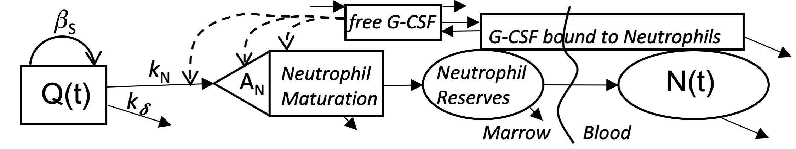

The units of Q and N are 1e6/kg and 1e9/kg.  The steady states (ss)  are 

```
library(tidyverse)
library(deSolve)
library(myelo)
craigPars16[c("Qss","Nrss","Nss","G1ss","G2ss")]
       Qss       Nrss        Nss       G1ss       G2ss 
1.1000e+00 2.2600e+00 3.7610e-01 2.5000e-02 2.1899e-05 
```

The following code reproduces the G1 response to subcutaneously injected GCSF given in Figure 5B of the paper.


```
craigPars16
(x0=c(Q=craigPars16[["Qss"]],Nr=craigPars16[["Nrss"]],N=craigPars16[["Nss"]],
      G1=craigPars16[["G1ss"]],G2=craigPars16[["G2ss"]],
      Tn=craigPars16[["tauNP"]]+craigPars16[["aNM"]],  #here time Tn is to reserves
      An=craigPars16[["ANss"]],Aq=craigPars16[["AQss"]],Cp=0,Cf=0,Cs1=0,Cs2=0,Gs=0,Ic=0,Ig=0))
(eventdat=data.frame(var="Gs",
                     time=0,
                     value=craigPars16[["F750"]]*750e3/craigPars16[["Vd750"]],
                     method="add"))
times <- seq(-15,2,by=.01)
yout <- dede(x0,times = times, func = craig16,	parms = craigPars16,
             events=list(data=eventdat),method="lsodar")

plotQtoG2=function(yout,cc) {
  D=data.frame(yout)
  d=D%>%select(time:G2)%>%gather(key="Lab",value="Value",-time)%>%
    mutate(Lab=factor(Lab,levels=c("Q","Nr","N","G1","G2")))
  tc=function(sz) theme_classic(base_size=sz)
  gx=xlab("Days")
  sbb=theme(strip.background=element_blank())
  g=d%>%ggplot(aes(x=time,y=Value))+facet_grid(Lab~.,scales = "free")+geom_line(size=1)+gx+tc(14)+sbb+cc
  print(g)
}
cc=coord_cartesian(xlim=c(-.1,2))#clips high errorbars
plotQtoG2(yout,cc)
ggsave("~/Results/myelo/craig16fig5b.png",height=6,width=6.5)
```


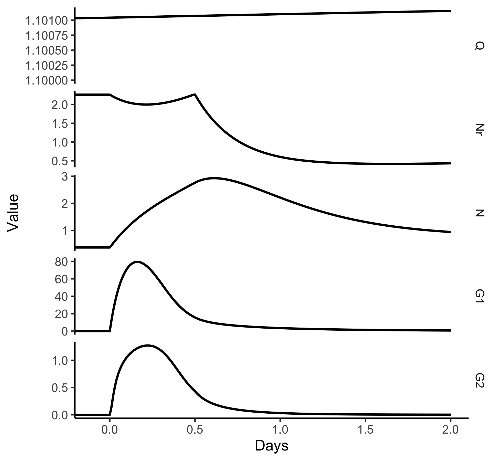
The cusp in neutrophil reserves  at ~0.5 days is curious. 


# Origins of oscillation patterns in cyclical thrombocytopenia (Zhuge et al JTB 2019)

The model of   [Zhuge et al  *J Theor Biol* **462** 432-445 (2019)](https://www.ncbi.nlm.nih.gov/pubmed/30496748) 
includes three state variables: numbers of stem cells (S),  neutrophils (N) and platelets (P). Stem cells self replicate at a net rate of &#0946;<sub>S</sub> which decreases with S, or they differentiate toward N, P or red blood cells (not modeled). Lineaage committed cells have net amplifications A<sub>N</sub> and A<sub>P</sub>; here net means multiplied by the probability of having zero lethal hits by the end of maturation (the number of lethal hits is the product of the time spent maturing and the apoptosis rate, which increases with final products to regulate N and P).  The model is depicted below, wherein dashed lines are feedback signals to apoptosis rates and solid lines are cell fluxes.  

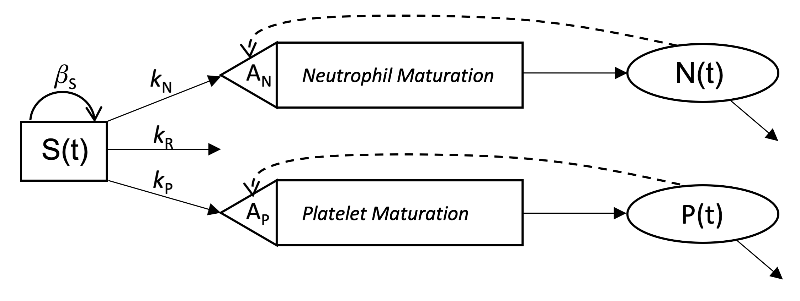

The units of S, N and P are 1e6/kg, 1e8/kg, and 1e10/kg.  Steady states in Table 1 (of the paper) are 

```
library(tidyverse)
library(deSolve)
library(myelo)
zhugePars19[c("Sss","Nss","Pss")]
#    Sss    Nss    Pss 
# 1.1000 6.9000 3.1071 
```

Converting S to cells per adult and N and P to cells per uL yields 
```
zhugePars19[c("Sss")]*70 #77e6 per 70 kg adult
zhugePars19[c("Nss")]*70/5# 96.6e8/L (10k/uL is high, but maybe some are not circulating)
zhugePars19[c("Pss")]*70/5# 43.4994e10/L (435k/uL is upper normal)
```

Note that 500 neutrophils/uL (dangerously low) maps to 5e8/L x 5L/70kg = 0.36e8/kg in this model 
and 2M platelets/uL (dangerously high) maps to 200e10/L x 5L/70kg = 14.3e10/kg. First we see how well the default parameters maintain the steady state as an initial condition. 

```
times <- seq(-200,1000,by=0.1)
yout <- dede(c(S=zhugePars19[["Sss"]],N=zhugePars19[["Nss"]],P=zhugePars19[["Pss"]]),
             times = times, func = zhuge19,	parms = zhugePars19)
D=data.frame(yout)
d=D%>%gather(key="Cell",value="Counts",-time)%>%mutate(Cell=factor(Cell,levels=c("S","N","P")))
tc=function(sz) theme_classic(base_size=sz)
gx=xlab("Days")
sbb=theme(strip.background=element_blank())
d%>%ggplot(aes(x=time,y=Counts))+facet_grid(Cell~.,scales = "free")+geom_line(size=1)+gx+tc(14)+sbb
ggsave("~/Results/myelo/default.png",height=6,width=6.5)

```

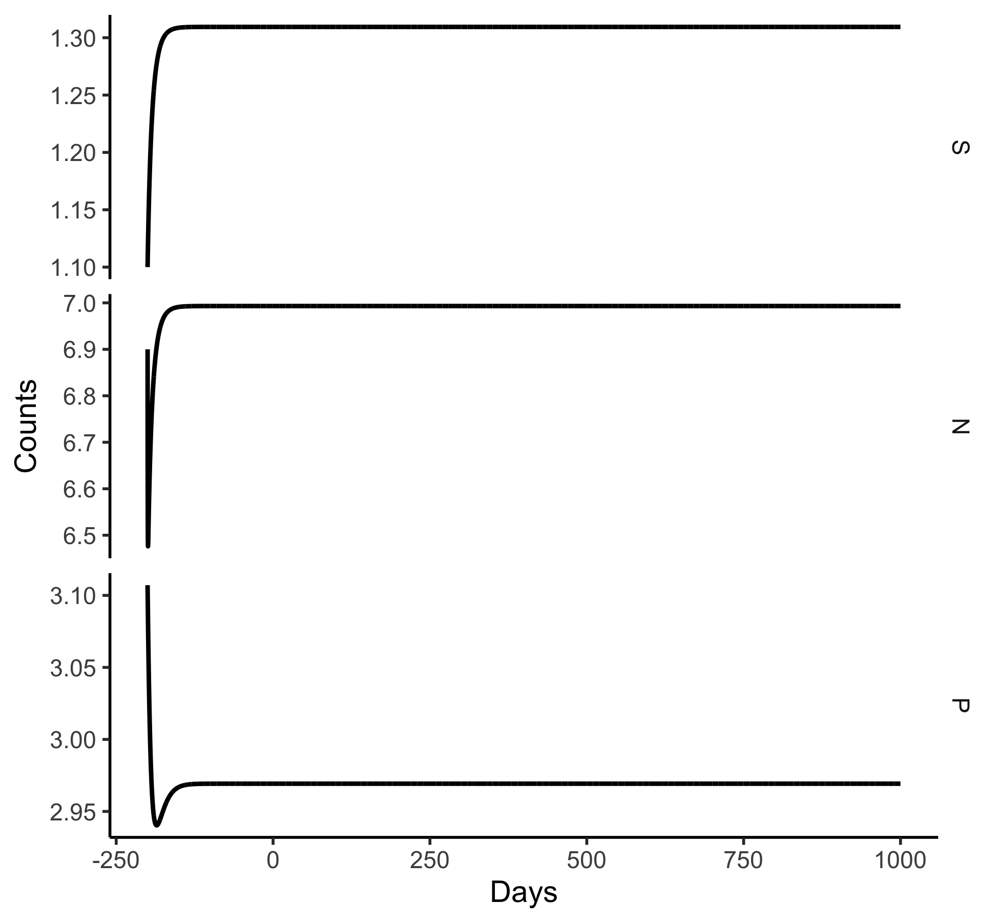
The default parameters thus yield a steady state that differs 
from the initial condition: 1.1 vs 1.3 for S, 6.9 vs 7.0 for N, and 3.1 vs 2.97 for P.


Parameter values in Table 2 are now used to yield patterns 1a, 1b and 2 
in Figures 2C, 2D and 2E, respectively.  Figure 2C is produced as follows 


```
zhugePars19["Kpbar"]=0.0744 # pattern 1a
zhugePars19["tauPM"]=13      # pattern 1a
times <- seq(-(zhugePars19["tauPM"]+zhugePars19["tauPS"]),1000,by=0.1)
yout <- dede(c(S=zhugePars19[["Sss"]],N=zhugePars19[["Nss"]],P=zhugePars19[["Pss"]]),
             times = times, func = zhuge19,	parms = zhugePars19)
D=data.frame(yout)
d=D%>%gather(key="Cell",value="Counts",-time)%>%mutate(Cell=factor(Cell,levels=c("S","N","P")))
d%>%ggplot(aes(x=time,y=Counts))+facet_grid(Cell~.,scales = "free")+geom_line(size=1)+gx+tc(14)+sbb 
ggsave("~/Results/myelo/patt1a.png",height=6,width=6.5)
```

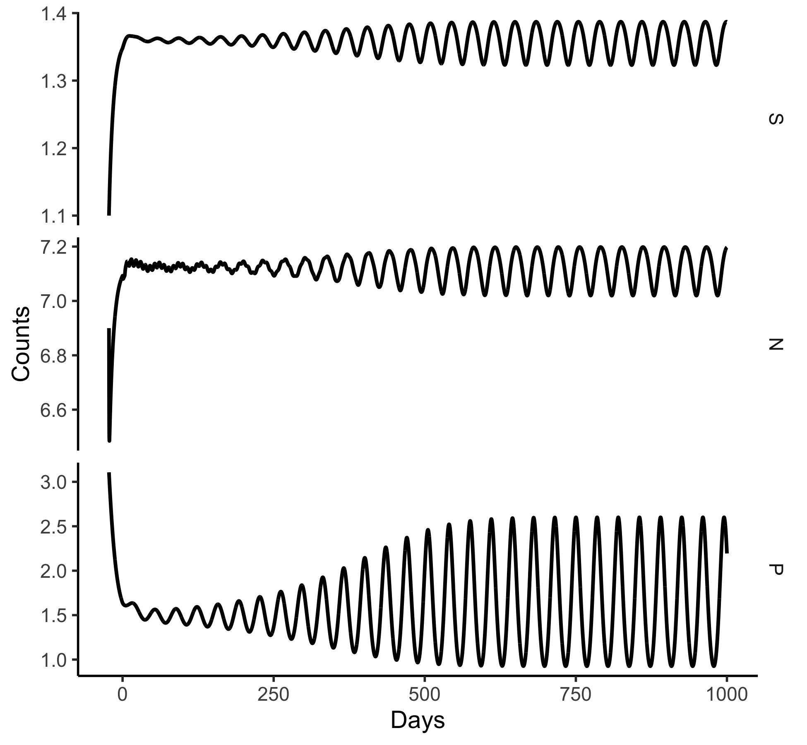
This shows the system reaching a 
limit cycle (oscillations that maintain a finite amplitude). Oscillations are stronger in P  than in N and S. The next two figures zoom in
on days 1700 to 2000 to yield exact matches to Figures 2D and 2E.


Figure 2D is
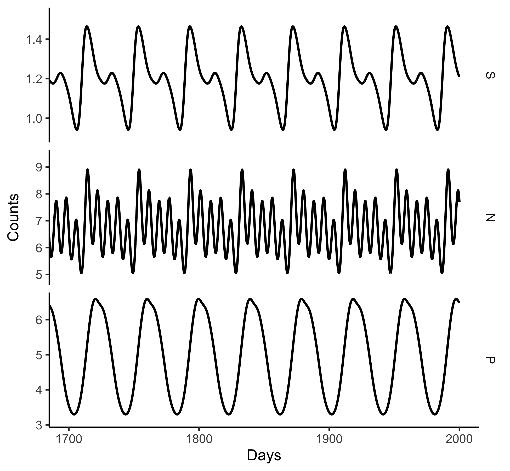
This figure was made by this script.  


```
zhugePars19["Kpbar"]=2      # pattern 1b
zhugePars19["tauPM"]=14      # pattern 1b
times <- seq(-(zhugePars19["tauPM"]+zhugePars19["tauPS"]),2000,by=0.1)
yout <- dede(c(S=zhugePars19[["Sss"]],N=zhugePars19[["Nss"]],P=zhugePars19[["Pss"]]),
             times = times, func = zhuge19,	parms = zhugePars19)
D=data.frame(yout)
d=D%>%gather(key="Cell",value="Counts",-time)%>%mutate(Cell=factor(Cell,levels=c("S","N","P")))
cc=coord_cartesian(xlim=c(1700,2000))
d%>%ggplot(aes(x=time,y=Counts))+facet_grid(Cell~.,scales = "free")+geom_line(size=1)+gx+tc(14)+sbb+cc
ggsave("~/Results/myelo/patt1b.png",height=6,width=6.5)
```


Figure 2E is
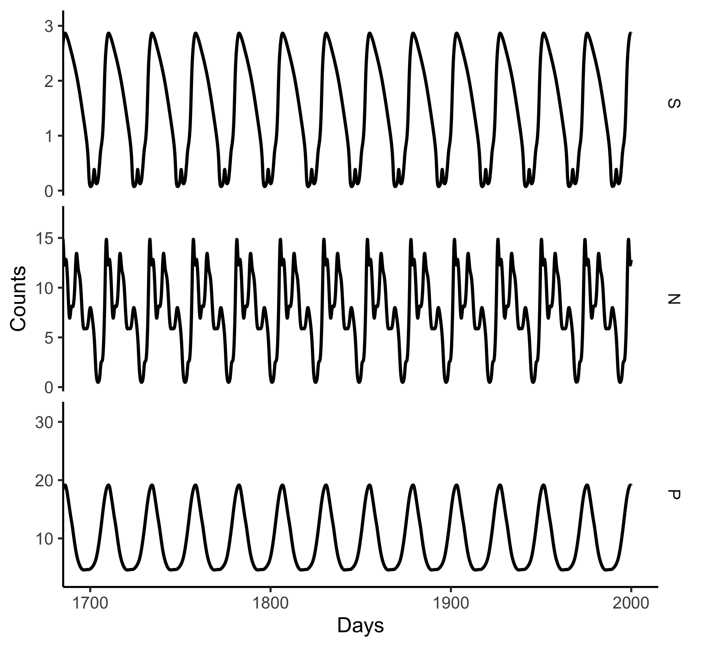
This figure was made by this script.  

```
zhugePars19["Kpbar"]=9.5442 # pattern 2
zhugePars19["tauPM"]=11.583  # pattern 2
yout <- dede(c(S=zhugePars19[["Sss"]],N=zhugePars19[["Nss"]],P=zhugePars19[["Pss"]]),
             times = times, func = zhuge19,	parms = zhugePars19)
D=data.frame(yout)
d=D%>%gather(key="Cell",value="Counts",-time)%>%mutate(Cell=factor(Cell,levels=c("S","N","P")))
d%>%ggplot(aes(x=time,y=Counts))+facet_grid(Cell~.,scales = "free")+geom_line(size=1)+gx+tc(14)+cc+sbb 
ggsave("~/Results/myelo/patt2.png",height=6,width=6.5)
```


# A mathematical model for chronic myelogenous leukemia (CML) and T cell interaction (Moore and Li 2004)

This model captures CML cells (C) interacting with naive T cells (Tn) and effector T cells (Te). 
The differential equations of this model are:


The following code reproduces Figures 6-8 in [Moore and Li 2004](https://www.ncbi.nlm.nih.gov/pubmed/15038986) 


```
library(tidyverse)
library(deSolve)
library(myelo)  

#Table 1
(p1=c(sn=0.073,dn=0.04,de=0.06,dc=0.2,  kn=.001,eta=100,alfn=0.41,alfe=0.2, Cmax=3e5, rc=.03, ge=.005, gc=.005)) 
#Table 3
(p6=c(sn=0.37, dn=0.23,de=0.30,dc=0.024,kn=.062,eta=720,alfn=0.14,alfe=0.98,Cmax=23e4,rc=.0057,ge=.057,gc=.0034)) 
(p7=c(sn=0.29, dn=0.35,de=0.40,dc=0.012,kn=.066,eta=140,alfn=0.39,alfe=0.65,Cmax=16e4,rc=.011, ge=.079, gc=.058)) 
(p8=c(sn=0.071,dn=0.05,de=0.12,dc=0.68, kn=.063,eta=43, alfn=0.56,alfe=0.53,Cmax=19e4,rc=.23,  ge=.0077,gc=.047)) 
(P=list(Table1=p1,Fig.6=p6,Fig.7=p7,Fig.8=p8))
(ic=c(Tn=1510,Te=20,C=1e4)) # units are cells/uL 
t= seq(0,750,1)             #  and days
######## see http://eriqande.github.io/2015/01/22/solving-differential-equations-in-R.html
L=lapply(P, function(x) { 
  params=x
  ode(y=ic,times=t,func=moore04,parms=params)
})
L
D=do.call(rbind, lapply(names(L), function(x) data.frame(L[[x]],x,stringsAsFactors=F)))
###########
ltb=theme(legend.margin=margin(0,0,0,0),legend.title=element_blank())
ltp=theme(legend.position="top",legend.direction="horizontal")
tc=function(sz) theme_classic(base_size=sz);
gy=ylab("CML Cells/uL")
gx=xlab("Days")
D%>%ggplot(aes(x=time,y=C,color=x))+geom_line(size=1)+gx+gy+tc(14)+ltb+ltp
ggsave("~/Results/CML/fig6to8.png",height=3,width=3.5)

```


The code below further zooms in on 0 to 100 of the plot in Figure 8

```
cc=coord_cartesian(xlim=c(0,100))
library(scales)
D%>%filter(x=="Fig.8")%>%
  ggplot(aes(x=time,y=C))+geom_line(size=1,color=hue_pal()(4)[3])+gx+gy+tc(14)+ltb+ltp+cc+
  annotate("text", x =50, y =10000, label = "Fig. 8")
ggsave("~/Results/CML/fig8.png",height=3,width=3)

```


We can now examine time courses of naive T cells

```
gy=ylab("Naive T Cells/uL")
D%>%ggplot(aes(x=time,y=Tn,color=x))+geom_line(size=1)+gx+gy+tc(14)+ltb+ltp+cc
ggsave("~/Results/CML/naive.png",height=3,width=3.5)

```


and effector T cells
```
gy=ylab("Effector T Cells/uL")
D%>%ggplot(aes(x=time,y=Te,color=x))+geom_line(size=1)+gx+gy+tc(14)+ltb+ltp+cc
ggsave("~/Results/CML/effector.png",height=3,width=3)

```


It seems the initial effecter T cell population is far higher than it should be. The following code zooms in on the first 3 time points
```
D%>%group_by(x)%>%nest()%>%mutate(top=map(data,function(x) x[1:3,]))%>%unnest(top)
#  A tibble: 12 x 6
#    x       time    Tn      Te      C     T
#    <chr>  <dbl> <dbl>   <dbl>  <dbl> <dbl>
#  1 Table1     0 1510  20      10000  1530 
#  2 Table1     1 1449.  0.0130  9062. 1449.
#  3 Table1     2 1391.  0.0137  8252. 1391.
#  4 Fig.6      0 1510  20      10000  1530 
#  5 Fig.6      1 1133.  0.0162  9937. 1133.
#  6 Fig.6      2  850.  0.0122  9877.  850.
#  7 Fig.7      0 1510  20      10000  1530 
#  8 Fig.7      1  997.  0.0316 10148.  997.
#  9 Fig.7      2  659.  0.0205 10319.  659.
# 10 Fig.8      0 1510  20      10000  1530 
# 11 Fig.8      1 1349.  0.645   9606. 1350.
# 12 Fig.8      2 1205.  0.588   9415. 1206.

```

A help page is available for the function called by ode() of the R package deSolve, i.e. moore04(). Its definition is
```
moore04<-function(Time, State, Pars) {
  with(as.list(c(State, Pars)),{
    dTn = sn - dn*Tn - kn*Tn*C/(C+eta) 
    dTe = alfn*kn*Tn*C/(C+eta) + alfe*Te*C/(C+eta) - de*Te - ge*C*Te
    dC  = rc*C*log(Cmax/C) - dc*C - gc*C*Te 
    list( c(dTn,dTe,dC), c(T=Tn+Te) )
  }) 
}
```
## A computational model to understand mouse iron physiology and disease [(Parmar and Mendes 2019, Plos Comp Biol)](https://www.ncbi.nlm.nih.gov/pubmed/30608934) 

This code first runs the model from -30 to 0 days to show the wildtype steady state. 
It then emulates hemachromatosis formation by setting
the hepcidin synthesis rate constant (ksHepci) to 0 at time 0 before running out to 365 days to yield values in Table 1.
The  set of plots below this code are from the plot method provided by deSolve: in the last line
the first argument to plot() is a matrix of class deSolve, so the plot method plot.deSolve() gets invoked. 

```
# use COPASI to save parmar sbml as XPPAUT *.ODE and do rest by hand + find/replace
library(myelo)   # load definition of function parmar19
library(deSolve)
library(rodeoExt) #provides rbind for deSolve class matrices

ic=c(NTBI=5.2e-11,Tf=1.50934e-08,FeDuo=3.85469e-07,FeBM=4.45824e-07,FeRest=7.91257e-06,FeLiver=1.51048e-06,
     Fe1Tf=1.05653e-08,FeSplee=1.52679e-07,EPO=3.15471e-15,Hepcidi=2.9912e-11,FeRBC=1.817e-05,Fe2Tf=2.46513e-08) 
(parameters=parmarPars19)

out=ode(y = ic, times = seq(-30,0,1), func = parmar19, parms = parameters) 
(N=length(ic))
n=dim(out)[1]
X0=out[n,2:(N+1)]
names(X0)<-names(ic)
parameters["ksHepci"]=0
out2   <- ode(y=X0, times=seq(1, 365, by = 1), func = parmar19, parms = parameters)
out=rbind(out,out2)
head(out)
graphics.off()
quartz(width=8,height=7)
vars=c("NTBI_c","Tf_c","FeDuo_c","FeBM_c","FeRBC_c","FeLiver_c","FeSplee_c","FeRest_c","Hepcidi_c")
plot(out,which=vars,xlab="Days",ylab="Concentration (M)") #screen capture to png
```
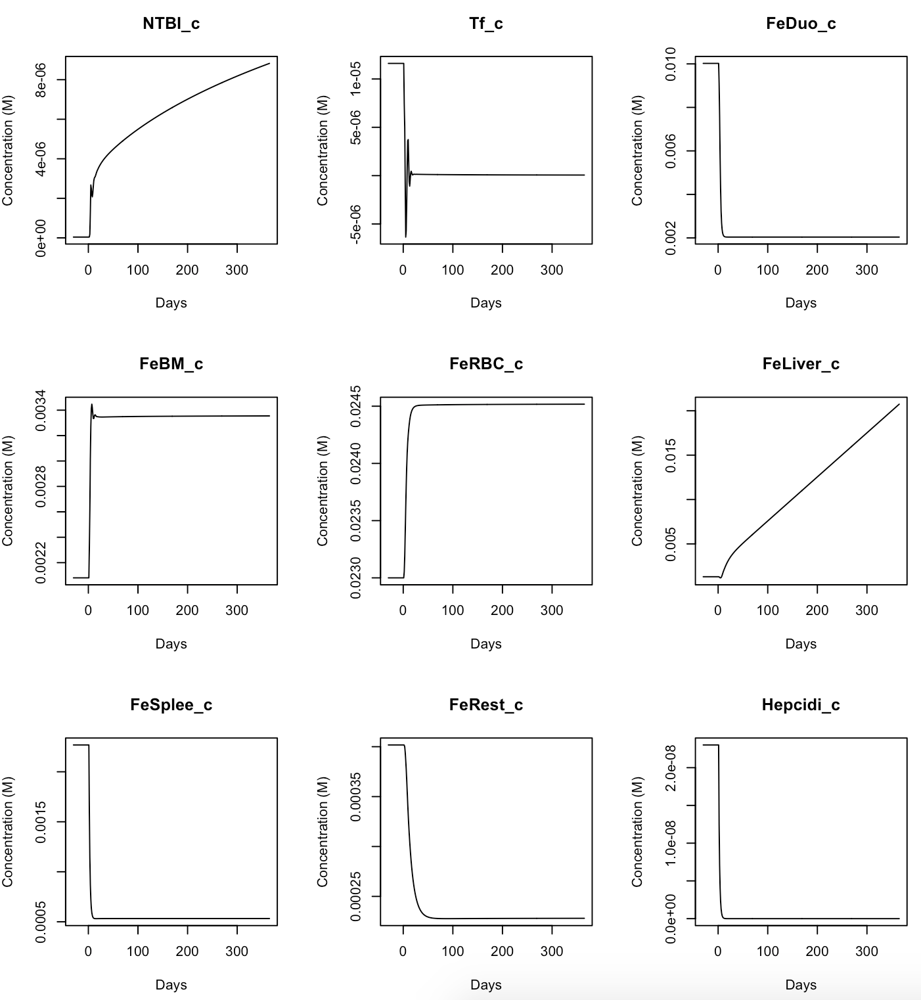

A newer way to plot things is to use ggplot2. For this we first need to convert the data into a long format using gather().
Using ggplot2 then yields nicer y-axes and also has the convenience of writing the file to a png automatically.

```
library(tidyverse)
ltb=theme(legend.margin=margin(0,0,0,0),legend.title=element_blank())
ltp=theme(legend.position="top",legend.direction="horizontal")
tc=function(sz) theme_classic(base_size=sz)
sbb=theme(strip.background=element_blank())
gy=ylab("Concentration in M")
gx=xlab("Days")
D=data.frame(out)
head(D)
D=D%>%select(time,NTBI_c:Hepcidi_c)
d=D%>%gather(key=variable,value=Concentration,-time)
d%>%ggplot(aes(x=time,y=Concentration))+facet_wrap(~variable,scales="free",nrow=3)+geom_line(size=1)+gx+gy+tc(14)+ltb+ltp+sbb
ggsave("~/Results/myelo/parmar19.png",height=6,width=6.5)
```

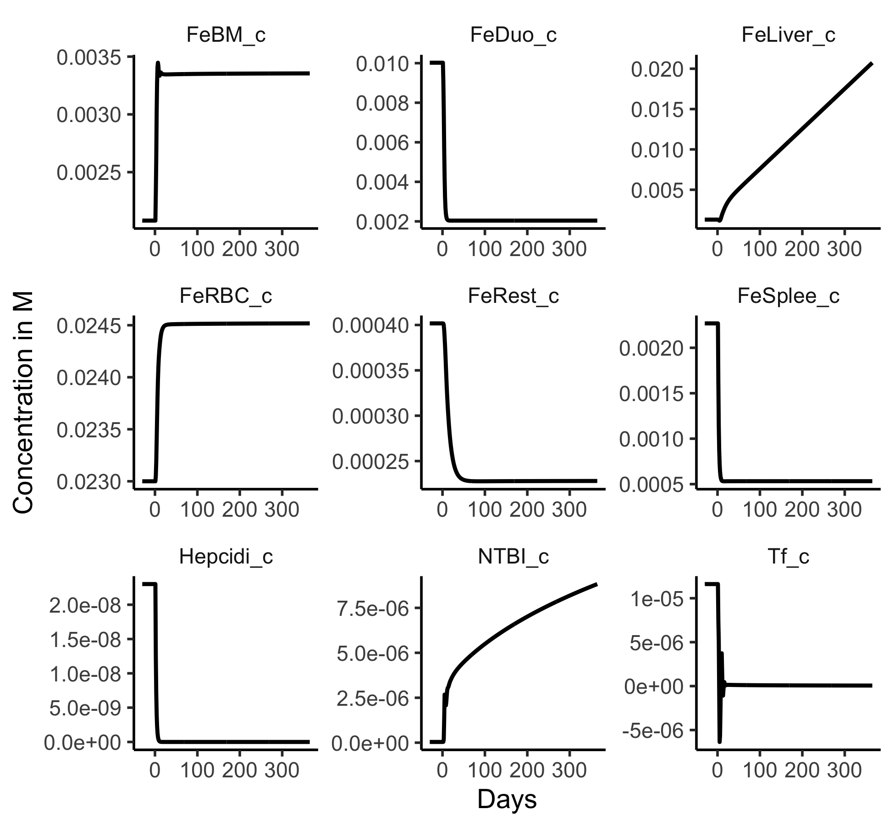

The transferrin concentration (Tf_c) is seen to dip to negative values.  COPASI does not do this.

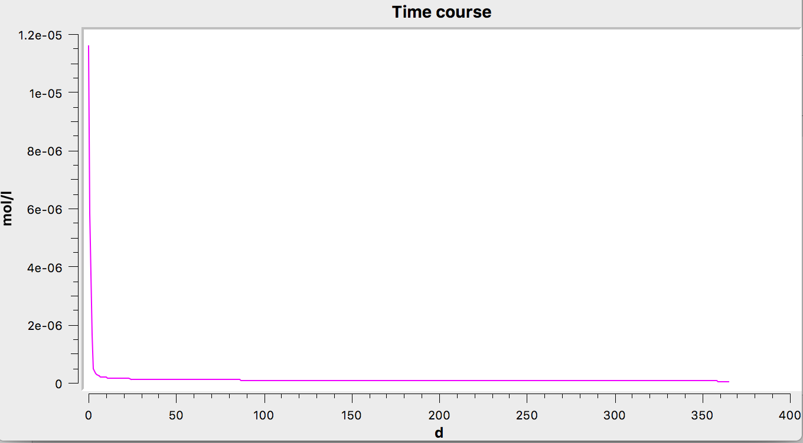

The reason for this difference is unclear. 


Fortunately, there is now a COPASI R Connector R package called CoRC, see https://github.com/jpahle/CoRC. CoRC allows us to run  the iron model through COPASI directly via model files created by COPASI, which was used to develop the model. The code (below) is straightforward. Plots are made using ggplot2 as above. Note that the runTC() (run Time Course)  argument save_result_in_memory must be overriden to TRUE.  

```
library(CoRC)
path="~/ccf/jarek/grants/msb/iron/parmar19sup/cps/"
(m0=loadModel(paste0(path,"IronMousePV3.cps")))
r0=runTC( model=m0,duration=30,save_result_in_memory = TRUE)
D0=r0$result%>%select(Time:FeRBC)%>%select(-Fe1Tf,-EPO)
D0$Time=D0$Time-30
(m1=loadModel(paste0(path,"IronMousePV3_Hemochromatosis.cps")))
r1=runTC(model=m1,save_result_in_memory = TRUE) 
D1=r1$result%>%select(Time:FeRBC)%>%select(-Fe1Tf,-EPO)
D=bind_rows(D0,D1)
d=D%>%gather(key=variable,value=Concentration,-Time)
d%>%ggplot(aes(x=Time,y=Concentration))+facet_wrap(~variable,scales="free",nrow=3)+geom_line(size=1)+gx+gy+tc(14)+ltb+ltp+sbb
ggsave("~/Results/myelo/parmar19CoRC.png",height=6,width=6.5)
```

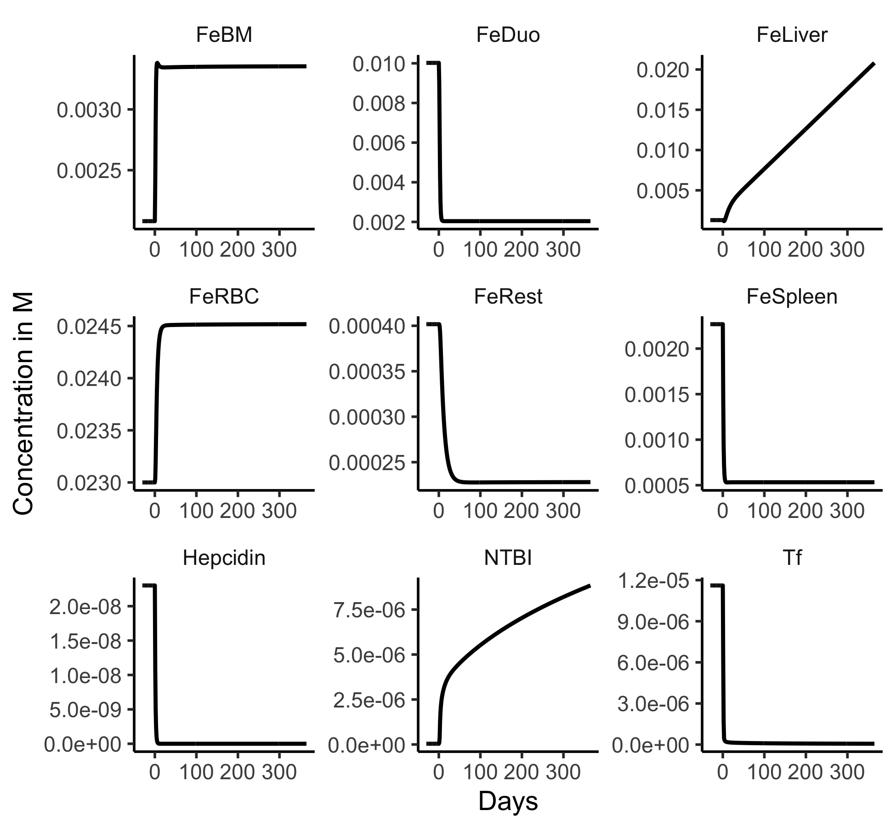
The high frequency glitches at early times of the perturbation of zapping the hepicidin synthesis rate instantly to zero have now disappeared. 


# Neutrophil dynamics in response to chemotherapy and G-CSF (Zhuge, Lei and Mackey, 2012)
This model captures ringing in neutrophil counts arising due to pure delays in their production. We focus 
first on a simplified version of the model in which the number of quiescent (Q) 
hematopoietic stem cells (HSC) is held constant.

First check that values in zhugePars match Table 1. 
```
library(tidyverse)
library(deSolve)
library(myelo)  
zhugePars #matches Table 1 parameters
#        Qss       gamS    gamMinS    gamMaxS       tauS         k0       the2         s2        Nss 
# 1.1000e+06 7.0000e-02 3.0000e-02 2.0000e-01 2.8000e+00 8.0000e+00 3.0000e+05 4.0000e+00 6.3000e+08 
#       gamN      tauNP      tauNM  tauNMgcsf       tauN      etaNP   etaMinNP   etaMaxNP       gam0 
# 2.4000e+00 5.0000e+00 6.0000e+00 2.0000e+00 1.1000e+01 2.5420e+00 2.0420e+00 3.0552e+00 2.7000e-01 
#    gamMin0         f0       the1         s1       kdel          T         T1 
# 1.2000e-01 4.0000e-01 3.6000e+07 1.0000e+00 1.0000e-02 2.1000e+01 4.0000e+00 

``` 

Next we examine ringing in Neut counts after we boost them from a steady of 6.4e8/kg to 2e9/kg. 

```
zhuge12N<-function(Time, State, Pars) {  
	with(as.list(c(State, Pars)), {
				An=exp(etaNP*tauNP-gam0*tauNM)
				if (Time < 0) 
					dN=-gamN*N + An*f0/(1+(Nss/the1)^s1)*Qss
				else
					dN=-gamN*N + An*f0/(1+(lagvalue(Time - tauN)/the1)^s1)*Qss
				list(c(dN))
			})
}
times= -zhugePars[["tauN"]]:5000
yout <- dede(c(N=zhugePars[["Nss"]]), times = times, func = zhuge12N,	parms = zhugePars)

zhugePars["Nss"]=tail(yout,1)[,"N"] # overide 6.3e8 to more accurare 6.398e8

(eventdat <- data.frame(var = c("N"),
                       time = c(25) ,
                       value = c(2e9),
                       method = c("rep")))

times= seq(-zhugePars[["tauN"]],100,by=0.01)
yout=dede(c(N=zhugePars[["Nss"]]),times=times,func=zhuge12N,
          parms=zhugePars,events=list(data=eventdat),method="lsodar")
D=data.frame(yout)
tc=function(sz) theme_classic(base_size=sz)
gy=ylab("Neutrophil Counts")
gx=xlab("Days")
D%>%ggplot(aes(x=time,y=N))+geom_line(size=1)+gx+gy+tc(14) 
ggsave("~/Results/myelo/zhugeNjumpTo2e9.png",height=6,width=6.5)
```

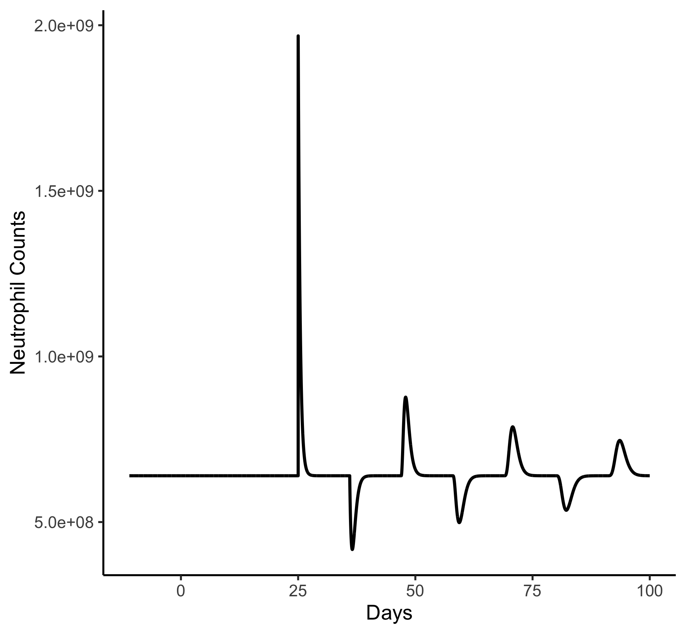
We see that the bolus that raised N to 2e9/kg on day 25 led to ordering 
too few to arrive 11 days later (trough), which led to ordering too many to arrive 
11 days later (second spike up), etc.
As peaks broaden, amplitudes drop. It is interesting that between spikes and
troughs, the system returns fully to steady state. 


#### Response of simple model to chemo (Figure 2B)

We reproduce Figure 2B exactly in two different ways. First we use events to stop integration
at points of parameter value switching. This is done by mapping dynamic parameters 
to dummy states (with zero derivatives) that are set to values at event times.  
```

library(tidyverse)
library(deSolve)
library(myelo)  
zhugePars["Nss"]=639805537  #SS found in readme.md
Tf=200
mkEventsC=function(zhugePars,Tf) {  #chemo events only
  (Tc1=seq(0,Tf,zhugePars["T"]))
  N1=length(Tc1)
  (Tc2=seq(1,Tf,zhugePars["T"]))
  N2=length(Tc2)
  (eventdat1 <- data.frame(var = rep("eta",N1),
                           time = Tc1 ,
                           value = rep(zhugePars["etaMinNP"],N1),
                           method = rep("rep",N1)))
  (eventdat2 <- data.frame(var = rep("eta",N2),
                           time = Tc2 ,
                           value = rep(zhugePars["etaNP"],N2),
                           method = rep("rep",N2)))
  bind_rows(eventdat1,eventdat2)%>%arrange(time)
}

eventDF=mkEventsC(zhugePars,Tf)
head(eventDF)
sapply(eventDF,class)

times= seq(-zhugePars[["tauN"]],Tf,by=0.01)

# Chemo acts only on proliferation,  so add one state to integrate eta 
zhuge12Nchemo<-function(Time, State, Pars) {  # model with stem cells Q treated as constant
  with(as.list(c(State, Pars)), {
    deta=0
    dEta=eta
    if (Time < 0) {
      An=exp(etaNP*tauNP-gam0*tauNM)  # no gcsf or chemo perturbations for negative times
      dN=-gamN*N + An*f0/(1+(Nss/the1)^s1)*Qss
    }
    else{
      delEta=lagvalue(Time - tauNM,3)-lagvalue(Time - tauN,3)
      An=exp(delEta - gam0*tauNM)
      dN=-gamN*N + An*f0/(1+(lagvalue(Time - tauN,1)/the1)^s1)*Qss
    }
    list(c(dN,deta,dEta))
  })
}

zhugePars["T"]=18
yout=dede(c(N=zhugePars[["Nss"]],eta=zhugePars[["etaNP"]],Eta=0),
          times=times,func=zhuge12Nchemo,
          parms=zhugePars,events=list(data=mkEventsC(zhugePars,Tf)),method="lsodar")
D18=data.frame(yout)

zhugePars["T"]=23
yout=dede(c(N=zhugePars[["Nss"]],eta=zhugePars[["etaNP"]],Eta=0),
          times=times,func=zhuge12Nchemo,
          parms=zhugePars,events=list(data=mkEventsC(zhugePars,Tf)),method="lsodar")
D23=data.frame(yout)
D23$Tc="23 Days"
D18$Tc="18 Days"
D=bind_rows(D18,D23)%>%mutate(N=N/1e8)
ltp=theme(legend.position="top")
sy=scale_y_log10()
tc=function(sz) theme_classic(base_size=sz)
gy=ylab("Neutrophil Counts")
gx=xlab("Days")
cc=coord_cartesian(ylim=c(1e-2,1e4))
gh=geom_hline(yintercept=0.63)
D%>%ggplot(aes(x=time,y=N,col=Tc))+geom_line(size=1)+gx+gy+tc(14)+sy+ltp+cc+gh
ggsave("~/Results/myelo/zhugeNchemoEventsfig2B.png",height=6,width=6.5)

```

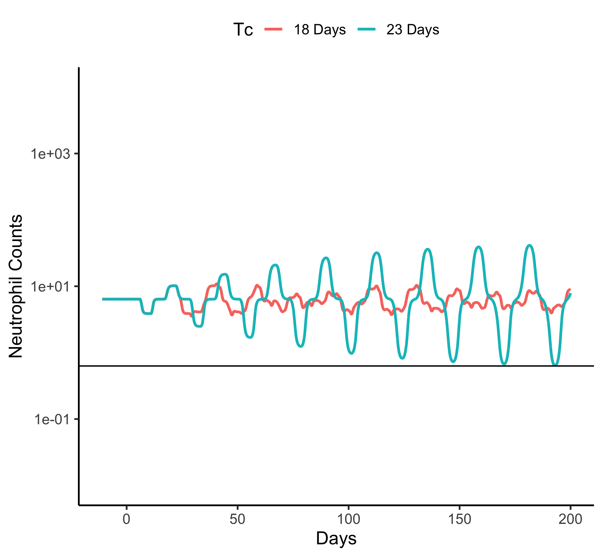
This figure appears to match figure 2B in Zhuge et al 2012 exactly. 
Next we see how the exact same plot can be created without events. 

```
zhuge12Nchemo<-function(Time, State, Pars) {  # model without events 
	with(as.list(c(State, Pars)), {
				dEta=etaNP
				if (Time < 0) {
					An=exp(etaNP*tauNP-gam0*tauNM)  # no gcsf or chemo perturbations for negative times
					dN=-gamN*N + An*f0/(1+(Nss/the1)^s1)*Qss
				}
				else{# quotients and remaninders: 21.4%/%10  21.4%%10
					if (Time%%T < 1) dEta=etaMinNP  # in chemo period
					delEta=lagvalue(Time - tauNM)[2]-lagvalue(Time - tauN)[2]
					An=exp(delEta - gam0*tauNM)
					dN=-gamN*N + An*f0/(1+(lagvalue(Time - tauN)[1]/the1)^s1)*Qss
				}
				list(c(dN,dEta))
			})
}
times <- seq(-zhugePars[["tauN"]],200,by=0.1)

zhugePars["T"]=18
yout18 <- dede(c(N=zhugePars[["Nss"]],Eta=0), times = times, func = zhuge12Nchemo,	parms = zhugePars)
D18=data.frame(yout18)

zhugePars["T"]=23
yout23 <- dede(c(N=zhugePars[["Nss"]],Eta=0), times = times, func = zhuge12Nchemo,	parms = zhugePars)
D23=data.frame(yout23)

D23$Tc="23 Days"
D18$Tc="18 Days"
D=bind_rows(D18,D23)%>%mutate(N=N/1e8)

D%>%ggplot(aes(x=time,y=N,col=Tc))+geom_line(size=1)+gx+gy+tc(14)+sy+ltp+cc+gh
ggsave("~/Results/myelo/zhugeNchemoFig2B.png",height=6,width=6.5)


```


Events were used because reported times are not necessarily integration times: the model with events could thus be more accurate. Identical solutions may be due to high frequencies causing integration step sizes small enough that differences are negligible.  


#### Response of full model to chemo and G-CSF (Figure 6B)
This code is the Zhuge12 help page example. It runs a model that includes both stem cells and neutrophils and both chemo and G-CSF. 

```
times <- seq(-zhugePars[["tauN"]],200,by=0.1)
zhugePars["T"]=21
zhugePars["T1"]=4
yout4 <- dede(c(Q=zhugePars[["Qss"]],N=zhugePars[["Nss"]],Eta=0,Gam=0,GamS=0),
		times = times, func = zhuge12,	parms = zhugePars)

zhugePars["T1"]=14
yout14 <- dede(c(Q=zhugePars[["Qss"]],N=zhugePars[["Nss"]],Eta=0,Gam=0,GamS=0),
		times = times, func = zhuge12,	parms = zhugePars)


D4=data.frame(yout4)
D14=data.frame(yout14)

D4$T1="4 Days"
D14$T1="14 Days"
D=bind_rows(D4,D14)%>%mutate(N=N/1e8)

D%>%ggplot(aes(x=time,y=N,col=T1))+geom_line(size=1)+gx+gy+tc(14)+sy+ltp+cc+gh
ggsave("~/Results/myelo/zhugeFig6B.png",height=6,width=6.5)
```

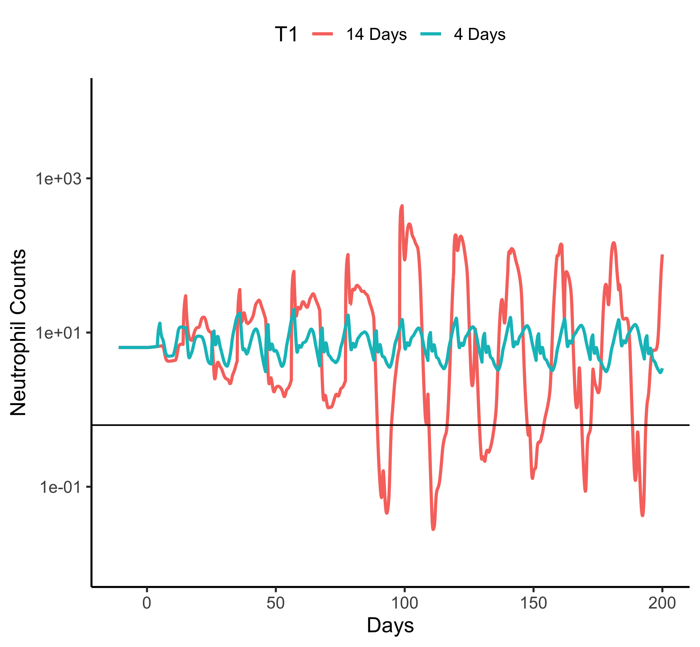

Relative to Figure 6B, the T1=14 curve here hits severe neutropenia ~40 days later 
(at ~90 vs ~50 days).  The reason for this is unclear. 


