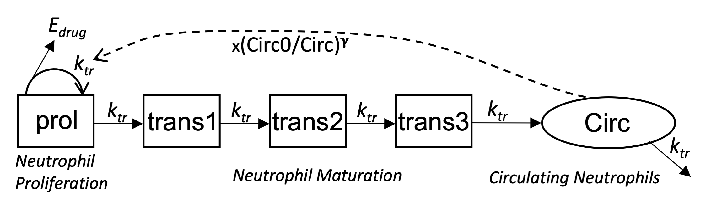
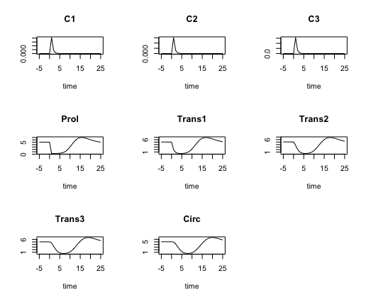
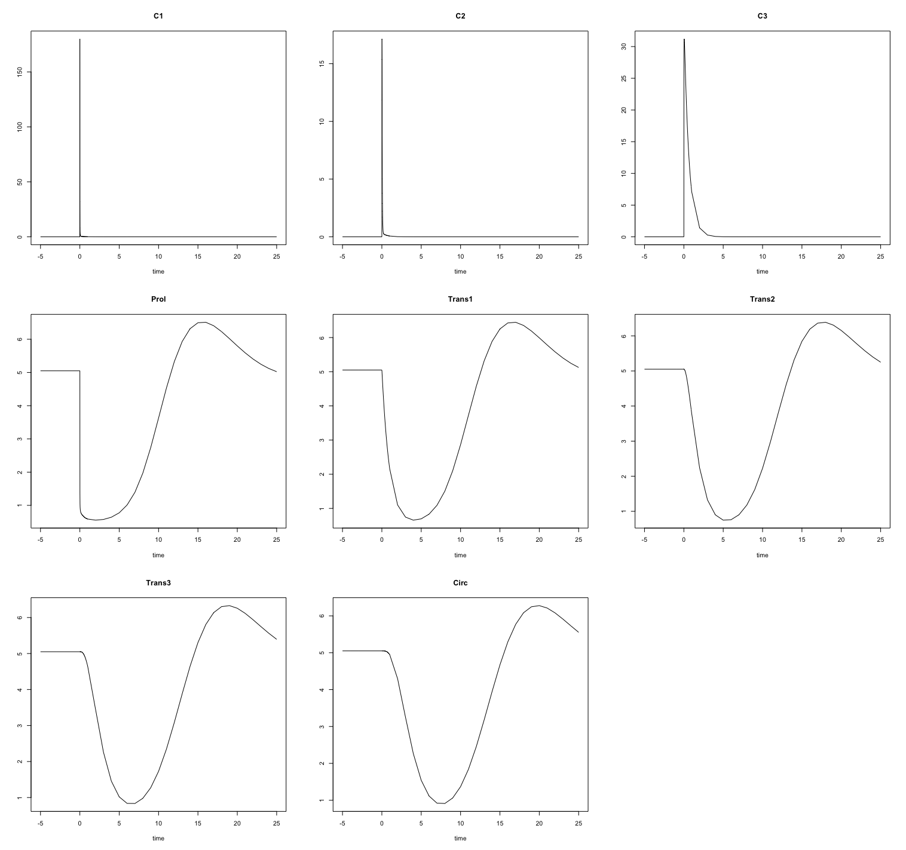
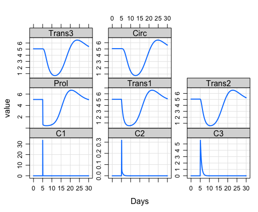
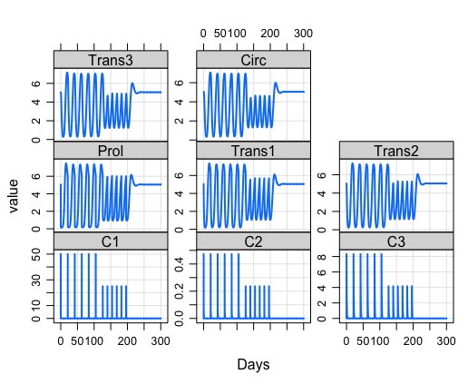
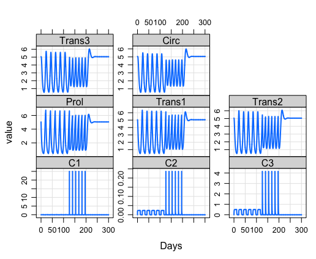

# myelo
This R package houses models of myeloid hematopoiesis. To install it use:  
```
devtools::install_github("radivot/myelo",subdir="myelo")
```

<!--
# Pharmacokinetic and -dynamic modelling of G-CSF derivatives in humans

The model of   [Scholz et al  *Theoretical Biology and Medical Modelling* **9** 32 (2012)](https://www.ncbi.nlm.nih.gov/pubmed/22846180) 
-->


# Model of Chemotherapy-Induced Myelosuppression With Parameter Consistency Across Drugs

[Friberg et al  *J Clin Oncol* **20**  4713-4721 (2002)](https://www.ncbi.nlm.nih.gov/pubmed/12488418) 
provide a model of 5 neutrophil lineage cell state variables, one proliferating, 
3 transitioning through maturation stages, and one circulating in  blood. 



In R their model is 
```
friberg02<-function(Time, State, Pars) {
  with(as.list(c(State, Pars)), {
    dC1=-(k12+k13+k10)*C1 + k21*C2 + k31*C3
    dC2=k12*C1 - k21*C2
    dC3=k13*C1 - k31*C3
    Cp=C1/V1/mw  #mw in mg/umole => uM
    Edrug=slope*Cp
    dProl = ktr*Prol*(1-Edrug)*(Circ0/Circ)^gam - ktr*Prol
    dTrans1=ktr*Prol-ktr*Trans1
    dTrans2=ktr*Trans1-ktr*Trans2
    dTrans3=ktr*Trans2-ktr*Trans3
    dCirc=ktr*Trans3-ktr*Circ
    return(list(c(dC1,dC2,dC3,dProl,dTrans1,dTrans2,dTrans3,dCirc)))
  })
}

```
Using fits of this model to docetaxel response data, the parameter estimates, with time in days, are
```
fribergPars02=c(Circ0=5.05, ktr=24*4/88.7,gam=0.161,slope=8.58, 
k12 = 24*1.06,k21 = 24*1.51,k13 = 24*1.26, k31 = 24*0.084,k10 = 24*5.2,V1=7.4,mw=0.808)
```
Starting from a steady state at t=-5 days, the code below simulates adding
 a bolus  of  docetaxel (100 mg/m2 *1.8 m2 = 180 mg) at t=0. 
```
library(tidyverse)
library(deSolve)
library(myelo)
times <- c(-5:0,seq(0,1,0.01),1:25)
x0=c(C1=0,C2=0,C3=0,Prol=5.05,Trans1=5.05,Trans2=5.05,Trans3=5.05,Circ=5.05)
(evnt=data.frame(var="C1",time=0,value=180,method="rep"))
yout=ode(x0,times=times,func=friberg02,events=list(data=evnt),parms=fribergPars02)
D=as.data.frame(yout)
gx=xlab("Days")
sbb=theme(strip.background=element_blank())
tc=function(sz) theme_classic(base_size=sz)
d=D%>%select(time,C1:Circ)%>%gather(key="Lab",value="Value",-time)
d%>%ggplot(aes(x=time,y=Value))+facet_grid(Lab~.,scales = "free")+geom_line(size=1)+gx+tc(14)+sbb
ggsave("~/Results/myelo/fri02.png",width=5, height=6)
```

Note that the initial number of circulating neutrophils (Circ),  5.05e3 cells/uL, is 
also the setpoint, Circ0, and from the equations, also the steady state of each  compartment. 

The same model in faster  deSolve C code, is
```
#include <R.h>
#include <Rinternals.h>
#include <Rdefines.h>
#include <R_ext/Rdynload.h>
static double  parms[11];
#define Circ0  parms[0]
#define ktr    parms[1]
#define gam    parms[2]
#define slope  parms[3]
#define k12    parms[4]
#define k21    parms[5]
#define k13    parms[6]
#define k31    parms[7]
#define k10    parms[8]
#define V1     parms[9]
#define mw     parms[10]


void parmsFri02(void (* odeparms)(int *, double *))
{   int N=11;
    odeparms(&N, parms);
}


void derivsFri02(int *neq, double *t, double *y, double *ydot)
{
    double C1, C2,C3,Prol,Trans1,Trans2,Trans3,Circ, Edrug;
    double dC1, dC2,dC3,dProl,dTrans1,dTrans2,dTrans3,dCirc;
    C1=y[0];  C2=y[1];   C3=y[2];  Prol=y[3];   
    Trans1=y[4];  Trans2=y[5];   Trans3=y[6];  Circ=y[7];   
    
    dC1=-(k12+k13+k10)*C1 + k21*C2 + k31*C3;
    dC2=k12*C1 - k21*C2;
    dC3=k13*C1 - k31*C3;
    Edrug=slope*C1;
    dProl = ktr*Prol*(1-Edrug)*pow(Circ0/Circ,gam) - ktr*Prol;
    dTrans1=ktr*Prol-ktr*Trans1;
    dTrans2=ktr*Trans1-ktr*Trans2;
    dTrans3=ktr*Trans2-ktr*Trans3;
    dCirc=ktr*Trans3-ktr*Circ;
    
    ydot[0] = dC1 ; 
    ydot[1] = dC2;
    ydot[2] = dC3;
    ydot[3] = dProl;
    ydot[4] = dTrans1;
    ydot[5] = dTrans2;
    ydot[6] = dTrans3;
    ydot[7] = dCirc;
}

```

Running this C version of the model is done as follows
```
(f=file.path(system.file(paste("libs",Sys.getenv("R_ARCH"),sep=""), package = "myelo"),
paste("myelo",.Platform$dynlib.ext,sep="")))
dyn.load(f)
yout=ode(x0,times=times,func="derivsFri02",
       dllname = "myelo",initfunc = "parmsFri02",
       events=list(data=evnt),parms=fribergPars02)
plot(yout) 
```



Using Metrum Research Group's mrgsolve, such C code is automatically generated and compiled using this neat R code.
```
library(mrgsolve)
code='
$PARAM Circ0=5.05,ktr=1.0823,gam=0.161,slope=8.58
k12=25.44,k21=36.24,k13=30.24,k31=2.016,k10=124.8,V1=7.4,mw=0.808
$INIT C1=0,C2=0,C3=0,Prol=5.05,Trans1=5.05,Trans2=5.05,Trans3=5.05,Circ=5.05 
$ODE 
double Cp=C1/V1/mw;
double Edrug=slope*Cp;
dxdt_C1=-(k12+k13+k10)*C1 + k21*C2 + k31*C3;
dxdt_C2=k12*C1 - k21*C2;
dxdt_C3=k13*C1 - k31*C3;
dxdt_Prol = ktr*Prol*(1-Edrug)*pow(Circ0/Circ,gam) - ktr*Prol;
dxdt_Trans1=ktr*Prol-ktr*Trans1;
dxdt_Trans2=ktr*Trans1-ktr*Trans2;
dxdt_Trans3=ktr*Trans2-ktr*Trans3;
dxdt_Circ=ktr*Trans3-ktr*Circ;
'
mod <- mread("fri02", "~/tmp", code)
(e=ev(time=5,amt=180,cmt=1)) 
mod%>%ev(e)%>%mrgsim(end = 30, delta = 0.01)%>%plot(xlab="Days")
```
which generates




mrssolve also offer nice Rx short hand as follows: 
```
(e=ev_rx("50 q 21 x 6 then 25 q 14 x 6"))
mod%>%ev(e)%>%mrgsim(end = 300, delta = 0.1)%>%plot(xlab="Days")
```




<!--
```
(e=ev_rx("50 over 2h q 21 x 6 then 25 q 14 x 6"))
mod%>%ev(e)%>%mrgsim(end = 300, delta = 0.1)%>%plot(xlab="Days")
```


```
(e=ev_rx("50 over 12h q 21 x 6 then 25 q 14 x 6"))
mod%>%ev(e)%>%mrgsim(end = 300, delta = 0.1)%>%plot(xlab="Days")
```


which shows that a 2 hour infusion is the same as a bolus with respect to PD but not PK, 
and that a 12 hour infusion also changes the PD. 


The following block simulates the model for 6 21 day cycles and adds a small amount of noise
```
ev1=ev(time=0, amt=33.5,addl=6)


(pars=c( lambda1=.192,b=5.85,d=0.00873,eA=0.15,eE=0.66))
PH=function(pars) {
  dput(ev1@data)
  left()
  ev1@data=merge(evnt@data,data.frame(t(pars)))
  (mod <- mod %>% ev(evnt))
  (out=mod%>%mrgsim(end = 100, delta = 1) )
  D=as.data.frame(as_tibble(out))
  D[!duplicated(D[1:2]),]
}
D=PH(pars)%>%select(ID,time,V)%>%mutate(Trt=levels(d$Trt)[ID])%>%mutate(Trt=as_factor(Trt))
head(D)
sd=2
D$V=D$V+rnorm(dim(D)[1],sd=sd)
D%>%ggplot(aes(x=time,y=V))+facet_wrap(Trt~.,scales = "free")+geom_line(size=1)+tc(11)+sbb
ggsave("~/tmp/simulated.png",width=5,height=4)
```

-->
