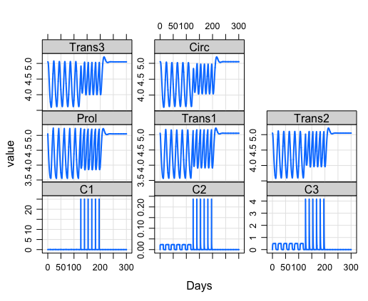
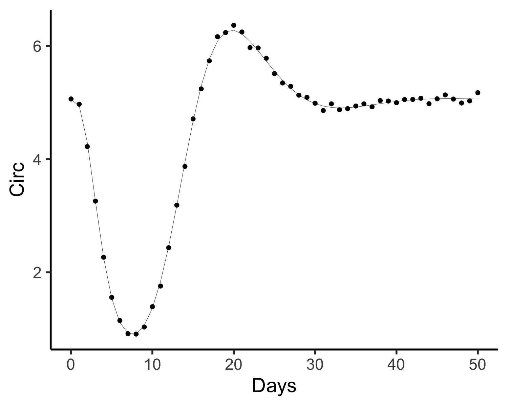

# myelo
This R package houses models of myeloid hematopoiesis. To install it use:  
```
devtools::install_github("radivot/myelo",subdir="myelo")
```

<!--
# Pharmacokinetic and -dynamic modelling of G-CSF derivatives in humans

The model of   [Scholz et al  *Theoretical Biology and Medical Modelling* **9** 32 (2012)](https://www.ncbi.nlm.nih.gov/pubmed/22846180) 
-->


# Model of Chemotherapy-Induced Myelosuppression With Parameter Consistency Across Drugs

[Friberg et al  *J Clin Oncol* **20**  4713-4721 (2002)](https://www.ncbi.nlm.nih.gov/pubmed/12488418) 
provide a model of 5 neutrophil lineage cell state variables, one proliferating, 
3 transitioning through maturation stages, and one circulating in  blood. 


In R their model is 
```
friberg02<-function(Time, State, Pars) {
  with(as.list(c(State, Pars)), {
    dC1=-(k12+k13+k10)*C1 + k21*C2 + k31*C3
    dC2=k12*C1 - k21*C2
    dC3=k13*C1 - k31*C3
    Cp=C1/V1/mw  #mw in mg/umole => uM
    Edrug=slope*Cp
    dProl = ktr*Prol*(1-Edrug)*(Circ0/Circ)^gam - ktr*Prol
    dTrans1=ktr*Prol-ktr*Trans1
    dTrans2=ktr*Trans1-ktr*Trans2
    dTrans3=ktr*Trans2-ktr*Trans3
    dCirc=ktr*Trans3-ktr*Circ
    return(list(c(dC1,dC2,dC3,dProl,dTrans1,dTrans2,dTrans3,dCirc)))
  })
}

```
Using fits of this model to docetaxel response data, the parameter estimates, with time in days, are
```
fribergPars02=c(Circ0=5.05, ktr=24*4/88.7,gam=0.161,slope=8.58, 
k12 = 24*1.06,k21 = 24*1.51,k13 = 24*1.26, k31 = 24*0.084,k10 = 24*5.2,V1=7.4,mw=0.808)
```
Starting from a steady state at t=-5 days, the code below simulates adding
 a bolus  of  docetaxel (100 mg/m2 *1.8 m2 = 180 mg) at t=0. 
```
library(tidyverse)
library(deSolve)
library(myelo)
times <- c(-5:0,seq(0,1,0.01),1:25)
x0=c(C1=0,C2=0,C3=0,Prol=5.05,Trans1=5.05,Trans2=5.05,Trans3=5.05,Circ=5.05)
(evnt=data.frame(var="C1",time=0,value=180,method="rep"))
yout=ode(x0,times=times,func=friberg02,events=list(data=evnt),parms=fribergPars02)
D=as.data.frame(yout)
gx=xlab("Days")
sbb=theme(strip.background=element_blank())
tc=function(sz) theme_classic(base_size=sz)
d=D%>%select(time,C1:Circ)%>%gather(key="Lab",value="Value",-time)
d%>%ggplot(aes(x=time,y=Value))+facet_grid(Lab~.,scales = "free")+geom_line(size=1)+gx+tc(14)+sbb
ggsave("~/Results/myelo/fri02.png",width=5, height=6)
```

Note that the initial number of circulating neutrophils (Circ),  5.05e3 cells/uL, is 
also the setpoint, Circ0, and from the equations, also the steady state of each  compartment. 

The same model in faster  deSolve C code, is
```
#include <R.h>
#include <Rinternals.h>
#include <Rdefines.h>
#include <R_ext/Rdynload.h>
static double  parms[11];
#define Circ0  parms[0]
#define ktr    parms[1]
#define gam    parms[2]
#define slope  parms[3]
#define k12    parms[4]
#define k21    parms[5]
#define k13    parms[6]
#define k31    parms[7]
#define k10    parms[8]
#define V1     parms[9]
#define mw     parms[10]


void parmsFri02(void (* odeparms)(int *, double *))
{   int N=11;
    odeparms(&N, parms);
}


void derivsFri02(int *neq, double *t, double *y, double *ydot)
{
    double C1, C2,C3,Prol,Trans1,Trans2,Trans3,Circ, Edrug;
    double dC1, dC2,dC3,dProl,dTrans1,dTrans2,dTrans3,dCirc;
    C1=y[0];  C2=y[1];   C3=y[2];  Prol=y[3];   
    Trans1=y[4];  Trans2=y[5];   Trans3=y[6];  Circ=y[7];   
    
    dC1=-(k12+k13+k10)*C1 + k21*C2 + k31*C3;
    dC2=k12*C1 - k21*C2;
    dC3=k13*C1 - k31*C3;
    Edrug=slope*C1;
    dProl = ktr*Prol*(1-Edrug)*pow(Circ0/Circ,gam) - ktr*Prol;
    dTrans1=ktr*Prol-ktr*Trans1;
    dTrans2=ktr*Trans1-ktr*Trans2;
    dTrans3=ktr*Trans2-ktr*Trans3;
    dCirc=ktr*Trans3-ktr*Circ;
    
    ydot[0] = dC1 ; 
    ydot[1] = dC2;
    ydot[2] = dC3;
    ydot[3] = dProl;
    ydot[4] = dTrans1;
    ydot[5] = dTrans2;
    ydot[6] = dTrans3;
    ydot[7] = dCirc;
}

```

Running this C version of the model is done as follows
```
(f=file.path(system.file(paste("libs",Sys.getenv("R_ARCH"),sep=""), package = "myelo"),
paste("myelo",.Platform$dynlib.ext,sep="")))
dyn.load(f)
yout=ode(x0,times=times,func="derivsFri02",
       dllname = "myelo",initfunc = "parmsFri02",
       events=list(data=evnt),parms=fribergPars02)
plot(yout) 
```


Using Metrum Research Group's mrgsolve, such C code is automatically generated and compiled using this neat R code.
```
library(mrgsolve)
code='
$PARAM Circ0=5.05,ktr=1.0823,gam=0.161,slope=8.58
k12=25.44,k21=36.24,k13=30.24,k31=2.016,k10=124.8,V1=7.4,mw=0.808
$INIT C1=0,C2=0,C3=0,Prol=5.05,Trans1=5.05,Trans2=5.05,Trans3=5.05,Circ=5.05 
$ODE 
double Cp=C1/V1/mw;
double Edrug=slope*Cp;
dxdt_C1=-(k12+k13+k10)*C1 + k21*C2 + k31*C3;
dxdt_C2=k12*C1 - k21*C2;
dxdt_C3=k13*C1 - k31*C3;
dxdt_Prol = ktr*Prol*(1-Edrug)*pow(Circ0/Circ,gam) - ktr*Prol;
dxdt_Trans1=ktr*Prol-ktr*Trans1;
dxdt_Trans2=ktr*Trans1-ktr*Trans2;
dxdt_Trans3=ktr*Trans2-ktr*Trans3;
dxdt_Circ=ktr*Trans3-ktr*Circ;
'
mod <- mread("fri02", "~/tmp", code)
(e=ev(time=0,amt=180,cmt=1)) 
out=mod%>%ev(e)%>%mrgsim(start=0,end = 25, delta = 1)
out%>%plot(xlab="Days")
d=as.data.frame(out)
D=d%>%select(time,Prol:Circ)%>%gather(key="Cell",value="Value",-time)%>%mutate(Cell=as_factor(Cell))
D%>%ggplot(aes(x=time,y=Value,col=Cell))+geom_line(size=1)+gx+tc(14)+sbb
```
which generates


mrgsolve also offers nice Rx short hand as follows: 
```
(e=ev_rx("50 q 21 x 6 then 25 q 14 x 6"))
mod%>%ev(e)%>%mrgsim(end = 300, delta = 0.1)%>%plot(xlab="Days")
```


and the ability to easily change the dose to a continuous infusion, here over 12 of the 21 days
of a cycle
```
(e=ev_rx("50 over 12 q 21 x 6 then 25 q 14 x 6"))
mod%>%ev(e)%>%mrgsim(end = 300, delta = 0.1)%>%plot(xlab="Days")
```


To see if we can recover parameters from a simulation, we first simulate some data

```
(e=ev(time=0,amt=180,cmt=1)) 
END=50
DELTA=1
out=mod%>%ev(e)%>%mrgsim(start=0,end=END,delta=DELTA)
d=as.data.frame(out)[-1,]
d=d[!duplicated(d$time),]
sd=0.05
d$ANC=d$Circ+rnorm(dim(d)[1],sd=sd)
d%>%ggplot(aes(x=time,y=Circ))+ geom_line(size=.1)+
  geom_point(aes(x=time,y=ANC),size=1)+gx+tc(14)+sbb
```



and then retrieve the estimates with initial guesses 2-fold higher 

```
dput(fribergPars02)
(pars=c(Circ0 = 5.05, ktr = 1.08229988726043,gam = 0.161, slope = 8.58))
LF4=function(pars) {
  evnt=ev(time=0,amt=180,cmt=1,Circ0=pars["Circ0"],ktr=pars["ktr"],gam=pars["gam"],slope=pars["slope"],
          Prol_0=pars["Circ0"],Trans1_0=pars["Circ0"],Trans2_0=pars["Circ0"],
          Trans3_0=pars["Circ0"],Circ_0=pars["Circ0"] )
  as.data.frame(mod%>%ev(evnt)%>%mrgsim(start=0,end = END, delta = DELTA))[-1,]
}
D=LF4(pars)%>%select(time,Circ)
dd=d%>%select(time,Circ=ANC)%>%mutate(sd=sd)
LF4cost <- function (pars) {
  out=LF4(pars)%>%select(time,Circ)
  modCost(model = out, obs = dd, err = "sd")
}
parsIC=2*pars
LF4cost2 <- function(lpars)  LF4cost(exp(lpars))
Fit <- modFit(f = LF4cost2, p = log(parsIC),method="Nelder-Mead") #crashes without log
data.frame(parsIC,fit=exp(coef(Fit)),trueVals=pars)
(s=summary(Fit))
data.frame(point=exp(s$par[,1]),
           lowCI=exp(s$par[,1]-1.96*s$par[,2]),
           hiCI=exp(s$par[,1]+1.96*s$par[,2])  )
```

The output of this is shown below.

```
       parsIC       fit trueVals
Circ0 10.1000 5.0501892   5.0500
ktr    2.1646 1.0795027   1.0823
gam    0.3220 0.1613089   0.1610
slope 17.1600 8.6592076   8.5800
> (s=summary(Fit))

Parameters:
       Estimate Std. Error t value Pr(>|t|)    
Circ0  1.619426   0.001707  948.47   <2e-16 ***
ktr    0.076500   0.003939   19.42   <2e-16 ***
gam   -1.824434   0.005461 -334.11   <2e-16 ***
slope  2.158623   0.008585  251.43   <2e-16 ***
---
Signif. codes:  0 ‘***’ 0.001 ‘**’ 0.01 ‘*’ 0.05 ‘.’ 0.1 ‘ ’ 1

Residual standard error: 0.9787 on 47 degrees of freedom

Parameter correlation:
        Circ0     ktr     gam   slope
Circ0  1.0000  0.2436 -0.4412 -0.1203
ktr    0.2436  1.0000 -0.8460  0.2438
gam   -0.4412 -0.8460  1.0000 -0.1013
slope -0.1203  0.2438 -0.1013  1.0000
> data.frame(point=exp(s$par[,1]),
+            lowCI=exp(s$par[,1]-1.96*s$par[,2]),
+            hiCI=exp(s$par[,1]+1.96*s$par[,2])  )
          point     lowCI      hiCI
Circ0 5.0501892 5.0333168 5.0671182
ktr   1.0795027 1.0712001 1.0878696
gam   0.1613089 0.1595917 0.1630446
slope 8.6592076 8.5147167 8.8061505
```


Using deSolve C code in myelo and the R package bbmle, the same optimization is 
implemented as follows

```
library(bbmle)
pars=fribergPars02
nLL<-function(Circ0,ktr,gam,slope) { # pass these globally: d,pars
  Circ0=exp(Circ0)
  ktr=exp(ktr)
  gam=exp(gam)
  slope=exp(slope)
  x0=c(C1=0,C2=0,C3=0,Prol=Circ0,Trans1=Circ0,Trans2=Circ0,Trans3=Circ0,Circ=Circ0)
  pars["Circ0"]=Circ0 
  pars["ktr"]=ktr
  pars["gam"]=gam
  pars["slope"]=slope
  out=ode(x0,times=seq(0,END,DELTA),func="derivsFri02",
          dllname = "myelo",initfunc = "parmsFri02",
          ,events=list(data=evnt),parms=pars)
  y.pred=out[,"Circ"]
  sigma  <- sqrt(sum((d$ANC-y.pred)^2)/length(d$ANC))
  -sum(dnorm(d$ANC, mean=out[,"Circ"],sd=sigma,log=TRUE)) 
}

IC0=c(Circ0=5.05,ktr=1.083,gam=0.161,slope=8.58) 
IC=log(2*IC0)
(s=summary(M<-mle2(nLL,method="Nelder-Mead",
                start=as.list(IC),
                control = list(maxit=50000, parscale=IC) ) ) )
data.frame(IC=exp(IC),fit=exp(coef(M)),trueVals=IC0)
data.frame(point=exp(s@coef[,1]),
           lowCI=exp(s@coef[,1]-1.96*s@coef[,2]),
           hiCI=exp(s@coef[,1]+1.96*s@coef[,2])  )
```


Comparable CI are seen in the outputs below


```
Maximum likelihood estimation

Call:
mle2(minuslogl = nLL, start = as.list(IC), method = "Nelder-Mead", 
    control = list(maxit = 50000, parscale = IC))

Coefficients:
        Estimate Std. Error  z value     Pr(z)    
Circ0  1.6194619  0.0022869  708.151 < 2.2e-16 ***
ktr    0.0769291  0.0023961   32.106 < 2.2e-16 ***
gam   -1.8244965  0.0039945 -456.749 < 2.2e-16 ***
slope  2.1576451  0.0085379  252.715 < 2.2e-16 ***
---
Signif. codes:  0 ‘***’ 0.001 ‘**’ 0.01 ‘*’ 0.05 ‘.’ 0.1 ‘ ’ 1

-2 log L: -167.2652 
> data.frame(IC=exp(IC),fit=exp(coef(M)),trueVals=IC0)
          IC       fit trueVals
Circ0 10.100 5.0503721    5.050
ktr    2.166 1.0799655    1.083
gam    0.322 0.1612988    0.161
slope 17.160 8.6507416    8.580
> data.frame(point=exp(s@coef[,1]),
+            lowCI=exp(s@coef[,1]-1.96*s@coef[,2]),
+            hiCI=exp(s@coef[,1]+1.96*s@coef[,2])  )
          point     lowCI      hiCI
Circ0 5.0503721 5.0277854 5.0730602
ktr   1.0799655 1.0749054 1.0850494
gam   0.1612988 0.1600409 0.1625667
slope 8.6507416 8.5071829 8.7967229
```

