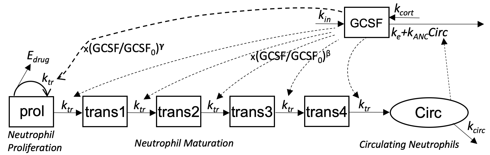

#  Characterization of Endogenous G-CSF and the Inverse Correlation to Chemotherapy-Induced Neutropenia in Patients with Breast Cancer Using Population Modeling 

[Quartino et al  *Pharm Res* **31**  3390-3403 (2014)](https://www.ncbi.nlm.nih.gov/pubmed/24919931) 
provide a model of 6 neutrophil lineage cell state variables, one proliferating, 
4 transitioning through maturation stages, and one circulating in  blood. 
Their model also includes GCSF formation, including due to corticosteroids given to reduce emesis due to docetaxel, and removal both by the kidney (ke) and internalization by
circulating neutrophils (Circ). Their model has separate control parameters for the 
effects of GCSF on maturation rates (beta) and proliferation rates (gamma).

